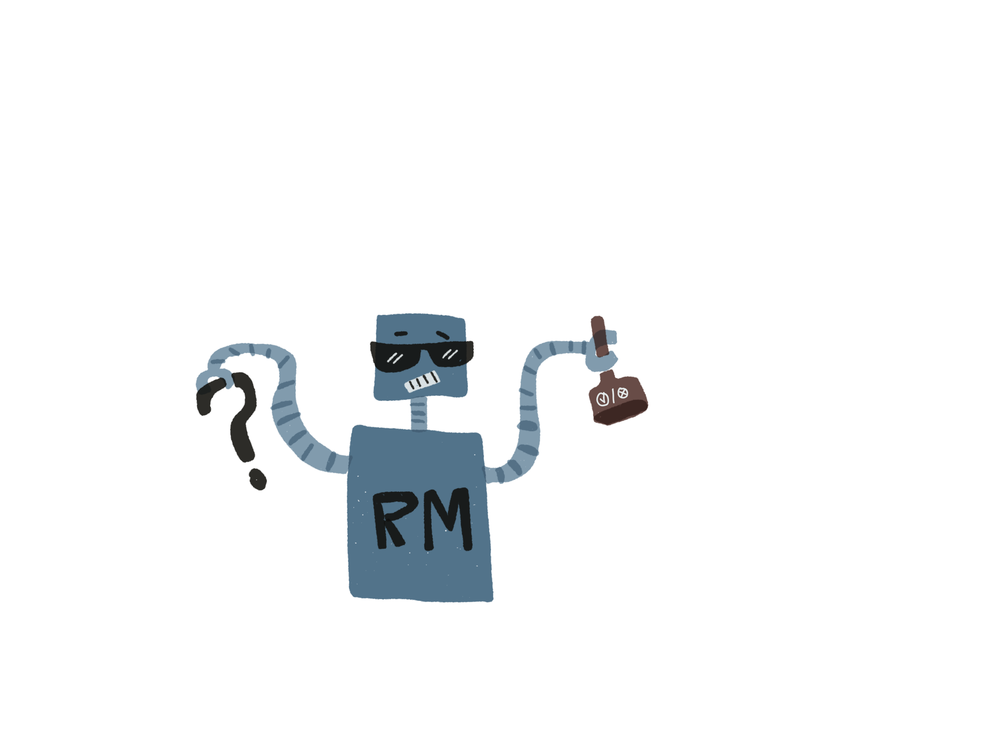

# dp-behandling


## Ansvarsområder

- Reagere på behandlingsverdige hendelser
- Starte behandling
- Innhente opplysninger som trengs for å ferdigstille behandling
- Si ifra når behandling er opprettet
- Si ifra når behandling har nok opplysninger til å kunne ferdigstilles. (Bekrefte opplysninger (Gjøre hypoteser til faktum))
- Har tilstand som vet hva som skal til for å ferdigstille behandling og lage vedtak/forslag til vedtak

## Dokumentasjon

 - [Se dokumentasjon](docs/README.md)

## Utvikling

### Komme i gang

Gradle brukes som byggverktøy og er bundlet inn.

```
./gradlew build
```

# Henvendelser

Spørsmål knyttet til koden eller prosjektet kan rettes mot:

* Eller en annen måte for omverden å kontakte teamet på

## For NAV-ansatte

Interne henvendelser kan sendes via Slack i kanalen #team-dagpenger-dev.
