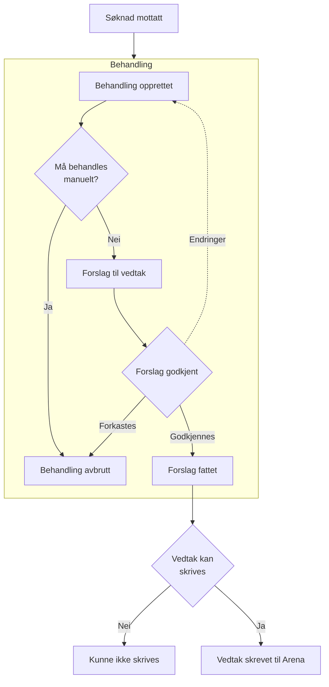
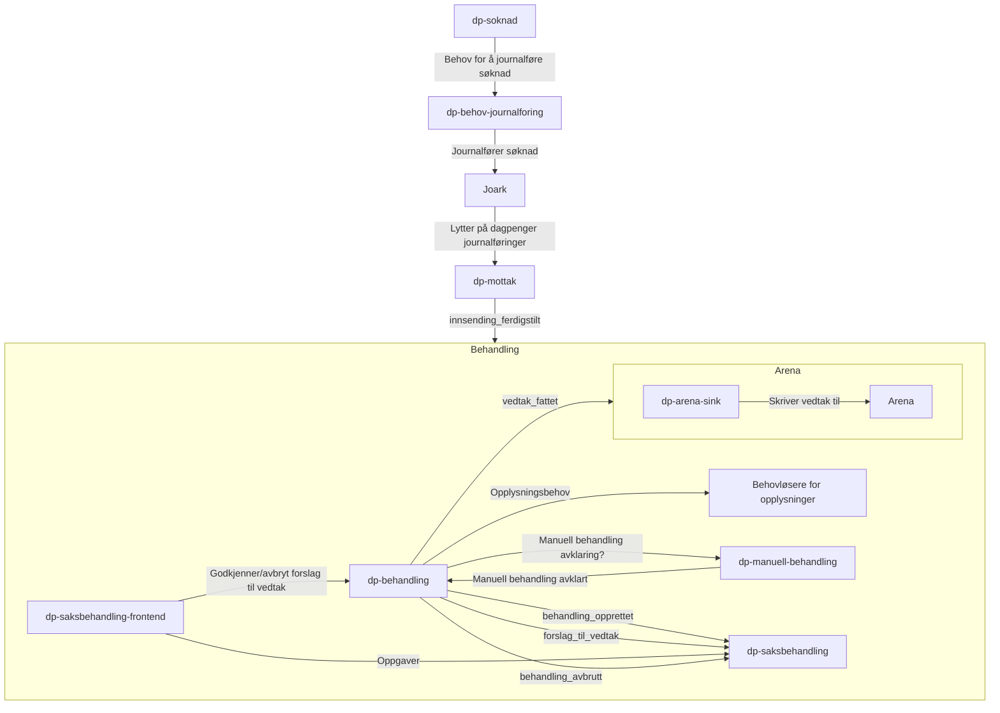

# dp-behandling

Behandler alle ulike hendelser på dagpenger.

## Implementasjonsmodell for behandling

- [Behandling og opplysninger](./opplysning/README.md)

## Flyt 



## Systemoversikt 




## Behov for opplysninger

[Komplett liste med behov](./behov.approved.md)

### Behov

Vi sender ut behov for opplysninger med denne konvolutten:

* **ident**: Fødselsnummer eller D-nummer
* **behandlingId**: ID på vår behandling. Legg denne på som logg kontekst 
* **søknadId**: ID på søknaden som behandlingen gjelder

```json
{
  "@id": "40a28aed-08ee-4744-9ba7-ada399e12e75",
  "@event_name": "behov",
  "@behovId": "018ee180-deef-7911-a91d-570b2d93a8b1",
  "@behov": [
    "opplysning-navn-1",
    "opplysning-navn-2"
  ],
  "ident": "12345678901",
  "søknadId" : "ed7d20ea-24e4-4b06-b796-a9bef6b3b012",
  "behandlingId": "018ee180-deef-7911-a91d-570b2d93a8b1",
  "@opplysningsbehov": true,
  "@opprettet": "2024-04-15T13:25:26.353152"
}
```

### Løsning

Behov kan løses enten som enkle verdier, eller med metadata:

Eksempel på enkel verdi:

```json
{
  /* ..resten av behovet */
  "@løsning": {
    "opplysning-navn-1": true,
    "opplysning-navn-2": 123123
  }
}
```

Eksempel på løsning med metadata:
```json
{
  /* ..resten av behovet */
  "@løsning": {
    "opplysning-navn-1": {
      "verdi": true,
      "gyldigFraOgMed": "2024-04-15",
      "gyldigTilOgMed": "2024-04-20"
    }
  }
}
```
