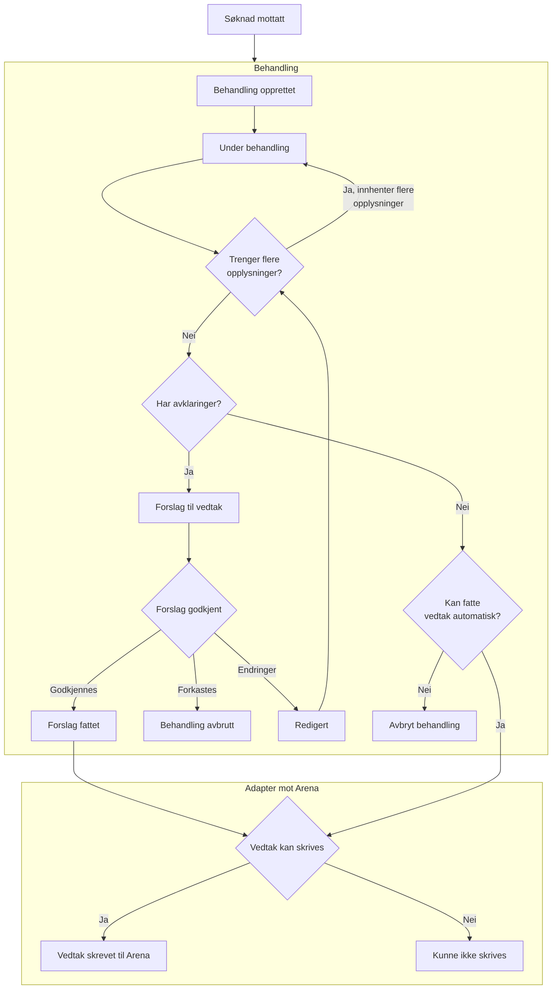
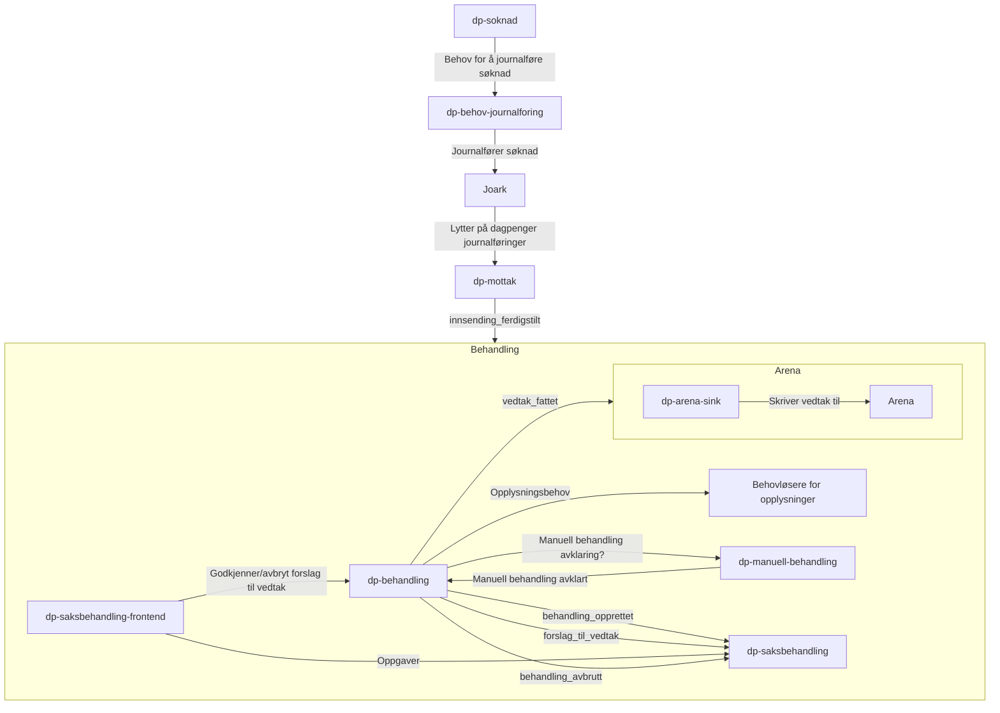

# dp-behandling

Behandler alle ulike hendelser på dagpenger.

## Implementasjonsmodell for behandling

Overordnet flyt er som følger:

- En hendelse kommer inn, for eksempel en søknad om dagpenger
- Vi oppretter en behandling
- Vi gjør en vurdering om behandlingen skal kobles på en eksisterende behandling, f.eks. ved gjenopptak eller behandling av et meldekort.
- Behandlingen starter utredning av hendelsen. Dette er innhenting av opplysninger og regelverksvurderinger.
- Underveis i behandlingen kan vi oppdage uklarheter eller risikoer. Da oppretter vi avklaringer underveis.
- Når vi har nok informasjon, kan vi fullføre behandlingen.
    - Har vi fortsatt åpne avklaringer vil behandlingen gå til saksbehandler for ferdigstillelse
    - Har vi ingen åpne avklaringer vil behandlingen automatisk avsluttes

Flere detaljer om [behandling og opplysninger](./opplysning/README.md).

## Overordnet flyt i en behandling



## Innhenting av opplysninger

[Komplett liste med behov](./behov.approved.md)

### Behov

Vi sender ut behov for opplysninger med denne konvolutten:

* **ident**: Fødselsnummer eller D-nummer
* **behandlingId**: ID på vår behandling. Legg denne på som logg kontekst
* **søknadId**: ID på søknaden som behandlingen gjelder

```json
{
  "@id": "40a28aed-08ee-4744-9ba7-ada399e12e75",
  "@event_name": "behov",
  "@behovId": "018ee180-deef-7911-a91d-570b2d93a8b1",
  "@behov": [
    "opplysning-navn-1",
    "opplysning-navn-2"
  ],
  "ident": "12345678901",
  "søknadId": "ed7d20ea-24e4-4b06-b796-a9bef6b3b012",
  "behandlingId": "018ee180-deef-7911-a91d-570b2d93a8b1",
  "@opplysningsbehov": true,
  "@opprettet": "2024-04-15T13:25:26.353152"
}
```

### Løsning

Behov kan løses enten som enkle verdier, eller med metadata:

Eksempel på enkel verdi:

```json
{
  /* ..resten av behovet */
  "@løsning": {
    "opplysning-navn-1": true,
    "opplysning-navn-2": 123123
  }
}
```

Eksempel på løsning med metadata:

```json
{
  /* ..resten av behovet */
  "@løsning": {
    "opplysning-navn-1": {
      "verdi": true,
      "gyldigFraOgMed": "2024-04-15",
      "gyldigTilOgMed": "2024-04-20"
    }
  }
}
```

## Avklaringer

Underveis i en behandling kan det være behov for å avklare motstridende informasjon, uklarheter, eller risikomomenter. Dette kan gjøres både
maskinelt, av sakbehandler, eller av søker.

En avklaring opprettes av det vi kaller ett kontrollpunkt. Alle kontrollpunkt kjøres hver gang behandlingen eller opplysningene i
behandlingen endres. Kontrollpunktene har tilgang til å gjøre mange ulike vurderinger på opplysningene, men typisk sjekker vi:

- Verdien til enn opplysning
- Kombinasjoner av verdier
- Hvor opplysningen kommer fra - maskinelt eller menneske

Når et kontrollpunkt oppdager noe som må avklares, opprettes en avklaring. Avklaringer kan lukkes på tre måter:

- Opplysningene som førte til avklaringen endres og avklaringen ikke lengre er nødvendig
- Avklaringen blir lukket av systemet etter å vurdert tilgjengelig informasjon
- Avklaringen blir kvittert ut av saksbehandler - uten at noe endres.

### Eksempel

Eksempler på avklaringer kan være:

- Det kan ligge gamle saker i Arena som kan være relevant. Vi oppretter en Avklaring som fører til at det automatisk sjekkes sakshistorikk i
  Arena. Finner vi noe relevant, blir avklaringen stående åpen så en saksbehandler kan vurdere informasjonen.
- Vi finner informasjon om arbeid i utlandet. En saksbehandler må vurdere om dette er relevant for saken.
- Bruker er under 18 år. Da skal vi ikke fatte automatiske vedtak, så en saksbehandler må vurdere saken. Avklaringen kvitteres ut, og vi kan
  fortsette behandlingen

### Kontrollpunkt for Verneplikt

```kotlin
val VernepliktKontroll =
    Kontrollpunkt(sjekker = Avklaringspunkter.Verneplikt) { opplysninger ->
        opplysninger.har(avtjentVerneplikt) && opplysninger.finnOpplysning(avtjentVerneplikt).verdi
    }
```

### Sporing

Avklaringer opprettes med referanser til informasjonen som førte til at avklaringen ble opprettet i utgangspunktet.

Hver gang en avklaring lukkes eller kvitteres vil det bli sporet hvorfor det skjedde. Det kan være endringer i underliggende opplysninger,
et system har markert den som lukket, eller en saksbehandler har kvittert ut avklaringen.

# Systemoversikt


