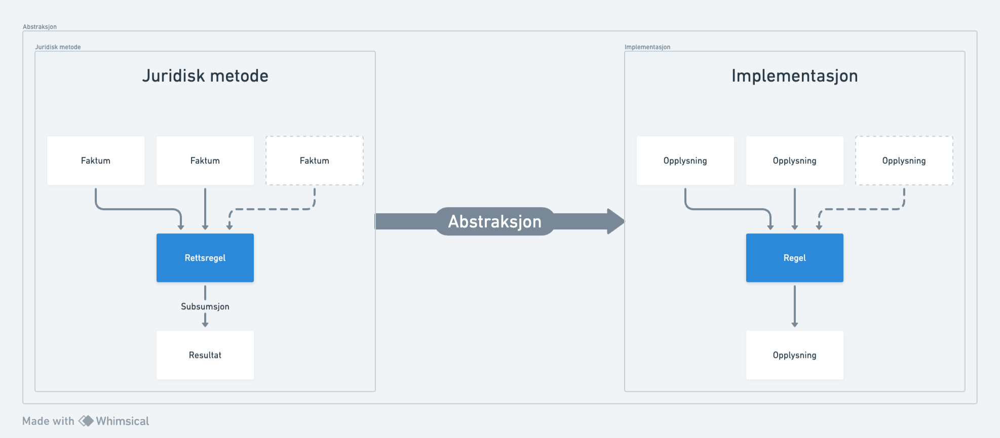
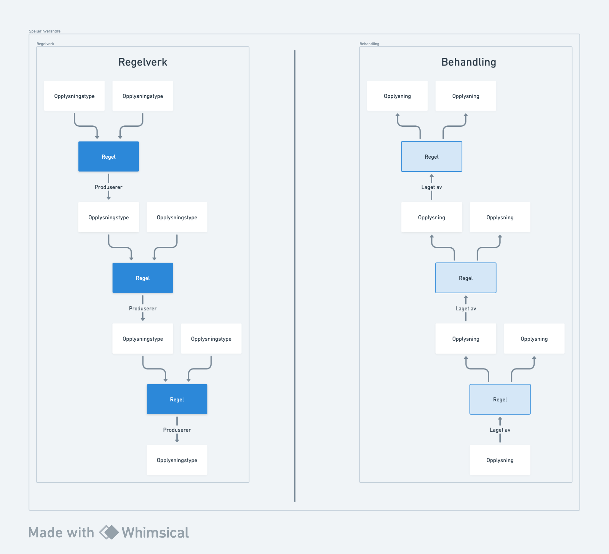
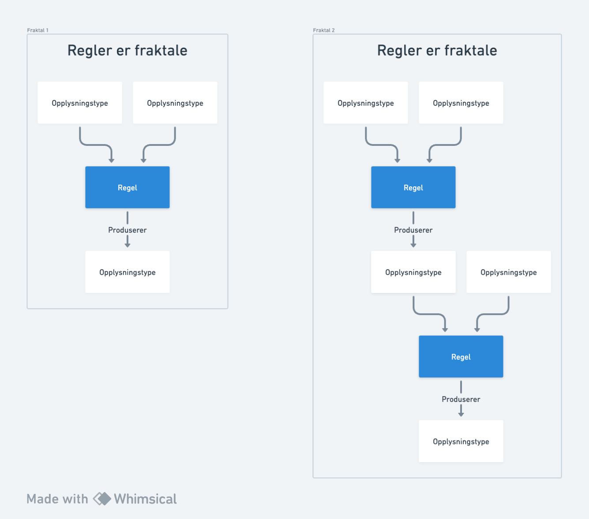

# Implementasjonsmodell for behandling

# Opplysning

Representerer en ting vi tror (hypotese) eller vet (faktum). Må ha en verdi. Verdien kan være dato, tall, boolske osv. 

## Gyldighetsperiode

Alle opplysninger har en gyldighetsperiode. Fra og med er obligatorisk, men til og med er åpen. Fra-og-med og til-og-med kan settes til samme dag for å si at en opplysning gjelder **en** dag.

### Erstatning av opplysning 

> **_MERKNAD:_** Erstatning er ikke implementert.[Skisser om erstatning og splitting](https://whimsical.com/erstatning-og-splitting-AnGM4QKHzDUyq7DT3zW1E7)

En opplysning kan erstatte en annen opplysning. Opplysning som blir ikke erstattet vil ikke bli slettet men en ny opplysning vil over ta med en ny gyldighetsperiode. 

## Opplysningstype

Vi kan identifisere ulike opplysninger via en type. Opplysningstype er navn på en opplysning. 

Eksempler
- personnavn
- fødselsdato
- diagnose
- inntekt
- vilkår *(feks om søker har rett til dagpenger)*

Opplysningstype er definert i  begrepskatalogen: [Opplysningstype (BEGREP-2062)](https://navno.sharepoint.com/sites/begreper/SitePages/Begrep.aspx?bid=BEGREP-2062)

> **_MERKNAD:_** Opplysningshierarki er ikke implementert.

Typene kan også struktureres i et hierarki. På den måten kan vi vite om en opplysning er et vilkår eller ei.

Tanken med hierarki på opplysningstype var vel egentlig å kunne gjøre det via opplysningstyper.
"Resultat" er jo ganske godt definert i jussen som utfallet av en subsumsjon. Så da er det på en måte reservert til vilkår. Mens vi har også en masse opplysninger som ikke er resultatet av et vilkår, f.eks. fødselsdato.
Tanken med hierarkiet på opplysningstype og en er()-funksjon som traverer opp hierarkiet er at man kan lage et hierarki over vilkår og delvilkår og så si noe sånt som:


````kotlin
val vilkår = Opplysningstype<Boolean>("Rett til dagpenger")
val minsteinntekt = Opplysningstype<Boolean>("§4-4 Minste arbeidsinntekt", vilkår)

val fødselsdato = Opplysningstype<LocalDate>("fødselsdato")

val resultat: List<Opplysning<*>> = opplysninger.find { it.er(vilkår) }

assertEquals(2, resultat.size)

````


## Tilstand

Vi bruker tilstand til å skille mellom det vi **vet** \(faktum\), og det vi **tror** \(hypotese\).

Saksbehandlers rolle vil typisk være å ta stilling til et utkast til vedtak, hvor det er flere hypoteser, og bekrefte de slik at vi kan behandle de som fakta.

## Sporing

Alle opplysninger bør oppstå i kontekst av en behandling og ha en relasjon tilbake til behandlingen som laget den.

### Utledning
Om en opplysning er utledet så har vi sporing som sier med hvilken funksjon på andre opplysninger som har utledet denne opplysningen. 


### Kilde

Om den ikke er utledet så er den satt av en ekstern melding. Da sporer vi hvilken melding som førte til hvilken verdi.  
Vi har to ulike meldinger:

- System (PDL, AAReg, osv)
- Manuell overstyring (saksbehandler, superbruker)

# Regel

> **_MERKNAD:_**  Må dokumenteres bedre, feks regelverksdato og versjonering av regler.

Representerer logikk om hvordan vi utleder opplysninger fra andre opplysninger.

## Logiske utledninger
A er sann, så B er sann

Feks
- En av
- Alle 
- Ingen av

## Matematiske utledninger

- Addisjon
- Subtraksjon
- Multiplikasjon
- Divisjon

## Sammenligningsutledninger

- Større enn (eller lik)
- Mindre enn (eller lik)
- Lik
- Før/etter dato

## Regler og opplysning 







# Faktainnhenting/behov/actions/plan

Representerer ting vi ønsker å vite. Fører til at det lages en eller flere opplysninger.

# Behandling

Representerer en prosess som beskriver hvilke ting må vurderes for å anse en hendelse som ferdig behandlet.

For en søknadshendelse vil det være å sjekke om alle vilkårene for å kunne innvilges dagpenger.

For en rapporteringshendelse vil det være å sjekke om de løpende vilkårene er oppgitt, og beregne hvor mange dager det skal betales dagpenger for.


# Vedtak

Representerer en beslutning basert på en behandling. Vil typisk være når alle opplysninger er fastsatt som faktum.

Vedtak er primært en kopi av behandling som arkiveres og kan ikke endres.

