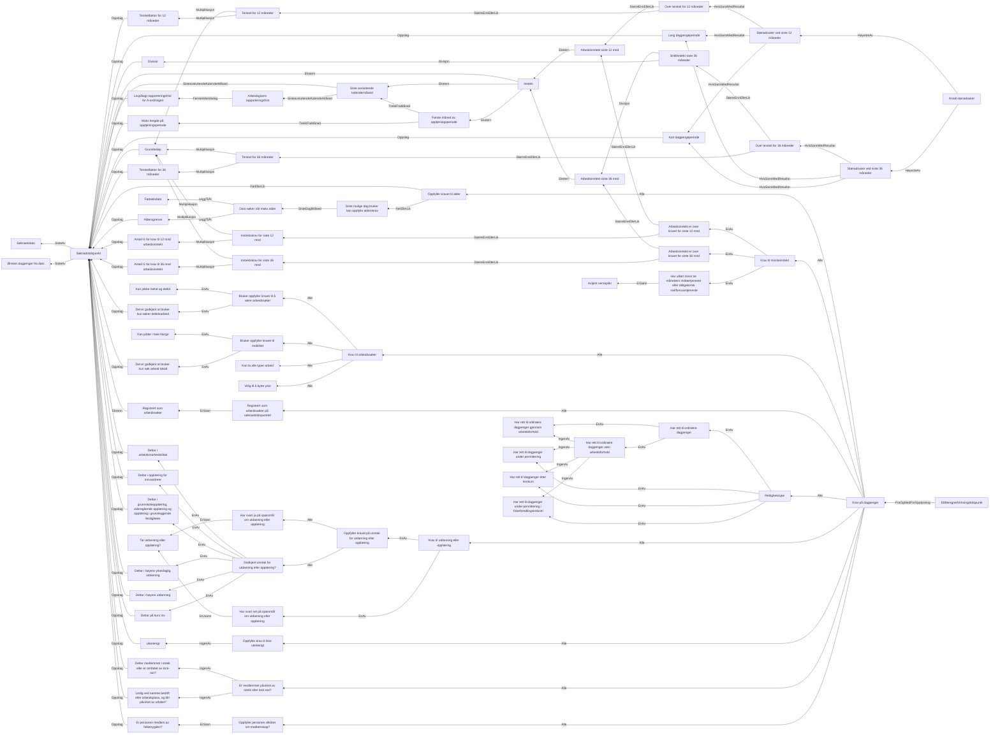

# Regeltre - Dagpenger (inngangsvilkår)

## Regeltre

```mermaid
graph RL
  A["Aldersgrense"] -->|"Oppslag"| B["Søknadstidspunkt"]
  C["Dato søker når maks alder"] -->|"LeggTilÅr"| D["Fødselsdato"]
  C["Dato søker når maks alder"] -->|"LeggTilÅr"| A["Aldersgrense"]
  E["Siste mulige dag bruker kan oppfylle alderskrav"] -->|"SisteDagIMåned"| C["Dato søker når maks alder"]
  F["Oppfyller kravet til alder"] -->|"FørEllerLik"| B["Søknadstidspunkt"]
  F["Oppfyller kravet til alder"] -->|"FørEllerLik"| E["Siste mulige dag bruker kan oppfylle alderskrav"]
  G["Kort dagpengeperiode"] -->|"Oppslag"| B["Søknadstidspunkt"]
  H["Lang dagpengeperiode"] -->|"Oppslag"| B["Søknadstidspunkt"]
  I["Terskelfaktor for 12 måneder"] -->|"Oppslag"| B["Søknadstidspunkt"]
  J["Terskelfaktor for 36 måneder"] -->|"Oppslag"| B["Søknadstidspunkt"]
  K["Divisior"] -->|"Oppslag"| B["Søknadstidspunkt"]
  L["Terskel for 12 måneder"] -->|"Multiplikasjon"| M["Grunnbeløp"]
  L["Terskel for 12 måneder"] -->|"Multiplikasjon"| I["Terskelfaktor for 12 måneder"]
  N["Terskel for 36 måneder"] -->|"Multiplikasjon"| M["Grunnbeløp"]
  N["Terskel for 36 måneder"] -->|"Multiplikasjon"| J["Terskelfaktor for 36 måneder"]
  O["Snittinntekt siste 36 måneder"] -->|"Divisjon"| P["Arbeidsinntekt siste 36 mnd"]
  O["Snittinntekt siste 36 måneder"] -->|"Divisjon"| K["Divisior"]
  Q["Over terskel for 12 måneder"] -->|"StørreEnnEllerLik"| R["Arbeidsinntekt siste 12 mnd"]
  Q["Over terskel for 12 måneder"] -->|"StørreEnnEllerLik"| L["Terskel for 12 måneder"]
  S["Over terskel for 36 måneder"] -->|"StørreEnnEllerLik"| O["Snittinntekt siste 36 måneder"]
  S["Over terskel for 36 måneder"] -->|"StørreEnnEllerLik"| N["Terskel for 36 måneder"]
  T["Stønadsuker ved siste 12 måneder"] -->|"HvisSannMedResultat"| Q["Over terskel for 12 måneder"]
  T["Stønadsuker ved siste 12 måneder"] -->|"HvisSannMedResultat"| H["Lang dagpengeperiode"]
  T["Stønadsuker ved siste 12 måneder"] -->|"HvisSannMedResultat"| G["Kort dagpengeperiode"]
  U["Stønadsuker ved siste 36 måneder"] -->|"HvisSannMedResultat"| S["Over terskel for 36 måneder"]
  U["Stønadsuker ved siste 36 måneder"] -->|"HvisSannMedResultat"| H["Lang dagpengeperiode"]
  U["Stønadsuker ved siste 36 måneder"] -->|"HvisSannMedResultat"| G["Kort dagpengeperiode"]
  V["Antall stønadsuker"] -->|"HøyesteAv"| T["Stønadsuker ved siste 12 måneder"]
  V["Antall stønadsuker"] -->|"HøyesteAv"| U["Stønadsuker ved siste 36 måneder"]
  W["Krav på dagpenger"] -->|"Alle"| F["Oppfyller kravet til alder"]
  W["Krav på dagpenger"] -->|"Alle"| X["Krav til minsteinntekt"]
  W["Krav på dagpenger"] -->|"Alle"| Y["Krav til arbeidssøker"]
  W["Krav på dagpenger"] -->|"Alle"| Z["Registrert som arbeidssøker på søknadstidspunktet"]
  W["Krav på dagpenger"] -->|"Alle"| AA["Rettighetstype"]
  W["Krav på dagpenger"] -->|"Alle"| AB["Krav til utdanning eller opplæring"]
  W["Krav på dagpenger"] -->|"Alle"| AC["Oppfyller krav til ikke utestengt"]
  W["Krav på dagpenger"] -->|"Alle"| AD["Er medlemmet påvirket av streik eller lock-out?"]
  W["Krav på dagpenger"] -->|"Alle"| AE["Oppfyller personen vilkåret om medlemskap?"]
  AF["Er personen medlem av folketrygden?"] -->|"Oppslag"| B["Søknadstidspunkt"]
  AE["Oppfyller personen vilkåret om medlemskap?"] -->|"ErSann"| AF["Er personen medlem av folketrygden?"]
  AG["Registrert som arbeidssøker"] -->|"Ekstern"| B["Søknadstidspunkt"]
  Z["Registrert som arbeidssøker på søknadstidspunktet"] -->|"ErSann"| AG["Registrert som arbeidssøker"]
  AH["Maks lengde på opptjeningsperiode"] -->|"Oppslag"| B["Søknadstidspunkt"]
  AI["Første måned av opptjeningsperiode"] -->|"TrekkFraMåned"| AJ["Siste avsluttende kalendermåned"]
  AI["Første måned av opptjeningsperiode"] -->|"TrekkFraMåned"| AH["Maks lengde på opptjeningsperiode"]
  AK["Inntekt"] -->|"Ekstern"| B["Søknadstidspunkt"]
  AK["Inntekt"] -->|"Ekstern"| AJ["Siste avsluttende kalendermåned"]
  AK["Inntekt"] -->|"Ekstern"| AI["Første måned av opptjeningsperiode"]
  M["Grunnbeløp"] -->|"Oppslag"| B["Søknadstidspunkt"]
  R["Arbeidsinntekt siste 12 mnd"] -->|"Ekstern"| AK["Inntekt"]
  AL["Antall G for krav til 12 mnd arbeidsinntekt"] -->|"Oppslag"| B["Søknadstidspunkt"]
  AM["Inntektskrav for siste 12 mnd"] -->|"Multiplikasjon"| M["Grunnbeløp"]
  AM["Inntektskrav for siste 12 mnd"] -->|"Multiplikasjon"| AL["Antall G for krav til 12 mnd arbeidsinntekt"]
  AN["Arbeidsinntekt er over kravet for siste 12 mnd"] -->|"StørreEnnEllerLik"| R["Arbeidsinntekt siste 12 mnd"]
  AN["Arbeidsinntekt er over kravet for siste 12 mnd"] -->|"StørreEnnEllerLik"| AM["Inntektskrav for siste 12 mnd"]
  P["Arbeidsinntekt siste 36 mnd"] -->|"Ekstern"| AK["Inntekt"]
  AO["Antall G for krav til 36 mnd arbeidsinntekt"] -->|"Oppslag"| B["Søknadstidspunkt"]
  AP["Inntektskrav for siste 36 mnd"] -->|"Multiplikasjon"| M["Grunnbeløp"]
  AP["Inntektskrav for siste 36 mnd"] -->|"Multiplikasjon"| AO["Antall G for krav til 36 mnd arbeidsinntekt"]
  AQ["Arbeidsinntekt er over kravet for siste 36 mnd"] -->|"StørreEnnEllerLik"| P["Arbeidsinntekt siste 36 mnd"]
  AQ["Arbeidsinntekt er over kravet for siste 36 mnd"] -->|"StørreEnnEllerLik"| AP["Inntektskrav for siste 36 mnd"]
  X["Krav til minsteinntekt"] -->|"EnAv"| AN["Arbeidsinntekt er over kravet for siste 12 mnd"]
  X["Krav til minsteinntekt"] -->|"EnAv"| AQ["Arbeidsinntekt er over kravet for siste 36 mnd"]
  X["Krav til minsteinntekt"] -->|"EnAv"| AR["Har utført minst tre måneders militærtjeneste eller obligatorisk sivilforsvarstjeneste"]
  AS["Lovpålagt rapporteringsfrist for A-ordningen"] -->|"Oppslag"| B["Søknadstidspunkt"]
  AT["Arbeidsgivers rapporteringsfrist"] -->|"FørsteArbeidsdag"| AS["Lovpålagt rapporteringsfrist for A-ordningen"]
  AJ["Siste avsluttende kalendermåned"] -->|"SisteavsluttendeKalenderMåned"| B["Søknadstidspunkt"]
  AJ["Siste avsluttende kalendermåned"] -->|"SisteavsluttendeKalenderMåned"| AT["Arbeidsgivers rapporteringsfrist"]
  AU["Det er godkjent at bruker kun søk arbeid lokalt"] -->|"Oppslag"| B["Søknadstidspunkt"]
  AV["Det er godkjent at bruker kun søker deltidsarbeid"] -->|"Oppslag"| B["Søknadstidspunkt"]
  AW["Bruker oppfyller kravet til mobilitet"] -->|"EnAv"| AX["Kan jobbe i hele Norge"]
  AW["Bruker oppfyller kravet til mobilitet"] -->|"EnAv"| AU["Det er godkjent at bruker kun søk arbeid lokalt"]
  AY["Bruker oppfyller kravet til å være arbeidssøker"] -->|"EnAv"| AZ["Kan jobbe heltid og deltid"]
  AY["Bruker oppfyller kravet til å være arbeidssøker"] -->|"EnAv"| AV["Det er godkjent at bruker kun søker deltidsarbeid"]
  Y["Krav til arbeidssøker"] -->|"Alle"| AY["Bruker oppfyller kravet til å være arbeidssøker"]
  Y["Krav til arbeidssøker"] -->|"Alle"| AW["Bruker oppfyller kravet til mobilitet"]
  Y["Krav til arbeidssøker"] -->|"Alle"| BA["Kan ta alle typer arbeid"]
  Y["Krav til arbeidssøker"] -->|"Alle"| BB["Villig til å bytte yrke"]
  BC["Har rett til ordinære dagpenger uten arbeidsforhold"] -->|"IngenAv"| BD["Har rett til ordinære dagpenger gjennom arbeidsforhold"]
  BC["Har rett til ordinære dagpenger uten arbeidsforhold"] -->|"IngenAv"| BE["Har rett til dagpenger under permittering"]
  BC["Har rett til ordinære dagpenger uten arbeidsforhold"] -->|"IngenAv"| BF["Har rett til dagpenger etter konkurs"]
  BC["Har rett til ordinære dagpenger uten arbeidsforhold"] -->|"IngenAv"| BG["Har rett til dagpenger under permittering i fiskeforedlingsindustri"]
  BH["Har rett til ordinære dagpenger"] -->|"EnAv"| BD["Har rett til ordinære dagpenger gjennom arbeidsforhold"]
  BH["Har rett til ordinære dagpenger"] -->|"EnAv"| BC["Har rett til ordinære dagpenger uten arbeidsforhold"]
  AA["Rettighetstype"] -->|"EnAv"| BH["Har rett til ordinære dagpenger"]
  AA["Rettighetstype"] -->|"EnAv"| BE["Har rett til dagpenger under permittering"]
  AA["Rettighetstype"] -->|"EnAv"| BF["Har rett til dagpenger etter konkurs"]
  AA["Rettighetstype"] -->|"EnAv"| BG["Har rett til dagpenger under permittering i fiskeforedlingsindustri"]
  BI["Deltar medlemmet i streik eller er omfattet av lock-out?"] -->|"Oppslag"| B["Søknadstidspunkt"]
  BJ["Ledig ved samme bedrift eller arbeidsplass, og blir påvirket av utfallet?"] -->|"Oppslag"| B["Søknadstidspunkt"]
  AD["Er medlemmet påvirket av streik eller lock-out?"] -->|"IngenAv"| BI["Deltar medlemmet i streik eller er omfattet av lock-out?"]
  AD["Er medlemmet påvirket av streik eller lock-out?"] -->|"IngenAv"| BJ["Ledig ved samme bedrift eller arbeidsplass, og blir påvirket av utfallet?"]
  B["Søknadstidspunkt"] -->|"SisteAv"| BK["Søknadsdato"]
  B["Søknadstidspunkt"] -->|"SisteAv"| BL["Ønsker dagpenger fra dato"]
  BM["Deltar i arbeidsmarkedstiltak"] -->|"Oppslag"| B["Søknadstidspunkt"]
  BN["Deltar i opplæring for innvandrere"] -->|"Oppslag"| B["Søknadstidspunkt"]
  BO["Deltar i grunnskoleopplæring, videregående opplæring og opplæring i grunnleggende ferdigheter"] -->|"Oppslag"| B["Søknadstidspunkt"]
  BP["Deltar i høyere yrkesfaglig utdanning"] -->|"Oppslag"| B["Søknadstidspunkt"]
  BQ["Deltar i høyere utdanning"] -->|"Oppslag"| B["Søknadstidspunkt"]
  BR["Deltar på kurs mv"] -->|"Oppslag"| B["Søknadstidspunkt"]
  BS["Godkjent unntak for utdanning eller opplæring?"] -->|"EnAv"| BM["Deltar i arbeidsmarkedstiltak"]
  BS["Godkjent unntak for utdanning eller opplæring?"] -->|"EnAv"| BN["Deltar i opplæring for innvandrere"]
  BS["Godkjent unntak for utdanning eller opplæring?"] -->|"EnAv"| BO["Deltar i grunnskoleopplæring, videregående opplæring og opplæring i grunnleggende ferdigheter"]
  BS["Godkjent unntak for utdanning eller opplæring?"] -->|"EnAv"| BP["Deltar i høyere yrkesfaglig utdanning"]
  BS["Godkjent unntak for utdanning eller opplæring?"] -->|"EnAv"| BQ["Deltar i høyere utdanning"]
  BS["Godkjent unntak for utdanning eller opplæring?"] -->|"EnAv"| BR["Deltar på kurs mv"]
  BT["Har svart ja på spørsmål om utdanning eller opplæring"] -->|"ErSann"| BU["Tar utdanning eller opplæring?"]
  BV["Har svart nei på spørsmål om utdanning eller opplæring"] -->|"ErUsann"| BU["Tar utdanning eller opplæring?"]
  BW["Oppfyller kravet på unntak for utdanning eller opplæring"] -->|"Alle"| BT["Har svart ja på spørsmål om utdanning eller opplæring"]
  BW["Oppfyller kravet på unntak for utdanning eller opplæring"] -->|"Alle"| BS["Godkjent unntak for utdanning eller opplæring?"]
  AB["Krav til utdanning eller opplæring"] -->|"EnAv"| BW["Oppfyller kravet på unntak for utdanning eller opplæring"]
  AB["Krav til utdanning eller opplæring"] -->|"EnAv"| BV["Har svart nei på spørsmål om utdanning eller opplæring"]
  BX["Utestengt"] -->|"Oppslag"| B["Søknadstidspunkt"]
  AC["Oppfyller krav til ikke utestengt"] -->|"IngenAv"| BX["Utestengt"]
  AR["Har utført minst tre måneders militærtjeneste eller obligatorisk sivilforsvarstjeneste"] -->|"ErSann"| BY["Avtjent verneplikt"]
  BZ["EttBeregnetVirkningstidspunkt"] -->|"FraOgMedForOpplysning"| W["Krav på dagpenger"]
```