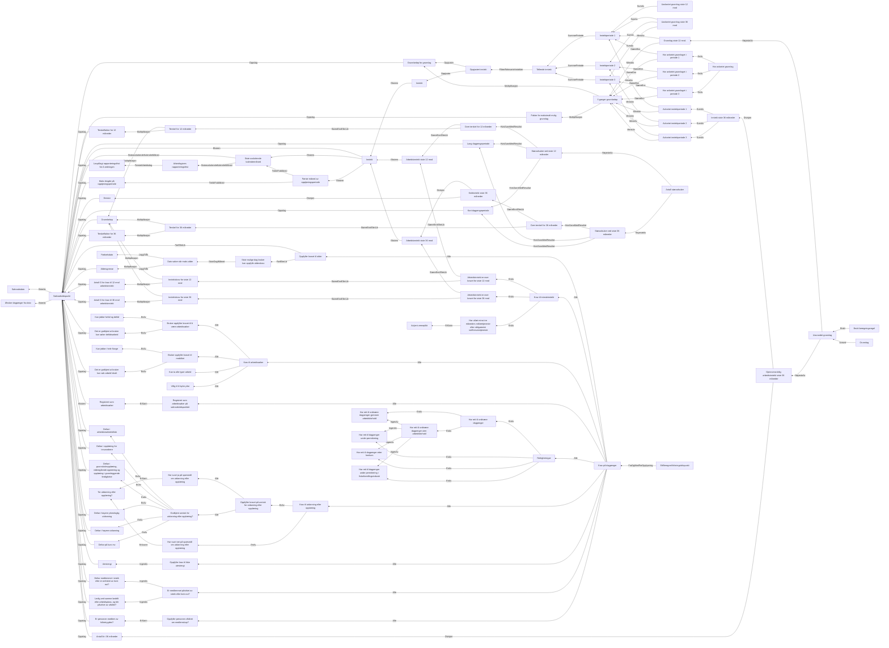

# Regeltre - Dagpenger (inngangsvilkår)

## Regeltre

```mermaid
graph RL
  A["Aldersgrense"] -->|"Oppslag"| B["Søknadstidspunkt"]
  C["Dato søker når maks alder"] -->|"LeggTilÅr"| D["Fødselsdato"]
  C["Dato søker når maks alder"] -->|"LeggTilÅr"| A["Aldersgrense"]
  E["Siste mulige dag bruker kan oppfylle alderskrav"] -->|"SisteDagIMåned"| C["Dato søker når maks alder"]
  F["Oppfyller kravet til alder"] -->|"FørEllerLik"| B["Søknadstidspunkt"]
  F["Oppfyller kravet til alder"] -->|"FørEllerLik"| E["Siste mulige dag bruker kan oppfylle alderskrav"]
  G["Antall år i 36 måneder"] -->|"Oppslag"| B["Søknadstidspunkt"]
  H["Faktor for maksimalt mulig grunnlag"] -->|"Oppslag"| B["Søknadstidspunkt"]
  I["6 ganger grunnbeløp"] -->|"Multiplikasjon"| J["Grunnbeløp for grunnlag"]
  I["6 ganger grunnbeløp"] -->|"Multiplikasjon"| H["Faktor for maksimalt mulig grunnlag"]
  K["Inntekt"] -->|"Ekstern"| L["Inntekt"]
  J["Grunnbeløp for grunnlag"] -->|"Oppslag"| B["Søknadstidspunkt"]
  M["Oppjustert inntekt"] -->|"Oppjuster"| J["Grunnbeløp for grunnlag"]
  M["Oppjustert inntekt"] -->|"Oppjuster"| K["Inntekt"]
  N["Tellende inntekt"] -->|"FiltrerRelevanteInntekter"| M["Oppjustert inntekt"]
  O["Inntektperiode 1"] -->|"SummerPeriode"| N["Tellende inntekt"]
  P["Inntektperiode 2"] -->|"SummerPeriode"| N["Tellende inntekt"]
  Q["Inntektperiode 3"] -->|"SummerPeriode"| N["Tellende inntekt"]
  R["Uavkortet grunnlag siste 12 mnd"] -->|"SumAv"| O["Inntektperiode 1"]
  S["Uavkortet grunnlag siste 36 mnd"] -->|"SumAv"| O["Inntektperiode 1"]
  S["Uavkortet grunnlag siste 36 mnd"] -->|"SumAv"| P["Inntektperiode 2"]
  S["Uavkortet grunnlag siste 36 mnd"] -->|"SumAv"| Q["Inntektperiode 3"]
  T["Avkortet inntektperiode 1"] -->|"MinstAv"| O["Inntektperiode 1"]
  T["Avkortet inntektperiode 1"] -->|"MinstAv"| I["6 ganger grunnbeløp"]
  U["Avkortet inntektperiode 2"] -->|"MinstAv"| P["Inntektperiode 2"]
  U["Avkortet inntektperiode 2"] -->|"MinstAv"| I["6 ganger grunnbeløp"]
  V["Avkortet inntektperiode 3"] -->|"MinstAv"| Q["Inntektperiode 3"]
  V["Avkortet inntektperiode 3"] -->|"MinstAv"| I["6 ganger grunnbeløp"]
  W["Grunnlag siste 12 mnd."] -->|"MinstAv"| O["Inntektperiode 1"]
  W["Grunnlag siste 12 mnd."] -->|"MinstAv"| I["6 ganger grunnbeløp"]
  X["Inntekt siste 36 måneder"] -->|"SumAv"| T["Avkortet inntektperiode 1"]
  X["Inntekt siste 36 måneder"] -->|"SumAv"| U["Avkortet inntektperiode 2"]
  X["Inntekt siste 36 måneder"] -->|"SumAv"| V["Avkortet inntektperiode 3"]
  Y["Gjennomsnittlig arbeidsinntekt siste 36 måneder"] -->|"Divisjon"| X["Inntekt siste 36 måneder"]
  Y["Gjennomsnittlig arbeidsinntekt siste 36 måneder"] -->|"Divisjon"| G["Antall år i 36 måneder"]
  Z["Uavrundet grunnlag"] -->|"HøyesteAv"| W["Grunnlag siste 12 mnd."]
  Z["Uavrundet grunnlag"] -->|"HøyesteAv"| Y["Gjennomsnittlig arbeidsinntekt siste 36 måneder"]
  AA["Brukt beregningsregel"] -->|"Brukt"| Z["Uavrundet grunnlag"]
  AB["Grunnlag"] -->|"Avrund"| Z["Uavrundet grunnlag"]
  AC["Har avkortet grunnlaget i periode 1"] -->|"StørreEnn"| O["Inntektperiode 1"]
  AC["Har avkortet grunnlaget i periode 1"] -->|"StørreEnn"| I["6 ganger grunnbeløp"]
  AD["Har avkortet grunnlaget i periode 2"] -->|"StørreEnn"| P["Inntektperiode 2"]
  AD["Har avkortet grunnlaget i periode 2"] -->|"StørreEnn"| I["6 ganger grunnbeløp"]
  AE["Har avkortet grunnlaget i periode 3"] -->|"StørreEnn"| Q["Inntektperiode 3"]
  AE["Har avkortet grunnlaget i periode 3"] -->|"StørreEnn"| I["6 ganger grunnbeløp"]
  AF["Har avkortet grunnlag"] -->|"EnAv"| AC["Har avkortet grunnlaget i periode 1"]
  AF["Har avkortet grunnlag"] -->|"EnAv"| AD["Har avkortet grunnlaget i periode 2"]
  AF["Har avkortet grunnlag"] -->|"EnAv"| AE["Har avkortet grunnlaget i periode 3"]
  AG["Kort dagpengeperiode"] -->|"Oppslag"| B["Søknadstidspunkt"]
  AH["Lang dagpengeperiode"] -->|"Oppslag"| B["Søknadstidspunkt"]
  AI["Terskelfaktor for 12 måneder"] -->|"Oppslag"| B["Søknadstidspunkt"]
  AJ["Terskelfaktor for 36 måneder"] -->|"Oppslag"| B["Søknadstidspunkt"]
  AK["Divisior"] -->|"Oppslag"| B["Søknadstidspunkt"]
  AL["Terskel for 12 måneder"] -->|"Multiplikasjon"| AM["Grunnbeløp"]
  AL["Terskel for 12 måneder"] -->|"Multiplikasjon"| AI["Terskelfaktor for 12 måneder"]
  AN["Terskel for 36 måneder"] -->|"Multiplikasjon"| AM["Grunnbeløp"]
  AN["Terskel for 36 måneder"] -->|"Multiplikasjon"| AJ["Terskelfaktor for 36 måneder"]
  AO["Snittinntekt siste 36 måneder"] -->|"Divisjon"| AP["Arbeidsinntekt siste 36 mnd"]
  AO["Snittinntekt siste 36 måneder"] -->|"Divisjon"| AK["Divisior"]
  AQ["Over terskel for 12 måneder"] -->|"StørreEnnEllerLik"| AR["Arbeidsinntekt siste 12 mnd"]
  AQ["Over terskel for 12 måneder"] -->|"StørreEnnEllerLik"| AL["Terskel for 12 måneder"]
  AS["Over terskel for 36 måneder"] -->|"StørreEnnEllerLik"| AO["Snittinntekt siste 36 måneder"]
  AS["Over terskel for 36 måneder"] -->|"StørreEnnEllerLik"| AN["Terskel for 36 måneder"]
  AT["Stønadsuker ved siste 12 måneder"] -->|"HvisSannMedResultat"| AQ["Over terskel for 12 måneder"]
  AT["Stønadsuker ved siste 12 måneder"] -->|"HvisSannMedResultat"| AH["Lang dagpengeperiode"]
  AT["Stønadsuker ved siste 12 måneder"] -->|"HvisSannMedResultat"| AG["Kort dagpengeperiode"]
  AU["Stønadsuker ved siste 36 måneder"] -->|"HvisSannMedResultat"| AS["Over terskel for 36 måneder"]
  AU["Stønadsuker ved siste 36 måneder"] -->|"HvisSannMedResultat"| AH["Lang dagpengeperiode"]
  AU["Stønadsuker ved siste 36 måneder"] -->|"HvisSannMedResultat"| AG["Kort dagpengeperiode"]
  AV["Antall stønadsuker"] -->|"HøyesteAv"| AT["Stønadsuker ved siste 12 måneder"]
  AV["Antall stønadsuker"] -->|"HøyesteAv"| AU["Stønadsuker ved siste 36 måneder"]
  AW["Krav på dagpenger"] -->|"Alle"| F["Oppfyller kravet til alder"]
  AW["Krav på dagpenger"] -->|"Alle"| AX["Krav til minsteinntekt"]
  AW["Krav på dagpenger"] -->|"Alle"| AY["Krav til arbeidssøker"]
  AW["Krav på dagpenger"] -->|"Alle"| AZ["Registrert som arbeidssøker på søknadstidspunktet"]
  AW["Krav på dagpenger"] -->|"Alle"| BA["Rettighetstype"]
  AW["Krav på dagpenger"] -->|"Alle"| BB["Krav til utdanning eller opplæring"]
  AW["Krav på dagpenger"] -->|"Alle"| BC["Oppfyller krav til ikke utestengt"]
  AW["Krav på dagpenger"] -->|"Alle"| BD["Er medlemmet påvirket av streik eller lock-out?"]
  AW["Krav på dagpenger"] -->|"Alle"| BE["Oppfyller personen vilkåret om medlemskap?"]
  BF["Er personen medlem av folketrygden?"] -->|"Oppslag"| B["Søknadstidspunkt"]
  BE["Oppfyller personen vilkåret om medlemskap?"] -->|"ErSann"| BF["Er personen medlem av folketrygden?"]
  BG["Registrert som arbeidssøker"] -->|"Ekstern"| B["Søknadstidspunkt"]
  AZ["Registrert som arbeidssøker på søknadstidspunktet"] -->|"ErSann"| BG["Registrert som arbeidssøker"]
  BH["Maks lengde på opptjeningsperiode"] -->|"Oppslag"| B["Søknadstidspunkt"]
  BI["Første måned av opptjeningsperiode"] -->|"TrekkFraMåned"| BJ["Siste avsluttende kalendermåned"]
  BI["Første måned av opptjeningsperiode"] -->|"TrekkFraMåned"| BH["Maks lengde på opptjeningsperiode"]
  L["Inntekt"] -->|"Ekstern"| B["Søknadstidspunkt"]
  L["Inntekt"] -->|"Ekstern"| BJ["Siste avsluttende kalendermåned"]
  L["Inntekt"] -->|"Ekstern"| BI["Første måned av opptjeningsperiode"]
  AM["Grunnbeløp"] -->|"Oppslag"| B["Søknadstidspunkt"]
  AR["Arbeidsinntekt siste 12 mnd"] -->|"Ekstern"| L["Inntekt"]
  BK["Antall G for krav til 12 mnd arbeidsinntekt"] -->|"Oppslag"| B["Søknadstidspunkt"]
  BL["Inntektskrav for siste 12 mnd"] -->|"Multiplikasjon"| AM["Grunnbeløp"]
  BL["Inntektskrav for siste 12 mnd"] -->|"Multiplikasjon"| BK["Antall G for krav til 12 mnd arbeidsinntekt"]
  BM["Arbeidsinntekt er over kravet for siste 12 mnd"] -->|"StørreEnnEllerLik"| AR["Arbeidsinntekt siste 12 mnd"]
  BM["Arbeidsinntekt er over kravet for siste 12 mnd"] -->|"StørreEnnEllerLik"| BL["Inntektskrav for siste 12 mnd"]
  AP["Arbeidsinntekt siste 36 mnd"] -->|"Ekstern"| L["Inntekt"]
  BN["Antall G for krav til 36 mnd arbeidsinntekt"] -->|"Oppslag"| B["Søknadstidspunkt"]
  BO["Inntektskrav for siste 36 mnd"] -->|"Multiplikasjon"| AM["Grunnbeløp"]
  BO["Inntektskrav for siste 36 mnd"] -->|"Multiplikasjon"| BN["Antall G for krav til 36 mnd arbeidsinntekt"]
  BP["Arbeidsinntekt er over kravet for siste 36 mnd"] -->|"StørreEnnEllerLik"| AP["Arbeidsinntekt siste 36 mnd"]
  BP["Arbeidsinntekt er over kravet for siste 36 mnd"] -->|"StørreEnnEllerLik"| BO["Inntektskrav for siste 36 mnd"]
  AX["Krav til minsteinntekt"] -->|"EnAv"| BM["Arbeidsinntekt er over kravet for siste 12 mnd"]
  AX["Krav til minsteinntekt"] -->|"EnAv"| BP["Arbeidsinntekt er over kravet for siste 36 mnd"]
  AX["Krav til minsteinntekt"] -->|"EnAv"| BQ["Har utført minst tre måneders militærtjeneste eller obligatorisk sivilforsvarstjeneste"]
  BR["Lovpålagt rapporteringsfrist for A-ordningen"] -->|"Oppslag"| B["Søknadstidspunkt"]
  BS["Arbeidsgivers rapporteringsfrist"] -->|"FørsteArbeidsdag"| BR["Lovpålagt rapporteringsfrist for A-ordningen"]
  BJ["Siste avsluttende kalendermåned"] -->|"SisteavsluttendeKalenderMåned"| B["Søknadstidspunkt"]
  BJ["Siste avsluttende kalendermåned"] -->|"SisteavsluttendeKalenderMåned"| BS["Arbeidsgivers rapporteringsfrist"]
  BT["Det er godkjent at bruker kun søk arbeid lokalt"] -->|"Oppslag"| B["Søknadstidspunkt"]
  BU["Det er godkjent at bruker kun søker deltidsarbeid"] -->|"Oppslag"| B["Søknadstidspunkt"]
  BV["Bruker oppfyller kravet til mobilitet"] -->|"EnAv"| BW["Kan jobbe i hele Norge"]
  BV["Bruker oppfyller kravet til mobilitet"] -->|"EnAv"| BT["Det er godkjent at bruker kun søk arbeid lokalt"]
  BX["Bruker oppfyller kravet til å være arbeidssøker"] -->|"EnAv"| BY["Kan jobbe heltid og deltid"]
  BX["Bruker oppfyller kravet til å være arbeidssøker"] -->|"EnAv"| BU["Det er godkjent at bruker kun søker deltidsarbeid"]
  AY["Krav til arbeidssøker"] -->|"Alle"| BX["Bruker oppfyller kravet til å være arbeidssøker"]
  AY["Krav til arbeidssøker"] -->|"Alle"| BV["Bruker oppfyller kravet til mobilitet"]
  AY["Krav til arbeidssøker"] -->|"Alle"| BZ["Kan ta alle typer arbeid"]
  AY["Krav til arbeidssøker"] -->|"Alle"| CA["Villig til å bytte yrke"]
  CB["Har rett til ordinære dagpenger uten arbeidsforhold"] -->|"IngenAv"| CC["Har rett til ordinære dagpenger gjennom arbeidsforhold"]
  CB["Har rett til ordinære dagpenger uten arbeidsforhold"] -->|"IngenAv"| CD["Har rett til dagpenger under permittering"]
  CB["Har rett til ordinære dagpenger uten arbeidsforhold"] -->|"IngenAv"| CE["Har rett til dagpenger etter konkurs"]
  CB["Har rett til ordinære dagpenger uten arbeidsforhold"] -->|"IngenAv"| CF["Har rett til dagpenger under permittering i fiskeforedlingsindustri"]
  CG["Har rett til ordinære dagpenger"] -->|"EnAv"| CC["Har rett til ordinære dagpenger gjennom arbeidsforhold"]
  CG["Har rett til ordinære dagpenger"] -->|"EnAv"| CB["Har rett til ordinære dagpenger uten arbeidsforhold"]
  BA["Rettighetstype"] -->|"EnAv"| CG["Har rett til ordinære dagpenger"]
  BA["Rettighetstype"] -->|"EnAv"| CD["Har rett til dagpenger under permittering"]
  BA["Rettighetstype"] -->|"EnAv"| CE["Har rett til dagpenger etter konkurs"]
  BA["Rettighetstype"] -->|"EnAv"| CF["Har rett til dagpenger under permittering i fiskeforedlingsindustri"]
  CH["Deltar medlemmet i streik eller er omfattet av lock-out?"] -->|"Oppslag"| B["Søknadstidspunkt"]
  CI["Ledig ved samme bedrift eller arbeidsplass, og blir påvirket av utfallet?"] -->|"Oppslag"| B["Søknadstidspunkt"]
  BD["Er medlemmet påvirket av streik eller lock-out?"] -->|"IngenAv"| CH["Deltar medlemmet i streik eller er omfattet av lock-out?"]
  BD["Er medlemmet påvirket av streik eller lock-out?"] -->|"IngenAv"| CI["Ledig ved samme bedrift eller arbeidsplass, og blir påvirket av utfallet?"]
  B["Søknadstidspunkt"] -->|"SisteAv"| CJ["Søknadsdato"]
  B["Søknadstidspunkt"] -->|"SisteAv"| CK["Ønsker dagpenger fra dato"]
  CL["Deltar i arbeidsmarkedstiltak"] -->|"Oppslag"| B["Søknadstidspunkt"]
  CM["Deltar i opplæring for innvandrere"] -->|"Oppslag"| B["Søknadstidspunkt"]
  CN["Deltar i grunnskoleopplæring, videregående opplæring og opplæring i grunnleggende ferdigheter"] -->|"Oppslag"| B["Søknadstidspunkt"]
  CO["Deltar i høyere yrkesfaglig utdanning"] -->|"Oppslag"| B["Søknadstidspunkt"]
  CP["Deltar i høyere utdanning"] -->|"Oppslag"| B["Søknadstidspunkt"]
  CQ["Deltar på kurs mv"] -->|"Oppslag"| B["Søknadstidspunkt"]
  CR["Godkjent unntak for utdanning eller opplæring?"] -->|"EnAv"| CL["Deltar i arbeidsmarkedstiltak"]
  CR["Godkjent unntak for utdanning eller opplæring?"] -->|"EnAv"| CM["Deltar i opplæring for innvandrere"]
  CR["Godkjent unntak for utdanning eller opplæring?"] -->|"EnAv"| CN["Deltar i grunnskoleopplæring, videregående opplæring og opplæring i grunnleggende ferdigheter"]
  CR["Godkjent unntak for utdanning eller opplæring?"] -->|"EnAv"| CO["Deltar i høyere yrkesfaglig utdanning"]
  CR["Godkjent unntak for utdanning eller opplæring?"] -->|"EnAv"| CP["Deltar i høyere utdanning"]
  CR["Godkjent unntak for utdanning eller opplæring?"] -->|"EnAv"| CQ["Deltar på kurs mv"]
  CS["Har svart ja på spørsmål om utdanning eller opplæring"] -->|"ErSann"| CT["Tar utdanning eller opplæring?"]
  CU["Har svart nei på spørsmål om utdanning eller opplæring"] -->|"ErUsann"| CT["Tar utdanning eller opplæring?"]
  CV["Oppfyller kravet på unntak for utdanning eller opplæring"] -->|"Alle"| CS["Har svart ja på spørsmål om utdanning eller opplæring"]
  CV["Oppfyller kravet på unntak for utdanning eller opplæring"] -->|"Alle"| CR["Godkjent unntak for utdanning eller opplæring?"]
  BB["Krav til utdanning eller opplæring"] -->|"EnAv"| CV["Oppfyller kravet på unntak for utdanning eller opplæring"]
  BB["Krav til utdanning eller opplæring"] -->|"EnAv"| CU["Har svart nei på spørsmål om utdanning eller opplæring"]
  CW["Utestengt"] -->|"Oppslag"| B["Søknadstidspunkt"]
  BC["Oppfyller krav til ikke utestengt"] -->|"IngenAv"| CW["Utestengt"]
  BQ["Har utført minst tre måneders militærtjeneste eller obligatorisk sivilforsvarstjeneste"] -->|"ErSann"| CX["Avtjent verneplikt"]
  CY["EttBeregnetVirkningstidspunkt"] -->|"FraOgMedForOpplysning"| AW["Krav på dagpenger"]
```