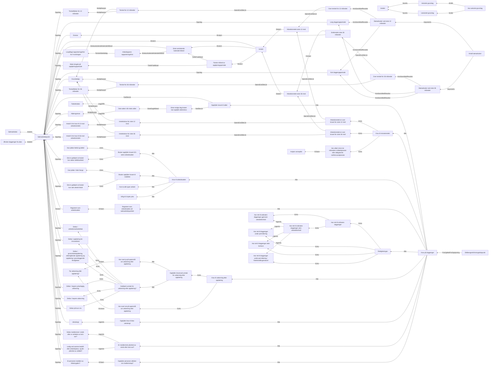

# Regeltre - Dagpenger (inngangsvilkår)

## Regeltre

```mermaid
graph RL
  A["Aldersgrense"] -->|"Oppslag"| B["Søknadstidspunkt"]
  C["Dato søker når maks alder"] -->|"LeggTilÅr"| D["Fødselsdato"]
  C["Dato søker når maks alder"] -->|"LeggTilÅr"| A["Aldersgrense"]
  E["Siste mulige dag bruker kan oppfylle alderskrav"] -->|"SisteDagIMåned"| C["Dato søker når maks alder"]
  F["Oppfyller kravet til alder"] -->|"FørEllerLik"| B["Søknadstidspunkt"]
  F["Oppfyller kravet til alder"] -->|"FørEllerLik"| E["Siste mulige dag bruker kan oppfylle alderskrav"]
  G["Avkortet grunnlag"] -->|"SumAv"| H["Inntekt"]
  I["Uavkortet grunnlag"] -->|"SumAv"| H["Inntekt"]
  J["Har avkortet grunnlag"] -->|"ErUlik"| G["Avkortet grunnlag"]
  J["Har avkortet grunnlag"] -->|"ErUlik"| I["Uavkortet grunnlag"]
  K["Kort dagpengeperiode"] -->|"Oppslag"| B["Søknadstidspunkt"]
  L["Lang dagpengeperiode"] -->|"Oppslag"| B["Søknadstidspunkt"]
  M["Terskelfaktor for 12 måneder"] -->|"Oppslag"| B["Søknadstidspunkt"]
  N["Terskelfaktor for 36 måneder"] -->|"Oppslag"| B["Søknadstidspunkt"]
  O["Divisior"] -->|"Oppslag"| B["Søknadstidspunkt"]
  P["Terskel for 12 måneder"] -->|"Multiplikasjon"| Q["Grunnbeløp"]
  P["Terskel for 12 måneder"] -->|"Multiplikasjon"| M["Terskelfaktor for 12 måneder"]
  R["Terskel for 36 måneder"] -->|"Multiplikasjon"| Q["Grunnbeløp"]
  R["Terskel for 36 måneder"] -->|"Multiplikasjon"| N["Terskelfaktor for 36 måneder"]
  S["Snittinntekt siste 36 måneder"] -->|"Divisjon"| T["Arbeidsinntekt siste 36 mnd"]
  S["Snittinntekt siste 36 måneder"] -->|"Divisjon"| O["Divisior"]
  U["Over terskel for 12 måneder"] -->|"StørreEnnEllerLik"| V["Arbeidsinntekt siste 12 mnd"]
  U["Over terskel for 12 måneder"] -->|"StørreEnnEllerLik"| P["Terskel for 12 måneder"]
  W["Over terskel for 36 måneder"] -->|"StørreEnnEllerLik"| S["Snittinntekt siste 36 måneder"]
  W["Over terskel for 36 måneder"] -->|"StørreEnnEllerLik"| R["Terskel for 36 måneder"]
  X["Stønadsuker ved siste 12 måneder"] -->|"HvisSannMedResultat"| U["Over terskel for 12 måneder"]
  X["Stønadsuker ved siste 12 måneder"] -->|"HvisSannMedResultat"| L["Lang dagpengeperiode"]
  X["Stønadsuker ved siste 12 måneder"] -->|"HvisSannMedResultat"| K["Kort dagpengeperiode"]
  Y["Stønadsuker ved siste 36 måneder"] -->|"HvisSannMedResultat"| W["Over terskel for 36 måneder"]
  Y["Stønadsuker ved siste 36 måneder"] -->|"HvisSannMedResultat"| L["Lang dagpengeperiode"]
  Y["Stønadsuker ved siste 36 måneder"] -->|"HvisSannMedResultat"| K["Kort dagpengeperiode"]
  Z["Antall stønadsuker"] -->|"HøyesteAv"| X["Stønadsuker ved siste 12 måneder"]
  Z["Antall stønadsuker"] -->|"HøyesteAv"| Y["Stønadsuker ved siste 36 måneder"]
  AA["Krav på dagpenger"] -->|"Alle"| F["Oppfyller kravet til alder"]
  AA["Krav på dagpenger"] -->|"Alle"| AB["Krav til minsteinntekt"]
  AA["Krav på dagpenger"] -->|"Alle"| AC["Krav til arbeidssøker"]
  AA["Krav på dagpenger"] -->|"Alle"| AD["Registrert som arbeidssøker på søknadstidspunktet"]
  AA["Krav på dagpenger"] -->|"Alle"| AE["Rettighetstype"]
  AA["Krav på dagpenger"] -->|"Alle"| AF["Krav til utdanning eller opplæring"]
  AA["Krav på dagpenger"] -->|"Alle"| AG["Oppfyller krav til ikke utestengt"]
  AA["Krav på dagpenger"] -->|"Alle"| AH["Er medlemmet påvirket av streik eller lock-out?"]
  AA["Krav på dagpenger"] -->|"Alle"| AI["Oppfyller personen vilkåret om medlemskap?"]
  AJ["Er personen medlem av folketrygden?"] -->|"Oppslag"| B["Søknadstidspunkt"]
  AI["Oppfyller personen vilkåret om medlemskap?"] -->|"ErSann"| AJ["Er personen medlem av folketrygden?"]
  AK["Registrert som arbeidssøker"] -->|"Ekstern"| B["Søknadstidspunkt"]
  AD["Registrert som arbeidssøker på søknadstidspunktet"] -->|"ErSann"| AK["Registrert som arbeidssøker"]
  AL["Maks lengde på opptjeningsperiode"] -->|"Oppslag"| B["Søknadstidspunkt"]
  AM["Første måned av opptjeningsperiode"] -->|"TrekkFraMåned"| AN["Siste avsluttende kalendermåned"]
  AM["Første måned av opptjeningsperiode"] -->|"TrekkFraMåned"| AL["Maks lengde på opptjeningsperiode"]
  AO["Inntekt"] -->|"Ekstern"| B["Søknadstidspunkt"]
  AO["Inntekt"] -->|"Ekstern"| AN["Siste avsluttende kalendermåned"]
  AO["Inntekt"] -->|"Ekstern"| AM["Første måned av opptjeningsperiode"]
  Q["Grunnbeløp"] -->|"Oppslag"| B["Søknadstidspunkt"]
  V["Arbeidsinntekt siste 12 mnd"] -->|"Ekstern"| AO["Inntekt"]
  AP["Antall G for krav til 12 mnd arbeidsinntekt"] -->|"Oppslag"| B["Søknadstidspunkt"]
  AQ["Inntektskrav for siste 12 mnd"] -->|"Multiplikasjon"| Q["Grunnbeløp"]
  AQ["Inntektskrav for siste 12 mnd"] -->|"Multiplikasjon"| AP["Antall G for krav til 12 mnd arbeidsinntekt"]
  AR["Arbeidsinntekt er over kravet for siste 12 mnd"] -->|"StørreEnnEllerLik"| V["Arbeidsinntekt siste 12 mnd"]
  AR["Arbeidsinntekt er over kravet for siste 12 mnd"] -->|"StørreEnnEllerLik"| AQ["Inntektskrav for siste 12 mnd"]
  T["Arbeidsinntekt siste 36 mnd"] -->|"Ekstern"| AO["Inntekt"]
  AS["Antall G for krav til 36 mnd arbeidsinntekt"] -->|"Oppslag"| B["Søknadstidspunkt"]
  AT["Inntektskrav for siste 36 mnd"] -->|"Multiplikasjon"| Q["Grunnbeløp"]
  AT["Inntektskrav for siste 36 mnd"] -->|"Multiplikasjon"| AS["Antall G for krav til 36 mnd arbeidsinntekt"]
  AU["Arbeidsinntekt er over kravet for siste 36 mnd"] -->|"StørreEnnEllerLik"| T["Arbeidsinntekt siste 36 mnd"]
  AU["Arbeidsinntekt er over kravet for siste 36 mnd"] -->|"StørreEnnEllerLik"| AT["Inntektskrav for siste 36 mnd"]
  AB["Krav til minsteinntekt"] -->|"EnAv"| AR["Arbeidsinntekt er over kravet for siste 12 mnd"]
  AB["Krav til minsteinntekt"] -->|"EnAv"| AU["Arbeidsinntekt er over kravet for siste 36 mnd"]
  AB["Krav til minsteinntekt"] -->|"EnAv"| AV["Har utført minst tre måneders militærtjeneste eller obligatorisk sivilforsvarstjeneste"]
  AW["Lovpålagt rapporteringsfrist for A-ordningen"] -->|"Oppslag"| B["Søknadstidspunkt"]
  AX["Arbeidsgivers rapporteringsfrist"] -->|"FørsteArbeidsdag"| AW["Lovpålagt rapporteringsfrist for A-ordningen"]
  AN["Siste avsluttende kalendermåned"] -->|"SisteavsluttendeKalenderMåned"| B["Søknadstidspunkt"]
  AN["Siste avsluttende kalendermåned"] -->|"SisteavsluttendeKalenderMåned"| AX["Arbeidsgivers rapporteringsfrist"]
  AY["Det er godkjent at bruker kun søk arbeid lokalt"] -->|"Oppslag"| B["Søknadstidspunkt"]
  AZ["Det er godkjent at bruker kun søker deltidsarbeid"] -->|"Oppslag"| B["Søknadstidspunkt"]
  BA["Bruker oppfyller kravet til mobilitet"] -->|"EnAv"| BB["Kan jobbe i hele Norge"]
  BA["Bruker oppfyller kravet til mobilitet"] -->|"EnAv"| AY["Det er godkjent at bruker kun søk arbeid lokalt"]
  BC["Bruker oppfyller kravet til å være arbeidssøker"] -->|"EnAv"| BD["Kan jobbe heltid og deltid"]
  BC["Bruker oppfyller kravet til å være arbeidssøker"] -->|"EnAv"| AZ["Det er godkjent at bruker kun søker deltidsarbeid"]
  AC["Krav til arbeidssøker"] -->|"Alle"| BC["Bruker oppfyller kravet til å være arbeidssøker"]
  AC["Krav til arbeidssøker"] -->|"Alle"| BA["Bruker oppfyller kravet til mobilitet"]
  AC["Krav til arbeidssøker"] -->|"Alle"| BE["Kan ta alle typer arbeid"]
  AC["Krav til arbeidssøker"] -->|"Alle"| BF["Villig til å bytte yrke"]
  BG["Har rett til ordinære dagpenger uten arbeidsforhold"] -->|"IngenAv"| BH["Har rett til ordinære dagpenger gjennom arbeidsforhold"]
  BG["Har rett til ordinære dagpenger uten arbeidsforhold"] -->|"IngenAv"| BI["Har rett til dagpenger under permittering"]
  BG["Har rett til ordinære dagpenger uten arbeidsforhold"] -->|"IngenAv"| BJ["Har rett til dagpenger etter konkurs"]
  BG["Har rett til ordinære dagpenger uten arbeidsforhold"] -->|"IngenAv"| BK["Har rett til dagpenger under permittering i fiskeforedlingsindustri"]
  BL["Har rett til ordinære dagpenger"] -->|"EnAv"| BH["Har rett til ordinære dagpenger gjennom arbeidsforhold"]
  BL["Har rett til ordinære dagpenger"] -->|"EnAv"| BG["Har rett til ordinære dagpenger uten arbeidsforhold"]
  AE["Rettighetstype"] -->|"EnAv"| BL["Har rett til ordinære dagpenger"]
  AE["Rettighetstype"] -->|"EnAv"| BI["Har rett til dagpenger under permittering"]
  AE["Rettighetstype"] -->|"EnAv"| BJ["Har rett til dagpenger etter konkurs"]
  AE["Rettighetstype"] -->|"EnAv"| BK["Har rett til dagpenger under permittering i fiskeforedlingsindustri"]
  BM["Deltar medlemmet i streik eller er omfattet av lock-out?"] -->|"Oppslag"| B["Søknadstidspunkt"]
  BN["Ledig ved samme bedrift eller arbeidsplass, og blir påvirket av utfallet?"] -->|"Oppslag"| B["Søknadstidspunkt"]
  AH["Er medlemmet påvirket av streik eller lock-out?"] -->|"IngenAv"| BM["Deltar medlemmet i streik eller er omfattet av lock-out?"]
  AH["Er medlemmet påvirket av streik eller lock-out?"] -->|"IngenAv"| BN["Ledig ved samme bedrift eller arbeidsplass, og blir påvirket av utfallet?"]
  B["Søknadstidspunkt"] -->|"SisteAv"| BO["Søknadsdato"]
  B["Søknadstidspunkt"] -->|"SisteAv"| BP["Ønsker dagpenger fra dato"]
  BQ["Deltar i arbeidsmarkedstiltak"] -->|"Oppslag"| B["Søknadstidspunkt"]
  BR["Deltar i opplæring for innvandrere"] -->|"Oppslag"| B["Søknadstidspunkt"]
  BS["Deltar i grunnskoleopplæring, videregående opplæring og opplæring i grunnleggende ferdigheter"] -->|"Oppslag"| B["Søknadstidspunkt"]
  BT["Deltar i høyere yrkesfaglig utdanning"] -->|"Oppslag"| B["Søknadstidspunkt"]
  BU["Deltar i høyere utdanning"] -->|"Oppslag"| B["Søknadstidspunkt"]
  BV["Deltar på kurs mv"] -->|"Oppslag"| B["Søknadstidspunkt"]
  BW["Godkjent unntak for utdanning eller opplæring?"] -->|"EnAv"| BQ["Deltar i arbeidsmarkedstiltak"]
  BW["Godkjent unntak for utdanning eller opplæring?"] -->|"EnAv"| BR["Deltar i opplæring for innvandrere"]
  BW["Godkjent unntak for utdanning eller opplæring?"] -->|"EnAv"| BS["Deltar i grunnskoleopplæring, videregående opplæring og opplæring i grunnleggende ferdigheter"]
  BW["Godkjent unntak for utdanning eller opplæring?"] -->|"EnAv"| BT["Deltar i høyere yrkesfaglig utdanning"]
  BW["Godkjent unntak for utdanning eller opplæring?"] -->|"EnAv"| BU["Deltar i høyere utdanning"]
  BW["Godkjent unntak for utdanning eller opplæring?"] -->|"EnAv"| BV["Deltar på kurs mv"]
  BX["Har svart ja på spørsmål om utdanning eller opplæring"] -->|"ErSann"| BY["Tar utdanning eller opplæring?"]
  BZ["Har svart nei på spørsmål om utdanning eller opplæring"] -->|"ErUsann"| BY["Tar utdanning eller opplæring?"]
  CA["Oppfyller kravet på unntak for utdanning eller opplæring"] -->|"Alle"| BX["Har svart ja på spørsmål om utdanning eller opplæring"]
  CA["Oppfyller kravet på unntak for utdanning eller opplæring"] -->|"Alle"| BW["Godkjent unntak for utdanning eller opplæring?"]
  AF["Krav til utdanning eller opplæring"] -->|"EnAv"| CA["Oppfyller kravet på unntak for utdanning eller opplæring"]
  AF["Krav til utdanning eller opplæring"] -->|"EnAv"| BZ["Har svart nei på spørsmål om utdanning eller opplæring"]
  CB["Utestengt"] -->|"Oppslag"| B["Søknadstidspunkt"]
  AG["Oppfyller krav til ikke utestengt"] -->|"IngenAv"| CB["Utestengt"]
  AV["Har utført minst tre måneders militærtjeneste eller obligatorisk sivilforsvarstjeneste"] -->|"ErSann"| CC["Avtjent verneplikt"]
  CD["EttBeregnetVirkningstidspunkt"] -->|"FraOgMedForOpplysning"| AA["Krav på dagpenger"]
```