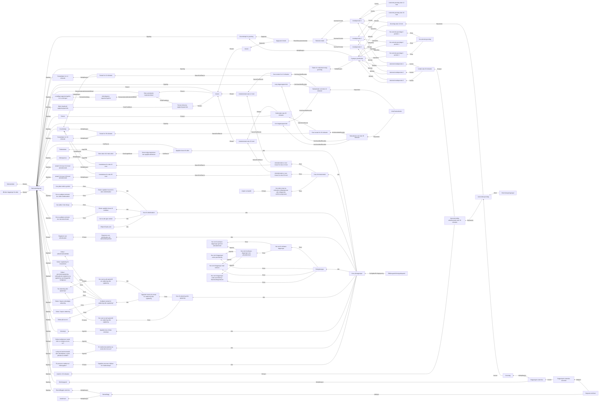

# Regeltre - Dagpenger (inngangsvilkår)

## Regeltre

```mermaid
graph RL
  A["Aldersgrense"] -->|"Oppslag"| B["Søknadstidspunkt"]
  C["Dato søker når maks alder"] -->|"LeggTilÅr"| D["Fødselsdato"]
  C["Dato søker når maks alder"] -->|"LeggTilÅr"| A["Aldersgrense"]
  E["Siste mulige dag bruker kan oppfylle alderskrav"] -->|"SisteDagIMåned"| C["Dato søker når maks alder"]
  F["Oppfyller kravet til alder"] -->|"FørEllerLik"| B["Søknadstidspunkt"]
  F["Oppfyller kravet til alder"] -->|"FørEllerLik"| E["Siste mulige dag bruker kan oppfylle alderskrav"]
  G["Antall år i 36 måneder"] -->|"Oppslag"| B["Søknadstidspunkt"]
  H["Faktor for maksimalt mulig grunnlag"] -->|"Oppslag"| B["Søknadstidspunkt"]
  I["6 ganger grunnbeløp"] -->|"Multiplikasjon"| J["Grunnbeløp for grunnlag"]
  I["6 ganger grunnbeløp"] -->|"Multiplikasjon"| H["Faktor for maksimalt mulig grunnlag"]
  K["Inntekt"] -->|"Ekstern"| L["Inntekt"]
  J["Grunnbeløp for grunnlag"] -->|"Oppslag"| B["Søknadstidspunkt"]
  M["Oppjustert inntekt"] -->|"Oppjuster"| J["Grunnbeløp for grunnlag"]
  M["Oppjustert inntekt"] -->|"Oppjuster"| K["Inntekt"]
  N["Tellende inntekt"] -->|"FiltrerRelevanteInntekter"| M["Oppjustert inntekt"]
  O["Inntektperiode 1"] -->|"SummerPeriode"| N["Tellende inntekt"]
  P["Inntektperiode 2"] -->|"SummerPeriode"| N["Tellende inntekt"]
  Q["Inntektperiode 3"] -->|"SummerPeriode"| N["Tellende inntekt"]
  R["Uavkortet grunnlag siste 12 mnd"] -->|"SumAv"| O["Inntektperiode 1"]
  S["Uavkortet grunnlag siste 36 mnd"] -->|"SumAv"| O["Inntektperiode 1"]
  S["Uavkortet grunnlag siste 36 mnd"] -->|"SumAv"| P["Inntektperiode 2"]
  S["Uavkortet grunnlag siste 36 mnd"] -->|"SumAv"| Q["Inntektperiode 3"]
  T["Avkortet inntektperiode 1"] -->|"MinstAv"| O["Inntektperiode 1"]
  T["Avkortet inntektperiode 1"] -->|"MinstAv"| I["6 ganger grunnbeløp"]
  U["Avkortet inntektperiode 2"] -->|"MinstAv"| P["Inntektperiode 2"]
  U["Avkortet inntektperiode 2"] -->|"MinstAv"| I["6 ganger grunnbeløp"]
  V["Avkortet inntektperiode 3"] -->|"MinstAv"| Q["Inntektperiode 3"]
  V["Avkortet inntektperiode 3"] -->|"MinstAv"| I["6 ganger grunnbeløp"]
  W["Grunnlag siste 12 mnd."] -->|"MinstAv"| O["Inntektperiode 1"]
  W["Grunnlag siste 12 mnd."] -->|"MinstAv"| I["6 ganger grunnbeløp"]
  X["Inntekt siste 36 måneder"] -->|"SumAv"| T["Avkortet inntektperiode 1"]
  X["Inntekt siste 36 måneder"] -->|"SumAv"| U["Avkortet inntektperiode 2"]
  X["Inntekt siste 36 måneder"] -->|"SumAv"| V["Avkortet inntektperiode 3"]
  Y["Gjennomsnittlig arbeidsinntekt siste 36 måneder"] -->|"Divisjon"| X["Inntekt siste 36 måneder"]
  Y["Gjennomsnittlig arbeidsinntekt siste 36 måneder"] -->|"Divisjon"| G["Antall år i 36 måneder"]
  Z["Uavrundet grunnlag"] -->|"HøyesteAv"| W["Grunnlag siste 12 mnd."]
  Z["Uavrundet grunnlag"] -->|"HøyesteAv"| Y["Gjennomsnittlig arbeidsinntekt siste 36 måneder"]
  AA["Brukt beregningsregel"] -->|"Brukt"| Z["Uavrundet grunnlag"]
  AB["Grunnlag"] -->|"Avrund"| Z["Uavrundet grunnlag"]
  AC["Har avkortet grunnlaget i periode 1"] -->|"StørreEnn"| O["Inntektperiode 1"]
  AC["Har avkortet grunnlaget i periode 1"] -->|"StørreEnn"| I["6 ganger grunnbeløp"]
  AD["Har avkortet grunnlaget i periode 2"] -->|"StørreEnn"| P["Inntektperiode 2"]
  AD["Har avkortet grunnlaget i periode 2"] -->|"StørreEnn"| I["6 ganger grunnbeløp"]
  AE["Har avkortet grunnlaget i periode 3"] -->|"StørreEnn"| Q["Inntektperiode 3"]
  AE["Har avkortet grunnlaget i periode 3"] -->|"StørreEnn"| I["6 ganger grunnbeløp"]
  AF["Har avkortet grunnlag"] -->|"EnAv"| AC["Har avkortet grunnlaget i periode 1"]
  AF["Har avkortet grunnlag"] -->|"EnAv"| AD["Har avkortet grunnlaget i periode 2"]
  AF["Har avkortet grunnlag"] -->|"EnAv"| AE["Har avkortet grunnlaget i periode 3"]
  AG["Barnetilleggets størrelse"] -->|"Oppslag"| B["Søknadstidspunkt"]
  AH["Dekningsgrad"] -->|"Oppslag"| B["Søknadstidspunkt"]
  AI["Dagpengens størrelse"] -->|"Multiplikasjon"| AB["Grunnlag"]
  AI["Dagpengens størrelse"] -->|"Multiplikasjon"| AH["Dekningsgrad"]
  AJ["Dagpengens størrelse avrundet"] -->|"Avrund"| AI["Dagpengens størrelse"]
  AK["Barnetillegg"] -->|"Multiplikasjon"| AG["Barnetilleggets størrelse"]
  AK["Barnetillegg"] -->|"Multiplikasjon"| AL["Antall barn"]
  AM["Dagsats med barn"] -->|"Addisjon"| AJ["Dagpengens størrelse avrundet"]
  AM["Dagsats med barn"] -->|"Addisjon"| AK["Barnetillegg"]
  AN["Kort dagpengeperiode"] -->|"Oppslag"| B["Søknadstidspunkt"]
  AO["Lang dagpengeperiode"] -->|"Oppslag"| B["Søknadstidspunkt"]
  AP["Terskelfaktor for 12 måneder"] -->|"Oppslag"| B["Søknadstidspunkt"]
  AQ["Terskelfaktor for 36 måneder"] -->|"Oppslag"| B["Søknadstidspunkt"]
  AR["Divisior"] -->|"Oppslag"| B["Søknadstidspunkt"]
  AS["Terskel for 12 måneder"] -->|"Multiplikasjon"| AT["Grunnbeløp"]
  AS["Terskel for 12 måneder"] -->|"Multiplikasjon"| AP["Terskelfaktor for 12 måneder"]
  AU["Terskel for 36 måneder"] -->|"Multiplikasjon"| AT["Grunnbeløp"]
  AU["Terskel for 36 måneder"] -->|"Multiplikasjon"| AQ["Terskelfaktor for 36 måneder"]
  AV["Snittinntekt siste 36 måneder"] -->|"Divisjon"| AW["Arbeidsinntekt siste 36 mnd"]
  AV["Snittinntekt siste 36 måneder"] -->|"Divisjon"| AR["Divisior"]
  AX["Over terskel for 12 måneder"] -->|"StørreEnnEllerLik"| AY["Arbeidsinntekt siste 12 mnd"]
  AX["Over terskel for 12 måneder"] -->|"StørreEnnEllerLik"| AS["Terskel for 12 måneder"]
  AZ["Over terskel for 36 måneder"] -->|"StørreEnnEllerLik"| AV["Snittinntekt siste 36 måneder"]
  AZ["Over terskel for 36 måneder"] -->|"StørreEnnEllerLik"| AU["Terskel for 36 måneder"]
  BA["Stønadsuker ved siste 12 måneder"] -->|"HvisSannMedResultat"| AX["Over terskel for 12 måneder"]
  BA["Stønadsuker ved siste 12 måneder"] -->|"HvisSannMedResultat"| AO["Lang dagpengeperiode"]
  BA["Stønadsuker ved siste 12 måneder"] -->|"HvisSannMedResultat"| AN["Kort dagpengeperiode"]
  BB["Stønadsuker ved siste 36 måneder"] -->|"HvisSannMedResultat"| AZ["Over terskel for 36 måneder"]
  BB["Stønadsuker ved siste 36 måneder"] -->|"HvisSannMedResultat"| AO["Lang dagpengeperiode"]
  BB["Stønadsuker ved siste 36 måneder"] -->|"HvisSannMedResultat"| AN["Kort dagpengeperiode"]
  BC["Antall stønadsuker"] -->|"HøyesteAv"| BA["Stønadsuker ved siste 12 måneder"]
  BC["Antall stønadsuker"] -->|"HøyesteAv"| BB["Stønadsuker ved siste 36 måneder"]
  BD["Krav på dagpenger"] -->|"Alle"| F["Oppfyller kravet til alder"]
  BD["Krav på dagpenger"] -->|"Alle"| BE["Krav til minsteinntekt"]
  BD["Krav på dagpenger"] -->|"Alle"| BF["Krav til arbeidssøker"]
  BD["Krav på dagpenger"] -->|"Alle"| BG["Registrert som arbeidssøker på søknadstidspunktet"]
  BD["Krav på dagpenger"] -->|"Alle"| BH["Rettighetstype"]
  BD["Krav på dagpenger"] -->|"Alle"| BI["Krav til utdanning eller opplæring"]
  BD["Krav på dagpenger"] -->|"Alle"| BJ["Oppfyller krav til ikke utestengt"]
  BD["Krav på dagpenger"] -->|"Alle"| BK["Er medlemmet påvirket av streik eller lock-out?"]
  BD["Krav på dagpenger"] -->|"Alle"| BL["Oppfyller personen vilkåret om medlemskap?"]
  BM["Er personen medlem av folketrygden?"] -->|"Oppslag"| B["Søknadstidspunkt"]
  BL["Oppfyller personen vilkåret om medlemskap?"] -->|"ErSann"| BM["Er personen medlem av folketrygden?"]
  BN["Registrert som arbeidssøker"] -->|"Ekstern"| B["Søknadstidspunkt"]
  BG["Registrert som arbeidssøker på søknadstidspunktet"] -->|"ErSann"| BN["Registrert som arbeidssøker"]
  BO["Maks lengde på opptjeningsperiode"] -->|"Oppslag"| B["Søknadstidspunkt"]
  BP["Første måned av opptjeningsperiode"] -->|"TrekkFraMåned"| BQ["Siste avsluttende kalendermåned"]
  BP["Første måned av opptjeningsperiode"] -->|"TrekkFraMåned"| BO["Maks lengde på opptjeningsperiode"]
  L["Inntekt"] -->|"Ekstern"| B["Søknadstidspunkt"]
  L["Inntekt"] -->|"Ekstern"| BQ["Siste avsluttende kalendermåned"]
  L["Inntekt"] -->|"Ekstern"| BP["Første måned av opptjeningsperiode"]
  AT["Grunnbeløp"] -->|"Oppslag"| B["Søknadstidspunkt"]
  AY["Arbeidsinntekt siste 12 mnd"] -->|"Ekstern"| L["Inntekt"]
  BR["Antall G for krav til 12 mnd arbeidsinntekt"] -->|"Oppslag"| B["Søknadstidspunkt"]
  BS["Inntektskrav for siste 12 mnd"] -->|"Multiplikasjon"| AT["Grunnbeløp"]
  BS["Inntektskrav for siste 12 mnd"] -->|"Multiplikasjon"| BR["Antall G for krav til 12 mnd arbeidsinntekt"]
  BT["Arbeidsinntekt er over kravet for siste 12 mnd"] -->|"StørreEnnEllerLik"| AY["Arbeidsinntekt siste 12 mnd"]
  BT["Arbeidsinntekt er over kravet for siste 12 mnd"] -->|"StørreEnnEllerLik"| BS["Inntektskrav for siste 12 mnd"]
  AW["Arbeidsinntekt siste 36 mnd"] -->|"Ekstern"| L["Inntekt"]
  BU["Antall G for krav til 36 mnd arbeidsinntekt"] -->|"Oppslag"| B["Søknadstidspunkt"]
  BV["Inntektskrav for siste 36 mnd"] -->|"Multiplikasjon"| AT["Grunnbeløp"]
  BV["Inntektskrav for siste 36 mnd"] -->|"Multiplikasjon"| BU["Antall G for krav til 36 mnd arbeidsinntekt"]
  BW["Arbeidsinntekt er over kravet for siste 36 mnd"] -->|"StørreEnnEllerLik"| AW["Arbeidsinntekt siste 36 mnd"]
  BW["Arbeidsinntekt er over kravet for siste 36 mnd"] -->|"StørreEnnEllerLik"| BV["Inntektskrav for siste 36 mnd"]
  BE["Krav til minsteinntekt"] -->|"EnAv"| BT["Arbeidsinntekt er over kravet for siste 12 mnd"]
  BE["Krav til minsteinntekt"] -->|"EnAv"| BW["Arbeidsinntekt er over kravet for siste 36 mnd"]
  BE["Krav til minsteinntekt"] -->|"EnAv"| BX["Har utført minst tre måneders militærtjeneste eller obligatorisk sivilforsvarstjeneste"]
  BY["Lovpålagt rapporteringsfrist for A-ordningen"] -->|"Oppslag"| B["Søknadstidspunkt"]
  BZ["Arbeidsgivers rapporteringsfrist"] -->|"FørsteArbeidsdag"| BY["Lovpålagt rapporteringsfrist for A-ordningen"]
  BQ["Siste avsluttende kalendermåned"] -->|"SisteavsluttendeKalenderMåned"| B["Søknadstidspunkt"]
  BQ["Siste avsluttende kalendermåned"] -->|"SisteavsluttendeKalenderMåned"| BZ["Arbeidsgivers rapporteringsfrist"]
  CA["Det er godkjent at bruker kun søk arbeid lokalt"] -->|"Oppslag"| B["Søknadstidspunkt"]
  CB["Det er godkjent at bruker kun søker deltidsarbeid"] -->|"Oppslag"| B["Søknadstidspunkt"]
  CC["Bruker oppfyller kravet til mobilitet"] -->|"EnAv"| CD["Kan jobbe i hele Norge"]
  CC["Bruker oppfyller kravet til mobilitet"] -->|"EnAv"| CA["Det er godkjent at bruker kun søk arbeid lokalt"]
  CE["Bruker oppfyller kravet til å være arbeidssøker"] -->|"EnAv"| CF["Kan jobbe heltid og deltid"]
  CE["Bruker oppfyller kravet til å være arbeidssøker"] -->|"EnAv"| CB["Det er godkjent at bruker kun søker deltidsarbeid"]
  BF["Krav til arbeidssøker"] -->|"Alle"| CE["Bruker oppfyller kravet til å være arbeidssøker"]
  BF["Krav til arbeidssøker"] -->|"Alle"| CC["Bruker oppfyller kravet til mobilitet"]
  BF["Krav til arbeidssøker"] -->|"Alle"| CG["Kan ta alle typer arbeid"]
  BF["Krav til arbeidssøker"] -->|"Alle"| CH["Villig til å bytte yrke"]
  CI["Har rett til ordinære dagpenger uten arbeidsforhold"] -->|"IngenAv"| CJ["Har rett til ordinære dagpenger gjennom arbeidsforhold"]
  CI["Har rett til ordinære dagpenger uten arbeidsforhold"] -->|"IngenAv"| CK["Har rett til dagpenger under permittering"]
  CI["Har rett til ordinære dagpenger uten arbeidsforhold"] -->|"IngenAv"| CL["Har rett til dagpenger etter konkurs"]
  CI["Har rett til ordinære dagpenger uten arbeidsforhold"] -->|"IngenAv"| CM["Har rett til dagpenger under permittering i fiskeforedlingsindustri"]
  CN["Har rett til ordinære dagpenger"] -->|"EnAv"| CJ["Har rett til ordinære dagpenger gjennom arbeidsforhold"]
  CN["Har rett til ordinære dagpenger"] -->|"EnAv"| CI["Har rett til ordinære dagpenger uten arbeidsforhold"]
  BH["Rettighetstype"] -->|"EnAv"| CN["Har rett til ordinære dagpenger"]
  BH["Rettighetstype"] -->|"EnAv"| CK["Har rett til dagpenger under permittering"]
  BH["Rettighetstype"] -->|"EnAv"| CL["Har rett til dagpenger etter konkurs"]
  BH["Rettighetstype"] -->|"EnAv"| CM["Har rett til dagpenger under permittering i fiskeforedlingsindustri"]
  CO["Deltar medlemmet i streik eller er omfattet av lock-out?"] -->|"Oppslag"| B["Søknadstidspunkt"]
  CP["Ledig ved samme bedrift eller arbeidsplass, og blir påvirket av utfallet?"] -->|"Oppslag"| B["Søknadstidspunkt"]
  BK["Er medlemmet påvirket av streik eller lock-out?"] -->|"IngenAv"| CO["Deltar medlemmet i streik eller er omfattet av lock-out?"]
  BK["Er medlemmet påvirket av streik eller lock-out?"] -->|"IngenAv"| CP["Ledig ved samme bedrift eller arbeidsplass, og blir påvirket av utfallet?"]
  B["Søknadstidspunkt"] -->|"SisteAv"| CQ["Søknadsdato"]
  B["Søknadstidspunkt"] -->|"SisteAv"| CR["Ønsker dagpenger fra dato"]
  CS["Deltar i arbeidsmarkedstiltak"] -->|"Oppslag"| B["Søknadstidspunkt"]
  CT["Deltar i opplæring for innvandrere"] -->|"Oppslag"| B["Søknadstidspunkt"]
  CU["Deltar i grunnskoleopplæring, videregående opplæring og opplæring i grunnleggende ferdigheter"] -->|"Oppslag"| B["Søknadstidspunkt"]
  CV["Deltar i høyere yrkesfaglig utdanning"] -->|"Oppslag"| B["Søknadstidspunkt"]
  CW["Deltar i høyere utdanning"] -->|"Oppslag"| B["Søknadstidspunkt"]
  CX["Deltar på kurs mv"] -->|"Oppslag"| B["Søknadstidspunkt"]
  CY["Godkjent unntak for utdanning eller opplæring?"] -->|"EnAv"| CS["Deltar i arbeidsmarkedstiltak"]
  CY["Godkjent unntak for utdanning eller opplæring?"] -->|"EnAv"| CT["Deltar i opplæring for innvandrere"]
  CY["Godkjent unntak for utdanning eller opplæring?"] -->|"EnAv"| CU["Deltar i grunnskoleopplæring, videregående opplæring og opplæring i grunnleggende ferdigheter"]
  CY["Godkjent unntak for utdanning eller opplæring?"] -->|"EnAv"| CV["Deltar i høyere yrkesfaglig utdanning"]
  CY["Godkjent unntak for utdanning eller opplæring?"] -->|"EnAv"| CW["Deltar i høyere utdanning"]
  CY["Godkjent unntak for utdanning eller opplæring?"] -->|"EnAv"| CX["Deltar på kurs mv"]
  CZ["Har svart ja på spørsmål om utdanning eller opplæring"] -->|"ErSann"| DA["Tar utdanning eller opplæring?"]
  DB["Har svart nei på spørsmål om utdanning eller opplæring"] -->|"ErUsann"| DA["Tar utdanning eller opplæring?"]
  DC["Oppfyller kravet på unntak for utdanning eller opplæring"] -->|"Alle"| CZ["Har svart ja på spørsmål om utdanning eller opplæring"]
  DC["Oppfyller kravet på unntak for utdanning eller opplæring"] -->|"Alle"| CY["Godkjent unntak for utdanning eller opplæring?"]
  BI["Krav til utdanning eller opplæring"] -->|"EnAv"| DC["Oppfyller kravet på unntak for utdanning eller opplæring"]
  BI["Krav til utdanning eller opplæring"] -->|"EnAv"| DB["Har svart nei på spørsmål om utdanning eller opplæring"]
  DD["Utestengt"] -->|"Oppslag"| B["Søknadstidspunkt"]
  BJ["Oppfyller krav til ikke utestengt"] -->|"IngenAv"| DD["Utestengt"]
  BX["Har utført minst tre måneders militærtjeneste eller obligatorisk sivilforsvarstjeneste"] -->|"ErSann"| DE["Avtjent verneplikt"]
  DF["EttBeregnetVirkningstidspunkt"] -->|"FraOgMedForOpplysning"| BD["Krav på dagpenger"]
```