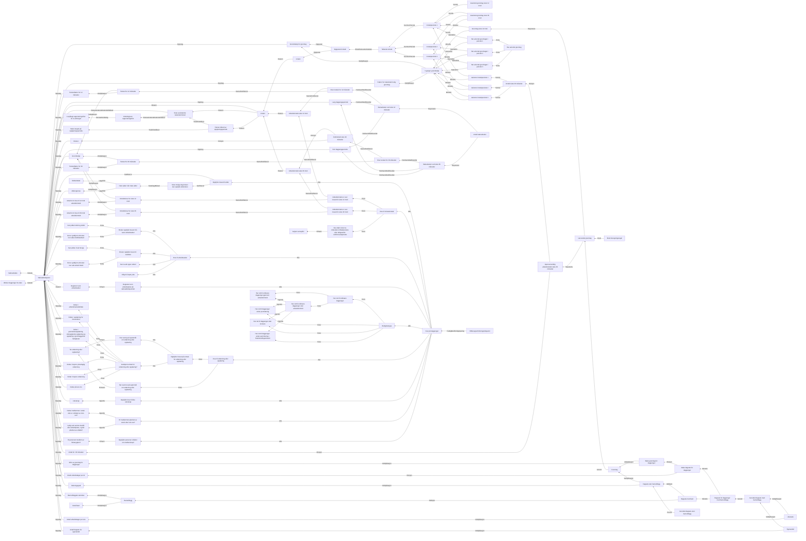

# Regeltre - Dagpenger (inngangsvilkår)

## Regeltre

```mermaid
graph RL
  A["Aldersgrense"] -->|"Oppslag"| B["Søknadstidspunkt"]
  C["Dato søker når maks alder"] -->|"LeggTilÅr"| D["Fødselsdato"]
  C["Dato søker når maks alder"] -->|"LeggTilÅr"| A["Aldersgrense"]
  E["Siste mulige dag bruker kan oppfylle alderskrav"] -->|"SisteDagIMåned"| C["Dato søker når maks alder"]
  F["Oppfyller kravet til alder"] -->|"FørEllerLik"| B["Søknadstidspunkt"]
  F["Oppfyller kravet til alder"] -->|"FørEllerLik"| E["Siste mulige dag bruker kan oppfylle alderskrav"]
  G["Antall år i 36 måneder"] -->|"Oppslag"| B["Søknadstidspunkt"]
  H["Faktor for maksimalt mulig grunnlag"] -->|"Oppslag"| B["Søknadstidspunkt"]
  I["6 ganger grunnbeløp"] -->|"Multiplikasjon"| J["Grunnbeløp for grunnlag"]
  I["6 ganger grunnbeløp"] -->|"Multiplikasjon"| H["Faktor for maksimalt mulig grunnlag"]
  K["Inntekt"] -->|"Ekstern"| L["Inntekt"]
  J["Grunnbeløp for grunnlag"] -->|"Oppslag"| B["Søknadstidspunkt"]
  M["Oppjustert inntekt"] -->|"Oppjuster"| J["Grunnbeløp for grunnlag"]
  M["Oppjustert inntekt"] -->|"Oppjuster"| K["Inntekt"]
  N["Tellende inntekt"] -->|"FiltrerRelevanteInntekter"| M["Oppjustert inntekt"]
  O["Inntektperiode 1"] -->|"SummerPeriode"| N["Tellende inntekt"]
  P["Inntektperiode 2"] -->|"SummerPeriode"| N["Tellende inntekt"]
  Q["Inntektperiode 3"] -->|"SummerPeriode"| N["Tellende inntekt"]
  R["Uavkortet grunnlag siste 12 mnd"] -->|"SumAv"| O["Inntektperiode 1"]
  S["Uavkortet grunnlag siste 36 mnd"] -->|"SumAv"| O["Inntektperiode 1"]
  S["Uavkortet grunnlag siste 36 mnd"] -->|"SumAv"| P["Inntektperiode 2"]
  S["Uavkortet grunnlag siste 36 mnd"] -->|"SumAv"| Q["Inntektperiode 3"]
  T["Avkortet inntektperiode 1"] -->|"MinstAv"| O["Inntektperiode 1"]
  T["Avkortet inntektperiode 1"] -->|"MinstAv"| I["6 ganger grunnbeløp"]
  U["Avkortet inntektperiode 2"] -->|"MinstAv"| P["Inntektperiode 2"]
  U["Avkortet inntektperiode 2"] -->|"MinstAv"| I["6 ganger grunnbeløp"]
  V["Avkortet inntektperiode 3"] -->|"MinstAv"| Q["Inntektperiode 3"]
  V["Avkortet inntektperiode 3"] -->|"MinstAv"| I["6 ganger grunnbeløp"]
  W["Grunnlag siste 12 mnd."] -->|"MinstAv"| O["Inntektperiode 1"]
  W["Grunnlag siste 12 mnd."] -->|"MinstAv"| I["6 ganger grunnbeløp"]
  X["Inntekt siste 36 måneder"] -->|"SumAv"| T["Avkortet inntektperiode 1"]
  X["Inntekt siste 36 måneder"] -->|"SumAv"| U["Avkortet inntektperiode 2"]
  X["Inntekt siste 36 måneder"] -->|"SumAv"| V["Avkortet inntektperiode 3"]
  Y["Gjennomsnittlig arbeidsinntekt siste 36 måneder"] -->|"Divisjon"| X["Inntekt siste 36 måneder"]
  Y["Gjennomsnittlig arbeidsinntekt siste 36 måneder"] -->|"Divisjon"| G["Antall år i 36 måneder"]
  Z["Uavrundet grunnlag"] -->|"HøyesteAv"| W["Grunnlag siste 12 mnd."]
  Z["Uavrundet grunnlag"] -->|"HøyesteAv"| Y["Gjennomsnittlig arbeidsinntekt siste 36 måneder"]
  AA["Brukt beregningsregel"] -->|"Brukt"| Z["Uavrundet grunnlag"]
  AB["Grunnlag"] -->|"Avrund"| Z["Uavrundet grunnlag"]
  AC["Har avkortet grunnlaget i periode 1"] -->|"StørreEnn"| O["Inntektperiode 1"]
  AC["Har avkortet grunnlaget i periode 1"] -->|"StørreEnn"| I["6 ganger grunnbeløp"]
  AD["Har avkortet grunnlaget i periode 2"] -->|"StørreEnn"| P["Inntektperiode 2"]
  AD["Har avkortet grunnlaget i periode 2"] -->|"StørreEnn"| I["6 ganger grunnbeløp"]
  AE["Har avkortet grunnlaget i periode 3"] -->|"StørreEnn"| Q["Inntektperiode 3"]
  AE["Har avkortet grunnlaget i periode 3"] -->|"StørreEnn"| I["6 ganger grunnbeløp"]
  AF["Har avkortet grunnlag"] -->|"EnAv"| AC["Har avkortet grunnlaget i periode 1"]
  AF["Har avkortet grunnlag"] -->|"EnAv"| AD["Har avkortet grunnlaget i periode 2"]
  AF["Har avkortet grunnlag"] -->|"EnAv"| AE["Har avkortet grunnlaget i periode 3"]
  AG["Barnetilleggets størrelse"] -->|"Oppslag"| B["Søknadstidspunkt"]
  AH["Dekningsgrad"] -->|"Oppslag"| B["Søknadstidspunkt"]
  AI["Dagsats uten barnetillegg"] -->|"Multiplikasjon"| AB["Grunnlag"]
  AI["Dagsats uten barnetillegg"] -->|"Multiplikasjon"| AH["Dekningsgrad"]
  AJ["Barnetillegg"] -->|"Multiplikasjon"| AG["Barnetilleggets størrelse"]
  AJ["Barnetillegg"] -->|"Multiplikasjon"| AK["Antall barn"]
  AL["Dagsats med barn"] -->|"Addisjon"| AI["Dagsats uten barnetillegg"]
  AL["Dagsats med barn"] -->|"Addisjon"| AJ["Barnetillegg"]
  AM["Antall arbeidsdager per uke"] -->|"Oppslag"| B["Søknadstidspunkt"]
  AN["90% av grunnlag for dagpenger"] -->|"Oppslag"| B["Søknadstidspunkt"]
  AO["Antall arbeidsdager per år"] -->|"Oppslag"| B["Søknadstidspunkt"]
  AP["Maks grunnlag for dagpenger"] -->|"Multiplikasjon"| AB["Grunnlag"]
  AP["Maks grunnlag for dagpenger"] -->|"Multiplikasjon"| AN["90% av grunnlag for dagpenger"]
  AQ["Maks dagsats for dagpenger"] -->|"Divisjon"| AP["Maks grunnlag for dagpenger"]
  AQ["Maks dagsats for dagpenger"] -->|"Divisjon"| AO["Antall arbeidsdager per år"]
  AR["Dagsats for dagpenger med barnetillegg"] -->|"MinstAv"| AQ["Maks dagsats for dagpenger"]
  AR["Dagsats for dagpenger med barnetillegg"] -->|"MinstAv"| AL["Dagsats med barn"]
  AS["Avrundet dagsats med barnetillegg"] -->|"Avrund"| AR["Dagsats for dagpenger med barnetillegg"]
  AT["Avrundet dagsats uten barnetillegg"] -->|"Avrund"| AI["Dagsats uten barnetillegg"]
  AU["Ukessats"] -->|"Multiplikasjon"| AS["Avrundet dagsats med barnetillegg"]
  AU["Ukessats"] -->|"Multiplikasjon"| AM["Antall arbeidsdager per uke"]
  AV["Kort dagpengeperiode"] -->|"Oppslag"| B["Søknadstidspunkt"]
  AW["Lang dagpengeperiode"] -->|"Oppslag"| B["Søknadstidspunkt"]
  AX["Terskelfaktor for 12 måneder"] -->|"Oppslag"| B["Søknadstidspunkt"]
  AY["Terskelfaktor for 36 måneder"] -->|"Oppslag"| B["Søknadstidspunkt"]
  AZ["Divisior"] -->|"Oppslag"| B["Søknadstidspunkt"]
  BA["Terskel for 12 måneder"] -->|"Multiplikasjon"| BB["Grunnbeløp"]
  BA["Terskel for 12 måneder"] -->|"Multiplikasjon"| AX["Terskelfaktor for 12 måneder"]
  BC["Terskel for 36 måneder"] -->|"Multiplikasjon"| BB["Grunnbeløp"]
  BC["Terskel for 36 måneder"] -->|"Multiplikasjon"| AY["Terskelfaktor for 36 måneder"]
  BD["Snittinntekt siste 36 måneder"] -->|"Divisjon"| BE["Arbeidsinntekt siste 36 mnd"]
  BD["Snittinntekt siste 36 måneder"] -->|"Divisjon"| AZ["Divisior"]
  BF["Over terskel for 12 måneder"] -->|"StørreEnnEllerLik"| BG["Arbeidsinntekt siste 12 mnd"]
  BF["Over terskel for 12 måneder"] -->|"StørreEnnEllerLik"| BA["Terskel for 12 måneder"]
  BH["Over terskel for 36 måneder"] -->|"StørreEnnEllerLik"| BD["Snittinntekt siste 36 måneder"]
  BH["Over terskel for 36 måneder"] -->|"StørreEnnEllerLik"| BC["Terskel for 36 måneder"]
  BI["Stønadsuker ved siste 12 måneder"] -->|"HvisSannMedResultat"| BF["Over terskel for 12 måneder"]
  BI["Stønadsuker ved siste 12 måneder"] -->|"HvisSannMedResultat"| AW["Lang dagpengeperiode"]
  BI["Stønadsuker ved siste 12 måneder"] -->|"HvisSannMedResultat"| AV["Kort dagpengeperiode"]
  BJ["Stønadsuker ved siste 36 måneder"] -->|"HvisSannMedResultat"| BH["Over terskel for 36 måneder"]
  BJ["Stønadsuker ved siste 36 måneder"] -->|"HvisSannMedResultat"| AW["Lang dagpengeperiode"]
  BJ["Stønadsuker ved siste 36 måneder"] -->|"HvisSannMedResultat"| AV["Kort dagpengeperiode"]
  BK["Antall stønadsuker"] -->|"HøyesteAv"| BI["Stønadsuker ved siste 12 måneder"]
  BK["Antall stønadsuker"] -->|"HøyesteAv"| BJ["Stønadsuker ved siste 36 måneder"]
  BL["Antall dagsats for egenandel"] -->|"Oppslag"| B["Søknadstidspunkt"]
  BM["Egenandel"] -->|"Multiplikasjon"| AS["Avrundet dagsats med barnetillegg"]
  BM["Egenandel"] -->|"Multiplikasjon"| BL["Antall dagsats for egenandel"]
  BN["Krav på dagpenger"] -->|"Alle"| F["Oppfyller kravet til alder"]
  BN["Krav på dagpenger"] -->|"Alle"| BO["Krav til minsteinntekt"]
  BN["Krav på dagpenger"] -->|"Alle"| BP["Krav til arbeidssøker"]
  BN["Krav på dagpenger"] -->|"Alle"| BQ["Registrert som arbeidssøker på søknadstidspunktet"]
  BN["Krav på dagpenger"] -->|"Alle"| BR["Rettighetstype"]
  BN["Krav på dagpenger"] -->|"Alle"| BS["Krav til utdanning eller opplæring"]
  BN["Krav på dagpenger"] -->|"Alle"| BT["Oppfyller krav til ikke utestengt"]
  BN["Krav på dagpenger"] -->|"Alle"| BU["Er medlemmet påvirket av streik eller lock-out?"]
  BN["Krav på dagpenger"] -->|"Alle"| BV["Oppfyller personen vilkåret om medlemskap?"]
  BW["Er personen medlem av folketrygden?"] -->|"Oppslag"| B["Søknadstidspunkt"]
  BV["Oppfyller personen vilkåret om medlemskap?"] -->|"ErSann"| BW["Er personen medlem av folketrygden?"]
  BX["Registrert som arbeidssøker"] -->|"Ekstern"| B["Søknadstidspunkt"]
  BQ["Registrert som arbeidssøker på søknadstidspunktet"] -->|"ErSann"| BX["Registrert som arbeidssøker"]
  BY["Maks lengde på opptjeningsperiode"] -->|"Oppslag"| B["Søknadstidspunkt"]
  BZ["Første måned av opptjeningsperiode"] -->|"TrekkFraMåned"| CA["Siste avsluttende kalendermåned"]
  BZ["Første måned av opptjeningsperiode"] -->|"TrekkFraMåned"| BY["Maks lengde på opptjeningsperiode"]
  L["Inntekt"] -->|"Ekstern"| B["Søknadstidspunkt"]
  L["Inntekt"] -->|"Ekstern"| CA["Siste avsluttende kalendermåned"]
  L["Inntekt"] -->|"Ekstern"| BZ["Første måned av opptjeningsperiode"]
  BB["Grunnbeløp"] -->|"Oppslag"| B["Søknadstidspunkt"]
  BG["Arbeidsinntekt siste 12 mnd"] -->|"Ekstern"| L["Inntekt"]
  CB["Antall G for krav til 12 mnd arbeidsinntekt"] -->|"Oppslag"| B["Søknadstidspunkt"]
  CC["Inntektskrav for siste 12 mnd"] -->|"Multiplikasjon"| BB["Grunnbeløp"]
  CC["Inntektskrav for siste 12 mnd"] -->|"Multiplikasjon"| CB["Antall G for krav til 12 mnd arbeidsinntekt"]
  CD["Arbeidsinntekt er over kravet for siste 12 mnd"] -->|"StørreEnnEllerLik"| BG["Arbeidsinntekt siste 12 mnd"]
  CD["Arbeidsinntekt er over kravet for siste 12 mnd"] -->|"StørreEnnEllerLik"| CC["Inntektskrav for siste 12 mnd"]
  BE["Arbeidsinntekt siste 36 mnd"] -->|"Ekstern"| L["Inntekt"]
  CE["Antall G for krav til 36 mnd arbeidsinntekt"] -->|"Oppslag"| B["Søknadstidspunkt"]
  CF["Inntektskrav for siste 36 mnd"] -->|"Multiplikasjon"| BB["Grunnbeløp"]
  CF["Inntektskrav for siste 36 mnd"] -->|"Multiplikasjon"| CE["Antall G for krav til 36 mnd arbeidsinntekt"]
  CG["Arbeidsinntekt er over kravet for siste 36 mnd"] -->|"StørreEnnEllerLik"| BE["Arbeidsinntekt siste 36 mnd"]
  CG["Arbeidsinntekt er over kravet for siste 36 mnd"] -->|"StørreEnnEllerLik"| CF["Inntektskrav for siste 36 mnd"]
  BO["Krav til minsteinntekt"] -->|"EnAv"| CD["Arbeidsinntekt er over kravet for siste 12 mnd"]
  BO["Krav til minsteinntekt"] -->|"EnAv"| CG["Arbeidsinntekt er over kravet for siste 36 mnd"]
  BO["Krav til minsteinntekt"] -->|"EnAv"| CH["Har utført minst tre måneders militærtjeneste eller obligatorisk sivilforsvarstjeneste"]
  CI["Lovpålagt rapporteringsfrist for A-ordningen"] -->|"Oppslag"| B["Søknadstidspunkt"]
  CJ["Arbeidsgivers rapporteringsfrist"] -->|"FørsteArbeidsdag"| CI["Lovpålagt rapporteringsfrist for A-ordningen"]
  CA["Siste avsluttende kalendermåned"] -->|"SisteavsluttendeKalenderMåned"| B["Søknadstidspunkt"]
  CA["Siste avsluttende kalendermåned"] -->|"SisteavsluttendeKalenderMåned"| CJ["Arbeidsgivers rapporteringsfrist"]
  CK["Det er godkjent at bruker kun søk arbeid lokalt"] -->|"Oppslag"| B["Søknadstidspunkt"]
  CL["Det er godkjent at bruker kun søker deltidsarbeid"] -->|"Oppslag"| B["Søknadstidspunkt"]
  CM["Bruker oppfyller kravet til mobilitet"] -->|"EnAv"| CN["Kan jobbe i hele Norge"]
  CM["Bruker oppfyller kravet til mobilitet"] -->|"EnAv"| CK["Det er godkjent at bruker kun søk arbeid lokalt"]
  CO["Bruker oppfyller kravet til å være arbeidssøker"] -->|"EnAv"| CP["Kan jobbe heltid og deltid"]
  CO["Bruker oppfyller kravet til å være arbeidssøker"] -->|"EnAv"| CL["Det er godkjent at bruker kun søker deltidsarbeid"]
  BP["Krav til arbeidssøker"] -->|"Alle"| CO["Bruker oppfyller kravet til å være arbeidssøker"]
  BP["Krav til arbeidssøker"] -->|"Alle"| CM["Bruker oppfyller kravet til mobilitet"]
  BP["Krav til arbeidssøker"] -->|"Alle"| CQ["Kan ta alle typer arbeid"]
  BP["Krav til arbeidssøker"] -->|"Alle"| CR["Villig til å bytte yrke"]
  CS["Har rett til ordinære dagpenger uten arbeidsforhold"] -->|"IngenAv"| CT["Har rett til ordinære dagpenger gjennom arbeidsforhold"]
  CS["Har rett til ordinære dagpenger uten arbeidsforhold"] -->|"IngenAv"| CU["Har rett til dagpenger under permittering"]
  CS["Har rett til ordinære dagpenger uten arbeidsforhold"] -->|"IngenAv"| CV["Har rett til dagpenger etter konkurs"]
  CS["Har rett til ordinære dagpenger uten arbeidsforhold"] -->|"IngenAv"| CW["Har rett til dagpenger under permittering i fiskeforedlingsindustri"]
  CX["Har rett til ordinære dagpenger"] -->|"EnAv"| CT["Har rett til ordinære dagpenger gjennom arbeidsforhold"]
  CX["Har rett til ordinære dagpenger"] -->|"EnAv"| CS["Har rett til ordinære dagpenger uten arbeidsforhold"]
  BR["Rettighetstype"] -->|"EnAv"| CX["Har rett til ordinære dagpenger"]
  BR["Rettighetstype"] -->|"EnAv"| CU["Har rett til dagpenger under permittering"]
  BR["Rettighetstype"] -->|"EnAv"| CV["Har rett til dagpenger etter konkurs"]
  BR["Rettighetstype"] -->|"EnAv"| CW["Har rett til dagpenger under permittering i fiskeforedlingsindustri"]
  CY["Deltar medlemmet i streik eller er omfattet av lock-out?"] -->|"Oppslag"| B["Søknadstidspunkt"]
  CZ["Ledig ved samme bedrift eller arbeidsplass, og blir påvirket av utfallet?"] -->|"Oppslag"| B["Søknadstidspunkt"]
  BU["Er medlemmet påvirket av streik eller lock-out?"] -->|"IngenAv"| CY["Deltar medlemmet i streik eller er omfattet av lock-out?"]
  BU["Er medlemmet påvirket av streik eller lock-out?"] -->|"IngenAv"| CZ["Ledig ved samme bedrift eller arbeidsplass, og blir påvirket av utfallet?"]
  B["Søknadstidspunkt"] -->|"SisteAv"| DA["Søknadsdato"]
  B["Søknadstidspunkt"] -->|"SisteAv"| DB["Ønsker dagpenger fra dato"]
  DC["Deltar i arbeidsmarkedstiltak"] -->|"Oppslag"| B["Søknadstidspunkt"]
  DD["Deltar i opplæring for innvandrere"] -->|"Oppslag"| B["Søknadstidspunkt"]
  DE["Deltar i grunnskoleopplæring, videregående opplæring og opplæring i grunnleggende ferdigheter"] -->|"Oppslag"| B["Søknadstidspunkt"]
  DF["Deltar i høyere yrkesfaglig utdanning"] -->|"Oppslag"| B["Søknadstidspunkt"]
  DG["Deltar i høyere utdanning"] -->|"Oppslag"| B["Søknadstidspunkt"]
  DH["Deltar på kurs mv"] -->|"Oppslag"| B["Søknadstidspunkt"]
  DI["Godkjent unntak for utdanning eller opplæring?"] -->|"EnAv"| DC["Deltar i arbeidsmarkedstiltak"]
  DI["Godkjent unntak for utdanning eller opplæring?"] -->|"EnAv"| DD["Deltar i opplæring for innvandrere"]
  DI["Godkjent unntak for utdanning eller opplæring?"] -->|"EnAv"| DE["Deltar i grunnskoleopplæring, videregående opplæring og opplæring i grunnleggende ferdigheter"]
  DI["Godkjent unntak for utdanning eller opplæring?"] -->|"EnAv"| DF["Deltar i høyere yrkesfaglig utdanning"]
  DI["Godkjent unntak for utdanning eller opplæring?"] -->|"EnAv"| DG["Deltar i høyere utdanning"]
  DI["Godkjent unntak for utdanning eller opplæring?"] -->|"EnAv"| DH["Deltar på kurs mv"]
  DJ["Har svart ja på spørsmål om utdanning eller opplæring"] -->|"ErSann"| DK["Tar utdanning eller opplæring?"]
  DL["Har svart nei på spørsmål om utdanning eller opplæring"] -->|"ErUsann"| DK["Tar utdanning eller opplæring?"]
  DM["Oppfyller kravet på unntak for utdanning eller opplæring"] -->|"Alle"| DJ["Har svart ja på spørsmål om utdanning eller opplæring"]
  DM["Oppfyller kravet på unntak for utdanning eller opplæring"] -->|"Alle"| DI["Godkjent unntak for utdanning eller opplæring?"]
  BS["Krav til utdanning eller opplæring"] -->|"EnAv"| DM["Oppfyller kravet på unntak for utdanning eller opplæring"]
  BS["Krav til utdanning eller opplæring"] -->|"EnAv"| DL["Har svart nei på spørsmål om utdanning eller opplæring"]
  DN["Utestengt"] -->|"Oppslag"| B["Søknadstidspunkt"]
  BT["Oppfyller krav til ikke utestengt"] -->|"IngenAv"| DN["Utestengt"]
  CH["Har utført minst tre måneders militærtjeneste eller obligatorisk sivilforsvarstjeneste"] -->|"ErSann"| DO["Avtjent verneplikt"]
  DP["EttBeregnetVirkningstidspunkt"] -->|"FraOgMedForOpplysning"| BN["Krav på dagpenger"]
```