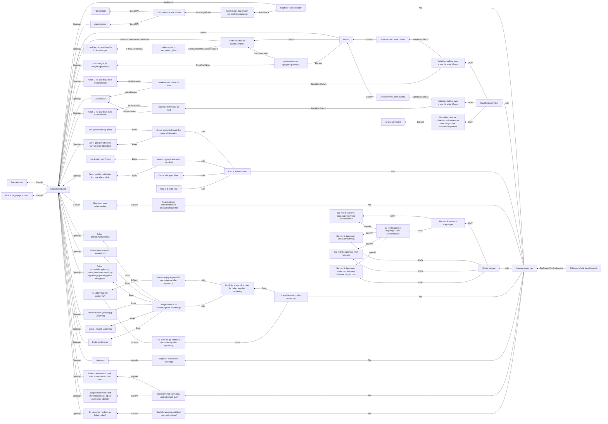

# Regeltre - Dagpenger 

## Regeltre

```mermaid
graph RL
  A["Aldersgrense"] -->|"Oppslag"| B["Søknadstidspunkt"]
  C["Dato søker når maks alder"] -->|"LeggTilÅr"| D["Fødselsdato"]
  C["Dato søker når maks alder"] -->|"LeggTilÅr"| A["Aldersgrense"]
  E["Siste mulige dag bruker kan oppfylle alderskrav"] -->|"SisteDagIMåned"| C["Dato søker når maks alder"]
  F["Oppfyller kravet til alder"] -->|"FørEllerLik"| B["Søknadstidspunkt"]
  F["Oppfyller kravet til alder"] -->|"FørEllerLik"| E["Siste mulige dag bruker kan oppfylle alderskrav"]
  G["Krav på dagpenger"] -->|"Alle"| F["Oppfyller kravet til alder"]
  G["Krav på dagpenger"] -->|"Alle"| H["Krav til minsteinntekt"]
  G["Krav på dagpenger"] -->|"Alle"| I["Krav til arbeidssøker"]
  G["Krav på dagpenger"] -->|"Alle"| J["Registrert som arbeidssøker på søknadstidspunktet"]
  G["Krav på dagpenger"] -->|"Alle"| K["Rettighetstype"]
  G["Krav på dagpenger"] -->|"Alle"| L["Krav til utdanning eller opplæring"]
  G["Krav på dagpenger"] -->|"Alle"| M["Oppfyller krav til ikke utestengt"]
  G["Krav på dagpenger"] -->|"Alle"| N["Er medlemmet påvirket av streik eller lock-out?"]
  G["Krav på dagpenger"] -->|"Alle"| O["Oppfyller personen vilkåret om medlemskap?"]
  P["Er personen medlem av folketrygden?"] -->|"Oppslag"| B["Søknadstidspunkt"]
  O["Oppfyller personen vilkåret om medlemskap?"] -->|"ErSann"| P["Er personen medlem av folketrygden?"]
  Q["Registrert som arbeidssøker"] -->|"Ekstern"| B["Søknadstidspunkt"]
  J["Registrert som arbeidssøker på søknadstidspunktet"] -->|"ErSann"| Q["Registrert som arbeidssøker"]
  R["Maks lengde på opptjeningsperiode"] -->|"Oppslag"| B["Søknadstidspunkt"]
  S["Første måned av opptjeningsperiode"] -->|"TrekkFraMåned"| T["Siste avsluttende kalendermåned"]
  S["Første måned av opptjeningsperiode"] -->|"TrekkFraMåned"| R["Maks lengde på opptjeningsperiode"]
  U["Inntekt"] -->|"Ekstern"| B["Søknadstidspunkt"]
  U["Inntekt"] -->|"Ekstern"| T["Siste avsluttende kalendermåned"]
  U["Inntekt"] -->|"Ekstern"| S["Første måned av opptjeningsperiode"]
  V["Grunnbeløp"] -->|"Oppslag"| B["Søknadstidspunkt"]
  W["Arbeidsinntekt siste 12 mnd"] -->|"Ekstern"| U["Inntekt"]
  X["Antall G for krav til 12 mnd arbeidsinntekt"] -->|"Oppslag"| B["Søknadstidspunkt"]
  Y["Inntektskrav for siste 12 mnd"] -->|"Multiplikasjon"| X["Antall G for krav til 12 mnd arbeidsinntekt"]
  Y["Inntektskrav for siste 12 mnd"] -->|"Multiplikasjon"| V["Grunnbeløp"]
  Z["Arbeidsinntekt er over kravet for siste 12 mnd"] -->|"StørreEnnEllerLik"| W["Arbeidsinntekt siste 12 mnd"]
  Z["Arbeidsinntekt er over kravet for siste 12 mnd"] -->|"StørreEnnEllerLik"| Y["Inntektskrav for siste 12 mnd"]
  AA["Arbeidsinntekt siste 36 mnd"] -->|"Ekstern"| U["Inntekt"]
  AB["Antall G for krav til 36 mnd arbeidsinntekt"] -->|"Oppslag"| B["Søknadstidspunkt"]
  AC["Inntektskrav for siste 36 mnd"] -->|"Multiplikasjon"| AB["Antall G for krav til 36 mnd arbeidsinntekt"]
  AC["Inntektskrav for siste 36 mnd"] -->|"Multiplikasjon"| V["Grunnbeløp"]
  AD["Arbeidsinntekt er over kravet for siste 36 mnd"] -->|"StørreEnnEllerLik"| AA["Arbeidsinntekt siste 36 mnd"]
  AD["Arbeidsinntekt er over kravet for siste 36 mnd"] -->|"StørreEnnEllerLik"| AC["Inntektskrav for siste 36 mnd"]
  H["Krav til minsteinntekt"] -->|"EnAv"| Z["Arbeidsinntekt er over kravet for siste 12 mnd"]
  H["Krav til minsteinntekt"] -->|"EnAv"| AD["Arbeidsinntekt er over kravet for siste 36 mnd"]
  H["Krav til minsteinntekt"] -->|"EnAv"| AE["Har utført minst tre måneders militærtjeneste eller obligatorisk sivilforsvarstjeneste"]
  AF["Lovpålagt rapporteringsfrist for A-ordningen"] -->|"Oppslag"| B["Søknadstidspunkt"]
  AG["Arbeidsgivers rapporteringsfrist"] -->|"FørsteArbeidsdag"| AF["Lovpålagt rapporteringsfrist for A-ordningen"]
  T["Siste avsluttende kalendermåned"] -->|"SisteavsluttendeKalenderMåned"| B["Søknadstidspunkt"]
  T["Siste avsluttende kalendermåned"] -->|"SisteavsluttendeKalenderMåned"| AG["Arbeidsgivers rapporteringsfrist"]
  AH["Det er godkjent at bruker kun søk arbeid lokalt"] -->|"Oppslag"| B["Søknadstidspunkt"]
  AI["Det er godkjent at bruker kun søker deltidsarbeid"] -->|"Oppslag"| B["Søknadstidspunkt"]
  AJ["Bruker oppfyller kravet til mobilitet"] -->|"EnAv"| AK["Kan jobbe i hele Norge"]
  AJ["Bruker oppfyller kravet til mobilitet"] -->|"EnAv"| AH["Det er godkjent at bruker kun søk arbeid lokalt"]
  AL["Bruker oppfyller kravet til å være arbeidssøker"] -->|"EnAv"| AM["Kan jobbe heltid og deltid"]
  AL["Bruker oppfyller kravet til å være arbeidssøker"] -->|"EnAv"| AI["Det er godkjent at bruker kun søker deltidsarbeid"]
  I["Krav til arbeidssøker"] -->|"Alle"| AL["Bruker oppfyller kravet til å være arbeidssøker"]
  I["Krav til arbeidssøker"] -->|"Alle"| AJ["Bruker oppfyller kravet til mobilitet"]
  I["Krav til arbeidssøker"] -->|"Alle"| AN["Kan ta alle typer arbeid"]
  I["Krav til arbeidssøker"] -->|"Alle"| AO["Villig til å bytte yrke"]
  AP["Har rett til ordinære dagpenger uten arbeidsforhold"] -->|"IngenAv"| AQ["Har rett til ordinære dagpenger gjennom arbeidsforhold"]
  AP["Har rett til ordinære dagpenger uten arbeidsforhold"] -->|"IngenAv"| AR["Har rett til dagpenger under permittering"]
  AP["Har rett til ordinære dagpenger uten arbeidsforhold"] -->|"IngenAv"| AS["Har rett til dagpenger etter konkurs"]
  AP["Har rett til ordinære dagpenger uten arbeidsforhold"] -->|"IngenAv"| AT["Har rett til dagpenger under permittering i fiskeforedlingsindustri"]
  AU["Har rett til ordinære dagpenger"] -->|"EnAv"| AQ["Har rett til ordinære dagpenger gjennom arbeidsforhold"]
  AU["Har rett til ordinære dagpenger"] -->|"EnAv"| AP["Har rett til ordinære dagpenger uten arbeidsforhold"]
  K["Rettighetstype"] -->|"EnAv"| AU["Har rett til ordinære dagpenger"]
  K["Rettighetstype"] -->|"EnAv"| AR["Har rett til dagpenger under permittering"]
  K["Rettighetstype"] -->|"EnAv"| AS["Har rett til dagpenger etter konkurs"]
  K["Rettighetstype"] -->|"EnAv"| AT["Har rett til dagpenger under permittering i fiskeforedlingsindustri"]
  AV["Deltar medlemmet i streik eller er omfattet av lock-out?"] -->|"Oppslag"| B["Søknadstidspunkt"]
  AW["Ledig ved samme bedrift eller arbeidsplass, og blir påvirket av utfallet?"] -->|"Oppslag"| B["Søknadstidspunkt"]
  N["Er medlemmet påvirket av streik eller lock-out?"] -->|"IngenAv"| AV["Deltar medlemmet i streik eller er omfattet av lock-out?"]
  N["Er medlemmet påvirket av streik eller lock-out?"] -->|"IngenAv"| AW["Ledig ved samme bedrift eller arbeidsplass, og blir påvirket av utfallet?"]
  B["Søknadstidspunkt"] -->|"SisteAv"| AX["Søknadsdato"]
  B["Søknadstidspunkt"] -->|"SisteAv"| AY["Ønsker dagpenger fra dato"]
  AE["Har utført minst tre måneders militærtjeneste eller obligatorisk sivilforsvarstjeneste"] -->|"ErSann"| AZ["Avtjent verneplikt"]
  BA["EttBeregnetVirkningstidspunkt"] -->|"FraOgMedForOpplysning"| G["Krav på dagpenger"]
  BB["Deltar i arbeidsmarkedstiltak"] -->|"Oppslag"| B["Søknadstidspunkt"]
  BC["Deltar i opplæring for innvandrere"] -->|"Oppslag"| B["Søknadstidspunkt"]
  BD["Deltar i grunnskoleopplæring, videregående opplæring og opplæring i grunnleggende ferdigheter"] -->|"Oppslag"| B["Søknadstidspunkt"]
  BE["Deltar i høyere yrkesfaglig utdanning"] -->|"Oppslag"| B["Søknadstidspunkt"]
  BF["Deltar i høyere utdanning"] -->|"Oppslag"| B["Søknadstidspunkt"]
  BG["Deltar på kurs mv"] -->|"Oppslag"| B["Søknadstidspunkt"]
  BH["Godkjent unntak for utdanning eller opplæring?"] -->|"EnAv"| BB["Deltar i arbeidsmarkedstiltak"]
  BH["Godkjent unntak for utdanning eller opplæring?"] -->|"EnAv"| BC["Deltar i opplæring for innvandrere"]
  BH["Godkjent unntak for utdanning eller opplæring?"] -->|"EnAv"| BD["Deltar i grunnskoleopplæring, videregående opplæring og opplæring i grunnleggende ferdigheter"]
  BH["Godkjent unntak for utdanning eller opplæring?"] -->|"EnAv"| BE["Deltar i høyere yrkesfaglig utdanning"]
  BH["Godkjent unntak for utdanning eller opplæring?"] -->|"EnAv"| BF["Deltar i høyere utdanning"]
  BH["Godkjent unntak for utdanning eller opplæring?"] -->|"EnAv"| BG["Deltar på kurs mv"]
  BI["Har svart ja på spørsmål om utdanning eller opplæring"] -->|"ErSann"| BJ["Tar utdanning eller opplæring?"]
  BK["Har svart nei på spørsmål om utdanning eller opplæring"] -->|"ErUsann"| BJ["Tar utdanning eller opplæring?"]
  BL["Oppfyller kravet på unntak for utdanning eller opplæring"] -->|"Alle"| BI["Har svart ja på spørsmål om utdanning eller opplæring"]
  BL["Oppfyller kravet på unntak for utdanning eller opplæring"] -->|"Alle"| BH["Godkjent unntak for utdanning eller opplæring?"]
  L["Krav til utdanning eller opplæring"] -->|"EnAv"| BL["Oppfyller kravet på unntak for utdanning eller opplæring"]
  L["Krav til utdanning eller opplæring"] -->|"EnAv"| BK["Har svart nei på spørsmål om utdanning eller opplæring"]
  BM["Utestengt"] -->|"Oppslag"| B["Søknadstidspunkt"]
  M["Oppfyller krav til ikke utestengt"] -->|"IngenAv"| BM["Utestengt"]
```