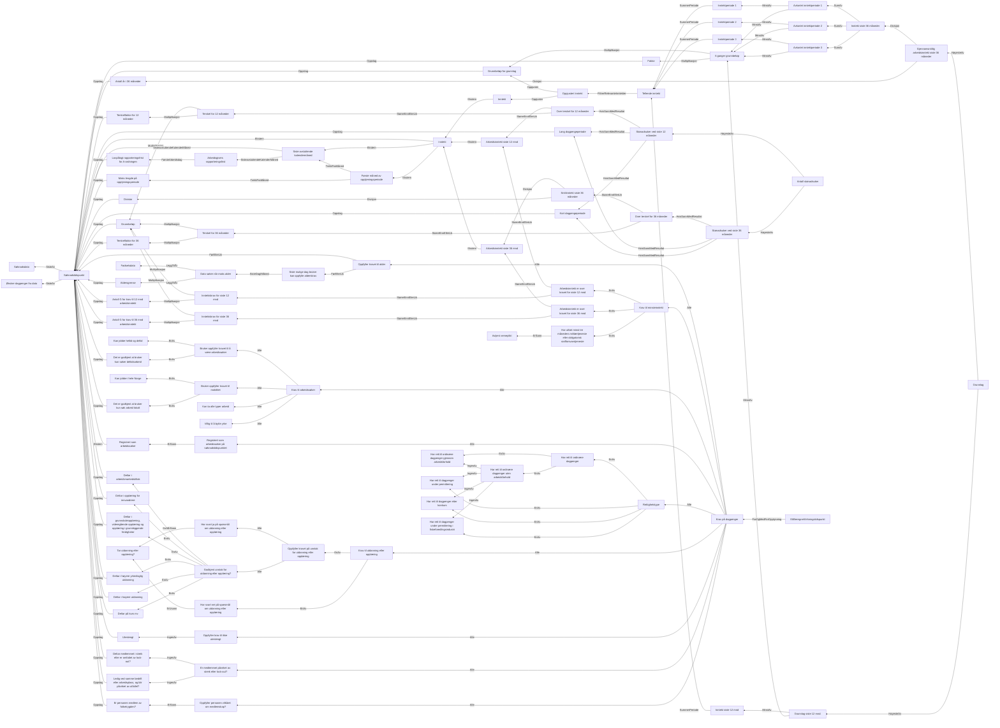

# Regeltre - Dagpenger (inngangsvilkår)

## Regeltre

```mermaid
graph RL
  A["Aldersgrense"] -->|"Oppslag"| B["Søknadstidspunkt"]
  C["Dato søker når maks alder"] -->|"LeggTilÅr"| D["Fødselsdato"]
  C["Dato søker når maks alder"] -->|"LeggTilÅr"| A["Aldersgrense"]
  E["Siste mulige dag bruker kan oppfylle alderskrav"] -->|"SisteDagIMåned"| C["Dato søker når maks alder"]
  F["Oppfyller kravet til alder"] -->|"FørEllerLik"| B["Søknadstidspunkt"]
  F["Oppfyller kravet til alder"] -->|"FørEllerLik"| E["Siste mulige dag bruker kan oppfylle alderskrav"]
  G["Faktor"] -->|"Oppslag"| B["Søknadstidspunkt"]
  H["6 ganger grunnbeløp"] -->|"Multiplikasjon"| I["Grunnbeløp for grunnlag"]
  H["6 ganger grunnbeløp"] -->|"Multiplikasjon"| G["Faktor"]
  J["Inntekt"] -->|"Ekstern"| K["Inntekt"]
  I["Grunnbeløp for grunnlag"] -->|"Oppslag"| B["Søknadstidspunkt"]
  L["Oppjustert inntekt"] -->|"Oppjuster"| I["Grunnbeløp for grunnlag"]
  L["Oppjustert inntekt"] -->|"Oppjuster"| J["Inntekt"]
  M["Tellende inntekt"] -->|"FiltrerRelevanteInntekter"| L["Oppjustert inntekt"]
  N["Inntekt siste 12 mnd"] -->|"SummerPeriode"| M["Tellende inntekt"]
  O["Grunnlag siste 12 mnd."] -->|"MinstAv"| N["Inntekt siste 12 mnd"]
  O["Grunnlag siste 12 mnd."] -->|"MinstAv"| H["6 ganger grunnbeløp"]
  P["Inntektperiode 1"] -->|"SummerPeriode"| M["Tellende inntekt"]
  Q["Inntektperiode 2"] -->|"SummerPeriode"| M["Tellende inntekt"]
  R["Inntektperiode 3"] -->|"SummerPeriode"| M["Tellende inntekt"]
  S["Avkortet inntektperiode 1"] -->|"MinstAv"| P["Inntektperiode 1"]
  S["Avkortet inntektperiode 1"] -->|"MinstAv"| H["6 ganger grunnbeløp"]
  T["Avkortet inntektperiode 2"] -->|"MinstAv"| Q["Inntektperiode 2"]
  T["Avkortet inntektperiode 2"] -->|"MinstAv"| H["6 ganger grunnbeløp"]
  U["Avkortet inntektperiode 3"] -->|"MinstAv"| R["Inntektperiode 3"]
  U["Avkortet inntektperiode 3"] -->|"MinstAv"| H["6 ganger grunnbeløp"]
  V["Inntekt siste 36 måneder"] -->|"SumAv"| S["Avkortet inntektperiode 1"]
  V["Inntekt siste 36 måneder"] -->|"SumAv"| T["Avkortet inntektperiode 2"]
  V["Inntekt siste 36 måneder"] -->|"SumAv"| U["Avkortet inntektperiode 3"]
  W["Antall år i 36 måneder"] -->|"Oppslag"| B["Søknadstidspunkt"]
  X["Gjennomsnittlig arbeidsinntekt siste 36 måneder"] -->|"Divisjon"| V["Inntekt siste 36 måneder"]
  X["Gjennomsnittlig arbeidsinntekt siste 36 måneder"] -->|"Divisjon"| W["Antall år i 36 måneder"]
  Y["Grunnlag"] -->|"HøyesteAv"| X["Gjennomsnittlig arbeidsinntekt siste 36 måneder"]
  Y["Grunnlag"] -->|"HøyesteAv"| O["Grunnlag siste 12 mnd."]
  Z["Kort dagpengeperiode"] -->|"Oppslag"| B["Søknadstidspunkt"]
  AA["Lang dagpengeperiode"] -->|"Oppslag"| B["Søknadstidspunkt"]
  AB["Terskelfaktor for 12 måneder"] -->|"Oppslag"| B["Søknadstidspunkt"]
  AC["Terskelfaktor for 36 måneder"] -->|"Oppslag"| B["Søknadstidspunkt"]
  AD["Divisior"] -->|"Oppslag"| B["Søknadstidspunkt"]
  AE["Terskel for 12 måneder"] -->|"Multiplikasjon"| AF["Grunnbeløp"]
  AE["Terskel for 12 måneder"] -->|"Multiplikasjon"| AB["Terskelfaktor for 12 måneder"]
  AG["Terskel for 36 måneder"] -->|"Multiplikasjon"| AF["Grunnbeløp"]
  AG["Terskel for 36 måneder"] -->|"Multiplikasjon"| AC["Terskelfaktor for 36 måneder"]
  AH["Snittinntekt siste 36 måneder"] -->|"Divisjon"| AI["Arbeidsinntekt siste 36 mnd"]
  AH["Snittinntekt siste 36 måneder"] -->|"Divisjon"| AD["Divisior"]
  AJ["Over terskel for 12 måneder"] -->|"StørreEnnEllerLik"| AK["Arbeidsinntekt siste 12 mnd"]
  AJ["Over terskel for 12 måneder"] -->|"StørreEnnEllerLik"| AE["Terskel for 12 måneder"]
  AL["Over terskel for 36 måneder"] -->|"StørreEnnEllerLik"| AH["Snittinntekt siste 36 måneder"]
  AL["Over terskel for 36 måneder"] -->|"StørreEnnEllerLik"| AG["Terskel for 36 måneder"]
  AM["Stønadsuker ved siste 12 måneder"] -->|"HvisSannMedResultat"| AJ["Over terskel for 12 måneder"]
  AM["Stønadsuker ved siste 12 måneder"] -->|"HvisSannMedResultat"| AA["Lang dagpengeperiode"]
  AM["Stønadsuker ved siste 12 måneder"] -->|"HvisSannMedResultat"| Z["Kort dagpengeperiode"]
  AN["Stønadsuker ved siste 36 måneder"] -->|"HvisSannMedResultat"| AL["Over terskel for 36 måneder"]
  AN["Stønadsuker ved siste 36 måneder"] -->|"HvisSannMedResultat"| AA["Lang dagpengeperiode"]
  AN["Stønadsuker ved siste 36 måneder"] -->|"HvisSannMedResultat"| Z["Kort dagpengeperiode"]
  AO["Antall stønadsuker"] -->|"HøyesteAv"| AM["Stønadsuker ved siste 12 måneder"]
  AO["Antall stønadsuker"] -->|"HøyesteAv"| AN["Stønadsuker ved siste 36 måneder"]
  AP["Krav på dagpenger"] -->|"Alle"| F["Oppfyller kravet til alder"]
  AP["Krav på dagpenger"] -->|"Alle"| AQ["Krav til minsteinntekt"]
  AP["Krav på dagpenger"] -->|"Alle"| AR["Krav til arbeidssøker"]
  AP["Krav på dagpenger"] -->|"Alle"| AS["Registrert som arbeidssøker på søknadstidspunktet"]
  AP["Krav på dagpenger"] -->|"Alle"| AT["Rettighetstype"]
  AP["Krav på dagpenger"] -->|"Alle"| AU["Krav til utdanning eller opplæring"]
  AP["Krav på dagpenger"] -->|"Alle"| AV["Oppfyller krav til ikke utestengt"]
  AP["Krav på dagpenger"] -->|"Alle"| AW["Er medlemmet påvirket av streik eller lock-out?"]
  AP["Krav på dagpenger"] -->|"Alle"| AX["Oppfyller personen vilkåret om medlemskap?"]
  AY["Er personen medlem av folketrygden?"] -->|"Oppslag"| B["Søknadstidspunkt"]
  AX["Oppfyller personen vilkåret om medlemskap?"] -->|"ErSann"| AY["Er personen medlem av folketrygden?"]
  AZ["Registrert som arbeidssøker"] -->|"Ekstern"| B["Søknadstidspunkt"]
  AS["Registrert som arbeidssøker på søknadstidspunktet"] -->|"ErSann"| AZ["Registrert som arbeidssøker"]
  BA["Maks lengde på opptjeningsperiode"] -->|"Oppslag"| B["Søknadstidspunkt"]
  BB["Første måned av opptjeningsperiode"] -->|"TrekkFraMåned"| BC["Siste avsluttende kalendermåned"]
  BB["Første måned av opptjeningsperiode"] -->|"TrekkFraMåned"| BA["Maks lengde på opptjeningsperiode"]
  K["Inntekt"] -->|"Ekstern"| B["Søknadstidspunkt"]
  K["Inntekt"] -->|"Ekstern"| BC["Siste avsluttende kalendermåned"]
  K["Inntekt"] -->|"Ekstern"| BB["Første måned av opptjeningsperiode"]
  AF["Grunnbeløp"] -->|"Oppslag"| B["Søknadstidspunkt"]
  AK["Arbeidsinntekt siste 12 mnd"] -->|"Ekstern"| K["Inntekt"]
  BD["Antall G for krav til 12 mnd arbeidsinntekt"] -->|"Oppslag"| B["Søknadstidspunkt"]
  BE["Inntektskrav for siste 12 mnd"] -->|"Multiplikasjon"| AF["Grunnbeløp"]
  BE["Inntektskrav for siste 12 mnd"] -->|"Multiplikasjon"| BD["Antall G for krav til 12 mnd arbeidsinntekt"]
  BF["Arbeidsinntekt er over kravet for siste 12 mnd"] -->|"StørreEnnEllerLik"| AK["Arbeidsinntekt siste 12 mnd"]
  BF["Arbeidsinntekt er over kravet for siste 12 mnd"] -->|"StørreEnnEllerLik"| BE["Inntektskrav for siste 12 mnd"]
  AI["Arbeidsinntekt siste 36 mnd"] -->|"Ekstern"| K["Inntekt"]
  BG["Antall G for krav til 36 mnd arbeidsinntekt"] -->|"Oppslag"| B["Søknadstidspunkt"]
  BH["Inntektskrav for siste 36 mnd"] -->|"Multiplikasjon"| AF["Grunnbeløp"]
  BH["Inntektskrav for siste 36 mnd"] -->|"Multiplikasjon"| BG["Antall G for krav til 36 mnd arbeidsinntekt"]
  BI["Arbeidsinntekt er over kravet for siste 36 mnd"] -->|"StørreEnnEllerLik"| AI["Arbeidsinntekt siste 36 mnd"]
  BI["Arbeidsinntekt er over kravet for siste 36 mnd"] -->|"StørreEnnEllerLik"| BH["Inntektskrav for siste 36 mnd"]
  AQ["Krav til minsteinntekt"] -->|"EnAv"| BF["Arbeidsinntekt er over kravet for siste 12 mnd"]
  AQ["Krav til minsteinntekt"] -->|"EnAv"| BI["Arbeidsinntekt er over kravet for siste 36 mnd"]
  AQ["Krav til minsteinntekt"] -->|"EnAv"| BJ["Har utført minst tre måneders militærtjeneste eller obligatorisk sivilforsvarstjeneste"]
  BK["Lovpålagt rapporteringsfrist for A-ordningen"] -->|"Oppslag"| B["Søknadstidspunkt"]
  BL["Arbeidsgivers rapporteringsfrist"] -->|"FørsteArbeidsdag"| BK["Lovpålagt rapporteringsfrist for A-ordningen"]
  BC["Siste avsluttende kalendermåned"] -->|"SisteavsluttendeKalenderMåned"| B["Søknadstidspunkt"]
  BC["Siste avsluttende kalendermåned"] -->|"SisteavsluttendeKalenderMåned"| BL["Arbeidsgivers rapporteringsfrist"]
  BM["Det er godkjent at bruker kun søk arbeid lokalt"] -->|"Oppslag"| B["Søknadstidspunkt"]
  BN["Det er godkjent at bruker kun søker deltidsarbeid"] -->|"Oppslag"| B["Søknadstidspunkt"]
  BO["Bruker oppfyller kravet til mobilitet"] -->|"EnAv"| BP["Kan jobbe i hele Norge"]
  BO["Bruker oppfyller kravet til mobilitet"] -->|"EnAv"| BM["Det er godkjent at bruker kun søk arbeid lokalt"]
  BQ["Bruker oppfyller kravet til å være arbeidssøker"] -->|"EnAv"| BR["Kan jobbe heltid og deltid"]
  BQ["Bruker oppfyller kravet til å være arbeidssøker"] -->|"EnAv"| BN["Det er godkjent at bruker kun søker deltidsarbeid"]
  AR["Krav til arbeidssøker"] -->|"Alle"| BQ["Bruker oppfyller kravet til å være arbeidssøker"]
  AR["Krav til arbeidssøker"] -->|"Alle"| BO["Bruker oppfyller kravet til mobilitet"]
  AR["Krav til arbeidssøker"] -->|"Alle"| BS["Kan ta alle typer arbeid"]
  AR["Krav til arbeidssøker"] -->|"Alle"| BT["Villig til å bytte yrke"]
  BU["Har rett til ordinære dagpenger uten arbeidsforhold"] -->|"IngenAv"| BV["Har rett til ordinære dagpenger gjennom arbeidsforhold"]
  BU["Har rett til ordinære dagpenger uten arbeidsforhold"] -->|"IngenAv"| BW["Har rett til dagpenger under permittering"]
  BU["Har rett til ordinære dagpenger uten arbeidsforhold"] -->|"IngenAv"| BX["Har rett til dagpenger etter konkurs"]
  BU["Har rett til ordinære dagpenger uten arbeidsforhold"] -->|"IngenAv"| BY["Har rett til dagpenger under permittering i fiskeforedlingsindustri"]
  BZ["Har rett til ordinære dagpenger"] -->|"EnAv"| BV["Har rett til ordinære dagpenger gjennom arbeidsforhold"]
  BZ["Har rett til ordinære dagpenger"] -->|"EnAv"| BU["Har rett til ordinære dagpenger uten arbeidsforhold"]
  AT["Rettighetstype"] -->|"EnAv"| BZ["Har rett til ordinære dagpenger"]
  AT["Rettighetstype"] -->|"EnAv"| BW["Har rett til dagpenger under permittering"]
  AT["Rettighetstype"] -->|"EnAv"| BX["Har rett til dagpenger etter konkurs"]
  AT["Rettighetstype"] -->|"EnAv"| BY["Har rett til dagpenger under permittering i fiskeforedlingsindustri"]
  CA["Deltar medlemmet i streik eller er omfattet av lock-out?"] -->|"Oppslag"| B["Søknadstidspunkt"]
  CB["Ledig ved samme bedrift eller arbeidsplass, og blir påvirket av utfallet?"] -->|"Oppslag"| B["Søknadstidspunkt"]
  AW["Er medlemmet påvirket av streik eller lock-out?"] -->|"IngenAv"| CA["Deltar medlemmet i streik eller er omfattet av lock-out?"]
  AW["Er medlemmet påvirket av streik eller lock-out?"] -->|"IngenAv"| CB["Ledig ved samme bedrift eller arbeidsplass, og blir påvirket av utfallet?"]
  B["Søknadstidspunkt"] -->|"SisteAv"| CC["Søknadsdato"]
  B["Søknadstidspunkt"] -->|"SisteAv"| CD["Ønsker dagpenger fra dato"]
  CE["Deltar i arbeidsmarkedstiltak"] -->|"Oppslag"| B["Søknadstidspunkt"]
  CF["Deltar i opplæring for innvandrere"] -->|"Oppslag"| B["Søknadstidspunkt"]
  CG["Deltar i grunnskoleopplæring, videregående opplæring og opplæring i grunnleggende ferdigheter"] -->|"Oppslag"| B["Søknadstidspunkt"]
  CH["Deltar i høyere yrkesfaglig utdanning"] -->|"Oppslag"| B["Søknadstidspunkt"]
  CI["Deltar i høyere utdanning"] -->|"Oppslag"| B["Søknadstidspunkt"]
  CJ["Deltar på kurs mv"] -->|"Oppslag"| B["Søknadstidspunkt"]
  CK["Godkjent unntak for utdanning eller opplæring?"] -->|"EnAv"| CE["Deltar i arbeidsmarkedstiltak"]
  CK["Godkjent unntak for utdanning eller opplæring?"] -->|"EnAv"| CF["Deltar i opplæring for innvandrere"]
  CK["Godkjent unntak for utdanning eller opplæring?"] -->|"EnAv"| CG["Deltar i grunnskoleopplæring, videregående opplæring og opplæring i grunnleggende ferdigheter"]
  CK["Godkjent unntak for utdanning eller opplæring?"] -->|"EnAv"| CH["Deltar i høyere yrkesfaglig utdanning"]
  CK["Godkjent unntak for utdanning eller opplæring?"] -->|"EnAv"| CI["Deltar i høyere utdanning"]
  CK["Godkjent unntak for utdanning eller opplæring?"] -->|"EnAv"| CJ["Deltar på kurs mv"]
  CL["Har svart ja på spørsmål om utdanning eller opplæring"] -->|"ErSann"| CM["Tar utdanning eller opplæring?"]
  CN["Har svart nei på spørsmål om utdanning eller opplæring"] -->|"ErUsann"| CM["Tar utdanning eller opplæring?"]
  CO["Oppfyller kravet på unntak for utdanning eller opplæring"] -->|"Alle"| CL["Har svart ja på spørsmål om utdanning eller opplæring"]
  CO["Oppfyller kravet på unntak for utdanning eller opplæring"] -->|"Alle"| CK["Godkjent unntak for utdanning eller opplæring?"]
  AU["Krav til utdanning eller opplæring"] -->|"EnAv"| CO["Oppfyller kravet på unntak for utdanning eller opplæring"]
  AU["Krav til utdanning eller opplæring"] -->|"EnAv"| CN["Har svart nei på spørsmål om utdanning eller opplæring"]
  CP["Utestengt"] -->|"Oppslag"| B["Søknadstidspunkt"]
  AV["Oppfyller krav til ikke utestengt"] -->|"IngenAv"| CP["Utestengt"]
  BJ["Har utført minst tre måneders militærtjeneste eller obligatorisk sivilforsvarstjeneste"] -->|"ErSann"| CQ["Avtjent verneplikt"]
  CR["EttBeregnetVirkningstidspunkt"] -->|"FraOgMedForOpplysning"| AP["Krav på dagpenger"]
```