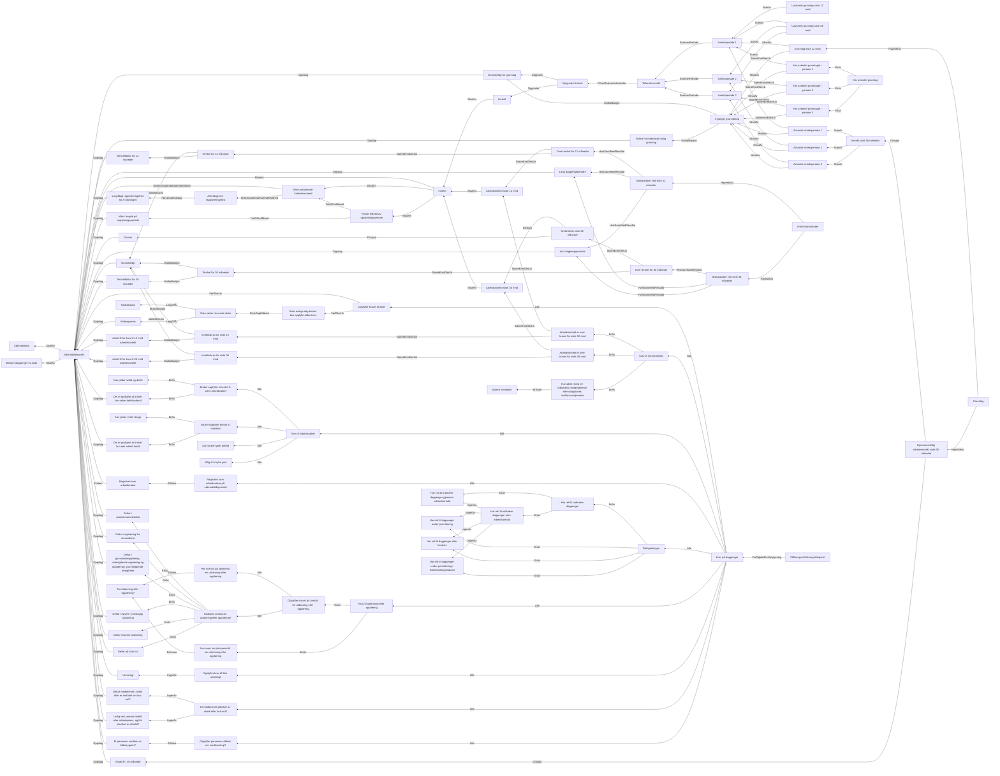

# Regeltre - Dagpenger (inngangsvilkår)

## Regeltre

```mermaid
graph RL
  A["Aldersgrense"] -->|"Oppslag"| B["Søknadstidspunkt"]
  C["Dato søker når maks alder"] -->|"LeggTilÅr"| D["Fødselsdato"]
  C["Dato søker når maks alder"] -->|"LeggTilÅr"| A["Aldersgrense"]
  E["Siste mulige dag bruker kan oppfylle alderskrav"] -->|"SisteDagIMåned"| C["Dato søker når maks alder"]
  F["Oppfyller kravet til alder"] -->|"FørEllerLik"| B["Søknadstidspunkt"]
  F["Oppfyller kravet til alder"] -->|"FørEllerLik"| E["Siste mulige dag bruker kan oppfylle alderskrav"]
  G["Antall år i 36 måneder"] -->|"Oppslag"| B["Søknadstidspunkt"]
  H["Faktor for maksimalt mulig grunnlag"] -->|"Oppslag"| B["Søknadstidspunkt"]
  I["6 ganger grunnbeløp"] -->|"Multiplikasjon"| J["Grunnbeløp for grunnlag"]
  I["6 ganger grunnbeløp"] -->|"Multiplikasjon"| H["Faktor for maksimalt mulig grunnlag"]
  K["Inntekt"] -->|"Ekstern"| L["Inntekt"]
  J["Grunnbeløp for grunnlag"] -->|"Oppslag"| B["Søknadstidspunkt"]
  M["Oppjustert inntekt"] -->|"Oppjuster"| J["Grunnbeløp for grunnlag"]
  M["Oppjustert inntekt"] -->|"Oppjuster"| K["Inntekt"]
  N["Tellende inntekt"] -->|"FiltrerRelevanteInntekter"| M["Oppjustert inntekt"]
  O["Inntektperiode 1"] -->|"SummerPeriode"| N["Tellende inntekt"]
  P["Inntektperiode 2"] -->|"SummerPeriode"| N["Tellende inntekt"]
  Q["Inntektperiode 3"] -->|"SummerPeriode"| N["Tellende inntekt"]
  R["Uavkortet grunnlag siste 12 mnd"] -->|"SumAv"| O["Inntektperiode 1"]
  S["Uavkortet grunnlag siste 36 mnd"] -->|"SumAv"| O["Inntektperiode 1"]
  S["Uavkortet grunnlag siste 36 mnd"] -->|"SumAv"| P["Inntektperiode 2"]
  S["Uavkortet grunnlag siste 36 mnd"] -->|"SumAv"| Q["Inntektperiode 3"]
  T["Avkortet inntektperiode 1"] -->|"MinstAv"| O["Inntektperiode 1"]
  T["Avkortet inntektperiode 1"] -->|"MinstAv"| I["6 ganger grunnbeløp"]
  U["Avkortet inntektperiode 2"] -->|"MinstAv"| P["Inntektperiode 2"]
  U["Avkortet inntektperiode 2"] -->|"MinstAv"| I["6 ganger grunnbeløp"]
  V["Avkortet inntektperiode 3"] -->|"MinstAv"| Q["Inntektperiode 3"]
  V["Avkortet inntektperiode 3"] -->|"MinstAv"| I["6 ganger grunnbeløp"]
  W["Grunnlag siste 12 mnd."] -->|"MinstAv"| O["Inntektperiode 1"]
  W["Grunnlag siste 12 mnd."] -->|"MinstAv"| I["6 ganger grunnbeløp"]
  X["Inntekt siste 36 måneder"] -->|"SumAv"| T["Avkortet inntektperiode 1"]
  X["Inntekt siste 36 måneder"] -->|"SumAv"| U["Avkortet inntektperiode 2"]
  X["Inntekt siste 36 måneder"] -->|"SumAv"| V["Avkortet inntektperiode 3"]
  Y["Gjennomsnittlig arbeidsinntekt siste 36 måneder"] -->|"Divisjon"| X["Inntekt siste 36 måneder"]
  Y["Gjennomsnittlig arbeidsinntekt siste 36 måneder"] -->|"Divisjon"| G["Antall år i 36 måneder"]
  Z["Grunnlag"] -->|"HøyesteAv"| W["Grunnlag siste 12 mnd."]
  Z["Grunnlag"] -->|"HøyesteAv"| Y["Gjennomsnittlig arbeidsinntekt siste 36 måneder"]
  AA["Har avkortet grunnlaget i periode 1"] -->|"StørreEnnEllerLik"| O["Inntektperiode 1"]
  AA["Har avkortet grunnlaget i periode 1"] -->|"StørreEnnEllerLik"| I["6 ganger grunnbeløp"]
  AB["Har avkortet grunnlaget i periode 2"] -->|"StørreEnnEllerLik"| P["Inntektperiode 2"]
  AB["Har avkortet grunnlaget i periode 2"] -->|"StørreEnnEllerLik"| I["6 ganger grunnbeløp"]
  AC["Har avkortet grunnlaget i periode 3"] -->|"StørreEnnEllerLik"| Q["Inntektperiode 3"]
  AC["Har avkortet grunnlaget i periode 3"] -->|"StørreEnnEllerLik"| I["6 ganger grunnbeløp"]
  AD["Har avkortet grunnlag"] -->|"EnAv"| AA["Har avkortet grunnlaget i periode 1"]
  AD["Har avkortet grunnlag"] -->|"EnAv"| AB["Har avkortet grunnlaget i periode 2"]
  AD["Har avkortet grunnlag"] -->|"EnAv"| AC["Har avkortet grunnlaget i periode 3"]
  AE["Kort dagpengeperiode"] -->|"Oppslag"| B["Søknadstidspunkt"]
  AF["Lang dagpengeperiode"] -->|"Oppslag"| B["Søknadstidspunkt"]
  AG["Terskelfaktor for 12 måneder"] -->|"Oppslag"| B["Søknadstidspunkt"]
  AH["Terskelfaktor for 36 måneder"] -->|"Oppslag"| B["Søknadstidspunkt"]
  AI["Divisior"] -->|"Oppslag"| B["Søknadstidspunkt"]
  AJ["Terskel for 12 måneder"] -->|"Multiplikasjon"| AK["Grunnbeløp"]
  AJ["Terskel for 12 måneder"] -->|"Multiplikasjon"| AG["Terskelfaktor for 12 måneder"]
  AL["Terskel for 36 måneder"] -->|"Multiplikasjon"| AK["Grunnbeløp"]
  AL["Terskel for 36 måneder"] -->|"Multiplikasjon"| AH["Terskelfaktor for 36 måneder"]
  AM["Snittinntekt siste 36 måneder"] -->|"Divisjon"| AN["Arbeidsinntekt siste 36 mnd"]
  AM["Snittinntekt siste 36 måneder"] -->|"Divisjon"| AI["Divisior"]
  AO["Over terskel for 12 måneder"] -->|"StørreEnnEllerLik"| AP["Arbeidsinntekt siste 12 mnd"]
  AO["Over terskel for 12 måneder"] -->|"StørreEnnEllerLik"| AJ["Terskel for 12 måneder"]
  AQ["Over terskel for 36 måneder"] -->|"StørreEnnEllerLik"| AM["Snittinntekt siste 36 måneder"]
  AQ["Over terskel for 36 måneder"] -->|"StørreEnnEllerLik"| AL["Terskel for 36 måneder"]
  AR["Stønadsuker ved siste 12 måneder"] -->|"HvisSannMedResultat"| AO["Over terskel for 12 måneder"]
  AR["Stønadsuker ved siste 12 måneder"] -->|"HvisSannMedResultat"| AF["Lang dagpengeperiode"]
  AR["Stønadsuker ved siste 12 måneder"] -->|"HvisSannMedResultat"| AE["Kort dagpengeperiode"]
  AS["Stønadsuker ved siste 36 måneder"] -->|"HvisSannMedResultat"| AQ["Over terskel for 36 måneder"]
  AS["Stønadsuker ved siste 36 måneder"] -->|"HvisSannMedResultat"| AF["Lang dagpengeperiode"]
  AS["Stønadsuker ved siste 36 måneder"] -->|"HvisSannMedResultat"| AE["Kort dagpengeperiode"]
  AT["Antall stønadsuker"] -->|"HøyesteAv"| AR["Stønadsuker ved siste 12 måneder"]
  AT["Antall stønadsuker"] -->|"HøyesteAv"| AS["Stønadsuker ved siste 36 måneder"]
  AU["Krav på dagpenger"] -->|"Alle"| F["Oppfyller kravet til alder"]
  AU["Krav på dagpenger"] -->|"Alle"| AV["Krav til minsteinntekt"]
  AU["Krav på dagpenger"] -->|"Alle"| AW["Krav til arbeidssøker"]
  AU["Krav på dagpenger"] -->|"Alle"| AX["Registrert som arbeidssøker på søknadstidspunktet"]
  AU["Krav på dagpenger"] -->|"Alle"| AY["Rettighetstype"]
  AU["Krav på dagpenger"] -->|"Alle"| AZ["Krav til utdanning eller opplæring"]
  AU["Krav på dagpenger"] -->|"Alle"| BA["Oppfyller krav til ikke utestengt"]
  AU["Krav på dagpenger"] -->|"Alle"| BB["Er medlemmet påvirket av streik eller lock-out?"]
  AU["Krav på dagpenger"] -->|"Alle"| BC["Oppfyller personen vilkåret om medlemskap?"]
  BD["Er personen medlem av folketrygden?"] -->|"Oppslag"| B["Søknadstidspunkt"]
  BC["Oppfyller personen vilkåret om medlemskap?"] -->|"ErSann"| BD["Er personen medlem av folketrygden?"]
  BE["Registrert som arbeidssøker"] -->|"Ekstern"| B["Søknadstidspunkt"]
  AX["Registrert som arbeidssøker på søknadstidspunktet"] -->|"ErSann"| BE["Registrert som arbeidssøker"]
  BF["Maks lengde på opptjeningsperiode"] -->|"Oppslag"| B["Søknadstidspunkt"]
  BG["Første måned av opptjeningsperiode"] -->|"TrekkFraMåned"| BH["Siste avsluttende kalendermåned"]
  BG["Første måned av opptjeningsperiode"] -->|"TrekkFraMåned"| BF["Maks lengde på opptjeningsperiode"]
  L["Inntekt"] -->|"Ekstern"| B["Søknadstidspunkt"]
  L["Inntekt"] -->|"Ekstern"| BH["Siste avsluttende kalendermåned"]
  L["Inntekt"] -->|"Ekstern"| BG["Første måned av opptjeningsperiode"]
  AK["Grunnbeløp"] -->|"Oppslag"| B["Søknadstidspunkt"]
  AP["Arbeidsinntekt siste 12 mnd"] -->|"Ekstern"| L["Inntekt"]
  BI["Antall G for krav til 12 mnd arbeidsinntekt"] -->|"Oppslag"| B["Søknadstidspunkt"]
  BJ["Inntektskrav for siste 12 mnd"] -->|"Multiplikasjon"| AK["Grunnbeløp"]
  BJ["Inntektskrav for siste 12 mnd"] -->|"Multiplikasjon"| BI["Antall G for krav til 12 mnd arbeidsinntekt"]
  BK["Arbeidsinntekt er over kravet for siste 12 mnd"] -->|"StørreEnnEllerLik"| AP["Arbeidsinntekt siste 12 mnd"]
  BK["Arbeidsinntekt er over kravet for siste 12 mnd"] -->|"StørreEnnEllerLik"| BJ["Inntektskrav for siste 12 mnd"]
  AN["Arbeidsinntekt siste 36 mnd"] -->|"Ekstern"| L["Inntekt"]
  BL["Antall G for krav til 36 mnd arbeidsinntekt"] -->|"Oppslag"| B["Søknadstidspunkt"]
  BM["Inntektskrav for siste 36 mnd"] -->|"Multiplikasjon"| AK["Grunnbeløp"]
  BM["Inntektskrav for siste 36 mnd"] -->|"Multiplikasjon"| BL["Antall G for krav til 36 mnd arbeidsinntekt"]
  BN["Arbeidsinntekt er over kravet for siste 36 mnd"] -->|"StørreEnnEllerLik"| AN["Arbeidsinntekt siste 36 mnd"]
  BN["Arbeidsinntekt er over kravet for siste 36 mnd"] -->|"StørreEnnEllerLik"| BM["Inntektskrav for siste 36 mnd"]
  AV["Krav til minsteinntekt"] -->|"EnAv"| BK["Arbeidsinntekt er over kravet for siste 12 mnd"]
  AV["Krav til minsteinntekt"] -->|"EnAv"| BN["Arbeidsinntekt er over kravet for siste 36 mnd"]
  AV["Krav til minsteinntekt"] -->|"EnAv"| BO["Har utført minst tre måneders militærtjeneste eller obligatorisk sivilforsvarstjeneste"]
  BP["Lovpålagt rapporteringsfrist for A-ordningen"] -->|"Oppslag"| B["Søknadstidspunkt"]
  BQ["Arbeidsgivers rapporteringsfrist"] -->|"FørsteArbeidsdag"| BP["Lovpålagt rapporteringsfrist for A-ordningen"]
  BH["Siste avsluttende kalendermåned"] -->|"SisteavsluttendeKalenderMåned"| B["Søknadstidspunkt"]
  BH["Siste avsluttende kalendermåned"] -->|"SisteavsluttendeKalenderMåned"| BQ["Arbeidsgivers rapporteringsfrist"]
  BR["Det er godkjent at bruker kun søk arbeid lokalt"] -->|"Oppslag"| B["Søknadstidspunkt"]
  BS["Det er godkjent at bruker kun søker deltidsarbeid"] -->|"Oppslag"| B["Søknadstidspunkt"]
  BT["Bruker oppfyller kravet til mobilitet"] -->|"EnAv"| BU["Kan jobbe i hele Norge"]
  BT["Bruker oppfyller kravet til mobilitet"] -->|"EnAv"| BR["Det er godkjent at bruker kun søk arbeid lokalt"]
  BV["Bruker oppfyller kravet til å være arbeidssøker"] -->|"EnAv"| BW["Kan jobbe heltid og deltid"]
  BV["Bruker oppfyller kravet til å være arbeidssøker"] -->|"EnAv"| BS["Det er godkjent at bruker kun søker deltidsarbeid"]
  AW["Krav til arbeidssøker"] -->|"Alle"| BV["Bruker oppfyller kravet til å være arbeidssøker"]
  AW["Krav til arbeidssøker"] -->|"Alle"| BT["Bruker oppfyller kravet til mobilitet"]
  AW["Krav til arbeidssøker"] -->|"Alle"| BX["Kan ta alle typer arbeid"]
  AW["Krav til arbeidssøker"] -->|"Alle"| BY["Villig til å bytte yrke"]
  BZ["Har rett til ordinære dagpenger uten arbeidsforhold"] -->|"IngenAv"| CA["Har rett til ordinære dagpenger gjennom arbeidsforhold"]
  BZ["Har rett til ordinære dagpenger uten arbeidsforhold"] -->|"IngenAv"| CB["Har rett til dagpenger under permittering"]
  BZ["Har rett til ordinære dagpenger uten arbeidsforhold"] -->|"IngenAv"| CC["Har rett til dagpenger etter konkurs"]
  BZ["Har rett til ordinære dagpenger uten arbeidsforhold"] -->|"IngenAv"| CD["Har rett til dagpenger under permittering i fiskeforedlingsindustri"]
  CE["Har rett til ordinære dagpenger"] -->|"EnAv"| CA["Har rett til ordinære dagpenger gjennom arbeidsforhold"]
  CE["Har rett til ordinære dagpenger"] -->|"EnAv"| BZ["Har rett til ordinære dagpenger uten arbeidsforhold"]
  AY["Rettighetstype"] -->|"EnAv"| CE["Har rett til ordinære dagpenger"]
  AY["Rettighetstype"] -->|"EnAv"| CB["Har rett til dagpenger under permittering"]
  AY["Rettighetstype"] -->|"EnAv"| CC["Har rett til dagpenger etter konkurs"]
  AY["Rettighetstype"] -->|"EnAv"| CD["Har rett til dagpenger under permittering i fiskeforedlingsindustri"]
  CF["Deltar medlemmet i streik eller er omfattet av lock-out?"] -->|"Oppslag"| B["Søknadstidspunkt"]
  CG["Ledig ved samme bedrift eller arbeidsplass, og blir påvirket av utfallet?"] -->|"Oppslag"| B["Søknadstidspunkt"]
  BB["Er medlemmet påvirket av streik eller lock-out?"] -->|"IngenAv"| CF["Deltar medlemmet i streik eller er omfattet av lock-out?"]
  BB["Er medlemmet påvirket av streik eller lock-out?"] -->|"IngenAv"| CG["Ledig ved samme bedrift eller arbeidsplass, og blir påvirket av utfallet?"]
  B["Søknadstidspunkt"] -->|"SisteAv"| CH["Søknadsdato"]
  B["Søknadstidspunkt"] -->|"SisteAv"| CI["Ønsker dagpenger fra dato"]
  CJ["Deltar i arbeidsmarkedstiltak"] -->|"Oppslag"| B["Søknadstidspunkt"]
  CK["Deltar i opplæring for innvandrere"] -->|"Oppslag"| B["Søknadstidspunkt"]
  CL["Deltar i grunnskoleopplæring, videregående opplæring og opplæring i grunnleggende ferdigheter"] -->|"Oppslag"| B["Søknadstidspunkt"]
  CM["Deltar i høyere yrkesfaglig utdanning"] -->|"Oppslag"| B["Søknadstidspunkt"]
  CN["Deltar i høyere utdanning"] -->|"Oppslag"| B["Søknadstidspunkt"]
  CO["Deltar på kurs mv"] -->|"Oppslag"| B["Søknadstidspunkt"]
  CP["Godkjent unntak for utdanning eller opplæring?"] -->|"EnAv"| CJ["Deltar i arbeidsmarkedstiltak"]
  CP["Godkjent unntak for utdanning eller opplæring?"] -->|"EnAv"| CK["Deltar i opplæring for innvandrere"]
  CP["Godkjent unntak for utdanning eller opplæring?"] -->|"EnAv"| CL["Deltar i grunnskoleopplæring, videregående opplæring og opplæring i grunnleggende ferdigheter"]
  CP["Godkjent unntak for utdanning eller opplæring?"] -->|"EnAv"| CM["Deltar i høyere yrkesfaglig utdanning"]
  CP["Godkjent unntak for utdanning eller opplæring?"] -->|"EnAv"| CN["Deltar i høyere utdanning"]
  CP["Godkjent unntak for utdanning eller opplæring?"] -->|"EnAv"| CO["Deltar på kurs mv"]
  CQ["Har svart ja på spørsmål om utdanning eller opplæring"] -->|"ErSann"| CR["Tar utdanning eller opplæring?"]
  CS["Har svart nei på spørsmål om utdanning eller opplæring"] -->|"ErUsann"| CR["Tar utdanning eller opplæring?"]
  CT["Oppfyller kravet på unntak for utdanning eller opplæring"] -->|"Alle"| CQ["Har svart ja på spørsmål om utdanning eller opplæring"]
  CT["Oppfyller kravet på unntak for utdanning eller opplæring"] -->|"Alle"| CP["Godkjent unntak for utdanning eller opplæring?"]
  AZ["Krav til utdanning eller opplæring"] -->|"EnAv"| CT["Oppfyller kravet på unntak for utdanning eller opplæring"]
  AZ["Krav til utdanning eller opplæring"] -->|"EnAv"| CS["Har svart nei på spørsmål om utdanning eller opplæring"]
  CU["Utestengt"] -->|"Oppslag"| B["Søknadstidspunkt"]
  BA["Oppfyller krav til ikke utestengt"] -->|"IngenAv"| CU["Utestengt"]
  BO["Har utført minst tre måneders militærtjeneste eller obligatorisk sivilforsvarstjeneste"] -->|"ErSann"| CV["Avtjent verneplikt"]
  CW["EttBeregnetVirkningstidspunkt"] -->|"FraOgMedForOpplysning"| AU["Krav på dagpenger"]
```