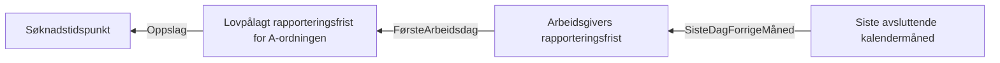

# Dagpengeforskriften § 3A-2. Siste avsluttede kalendermåned

## Regeltre



## Akseptansetester

```gherkin
                    #language: no
@dokumentasjon @regel-opptjeningstid
# Kapittel 3A. Søknadstidspunkt, opptjeningstid mv. - https://lovdata.no/dokument/SF/forskrift/1998-09-16-890/KAPITTEL_4#%C2%A73a-2
Egenskap: Dagpengeforskriften § 3A-2. Siste avsluttede kalendermåned

  Scenariomal: Finner siste avsluttede kalendermåned og opptjeningstid
    Gitt at søknadstidspunktet er <søknadstidspunktet>
    Så er arbeidsgivers pliktige rapporteringsfrist <rapporteringsfrist>
    Og opptjeningstiden er fra <sisteAvsluttende>

    Eksempler:
      | søknadstidspunktet | rapporteringsfrist | sisteAvsluttende |
      | 05.12.2023         | 05.12.2023         | 30.11.2023       |
      | 05.01.2024         | 05.01.2024         | 31.12.2023       |
      | 05.02.2024         | 05.02.2024         | 31.01.2024       |
      | 05.03.2024         | 05.03.2024         | 29.02.2024       |
      | 05.04.2024         | 05.04.2024         | 31.03.2024       |
      | 05.05.2024         | 06.05.2024         | 30.04.2024       |
      | 05.06.2024         | 05.06.2024         | 31.05.2024       |
      | 05.07.2024         | 05.07.2024         | 30.06.2024       |
      | 05.08.2024         | 05.08.2024         | 31.07.2024       |
      | 05.09.2024         | 05.09.2024         | 31.08.2024       |
      | 05.10.2024         | 07.10.2024         | 30.09.2024       |
      | 05.11.2024         | 05.11.2024         | 31.10.2024       |
      | 05.12.2024         | 05.12.2024         | 30.11.2024       |
      | 05.01.2025         | 06.01.2025         | 31.12.2024       |

``` 