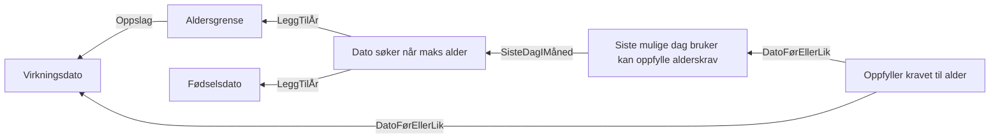

# §4-23 Bortfall på grunn av alder

Lovtekst: https://lovdata.no/lov/1997-02-28-19/§4-23

## Akseptansetester

```gherkin
#language: no
Egenskap: §4-23 Bortfall på grunn av alder

  Bakgrunn:
    Gitt at fødselsdatoen til søkeren er "10.02.1953"

  Scenariomal: Søker oppfyller alderskravet for §4-23 ut februar 2020
    Gitt at virkningstidspunktet er "<virkningstidspunkt>"
    Så skal utfallet være "<utfall>"

    Eksempler:
      | virkningstidspunkt | utfall |
      | 01.02.2020         | Ja     |
      | 10.02.2020         | Ja     |
      | 29.02.2020         | Ja     |
      | 01.03.2020         | Nei    |
      | 01.04.2022         | Nei    |
```

## Regeltre


## Implementasjon

```kotlin
object Alderskrav {
    val fødselsdato = Opplysningstype<LocalDate>("Fødselsdato")
    val aldersgrense = Opplysningstype<Int>("Aldersgrense")
    val virkningsdato = Opplysningstype<LocalDate>("Virkningsdato")

    private val sisteMåned = Opplysningstype<LocalDate>("Dato søker når maks alder")
    private val sisteDagIMåned = Opplysningstype<LocalDate>("Siste mulige dag bruker kan oppfylle alderskrav")

    val vilkår = Opplysningstype<Boolean>("Oppfyller kravet til alder")

    val regelsett =
        Regelsett("alder").apply {
            regel { aldersgrense.oppslag(virkningsdato) { 67 } }
            regel { sisteMåned.leggTilÅr(fødselsdato, aldersgrense) }
            regel { sisteDagIMåned.sisteDagIMåned(sisteMåned) }
            regel { vilkår.førEllerLik(virkningsdato, sisteDagIMåned) }
        }
}
```
