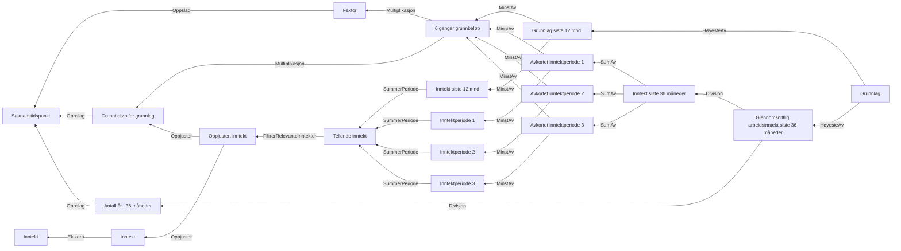

# § 4-11. Dagpengegrunnlag

## Regeltre



## Akseptansetester

```gherkin
#language: no
@dokumentasjon @regel-dagpengegrunnlag
Egenskap: § 4-11. Dagpengegrunnlag

  Bakgrunn:
    Gitt at inntekt for grunnlag er
      | Beløp  | Inntektsklasse | Periode |
      | 500000 | ARBEIDSINNTEKT | 2020-04 |
      | 500000 | ARBEIDSINNTEKT | 2020-05 |
      | 50000  | ARBEIDSINNTEKT | 2021-06 |
      | 50000  | ARBEIDSINNTEKT | 2021-07 |

  Scenario: Grunnlag for dagpenger
    Gitt at søknadsdato for dagpenger er 01.04.2022
    Så beregnet grunnlag være "246131.33333333333333333333" og "246131.33333333333333333333"
    Og vi har ikke avkortet
    #Og beregningsregel er "siste36"
``` 