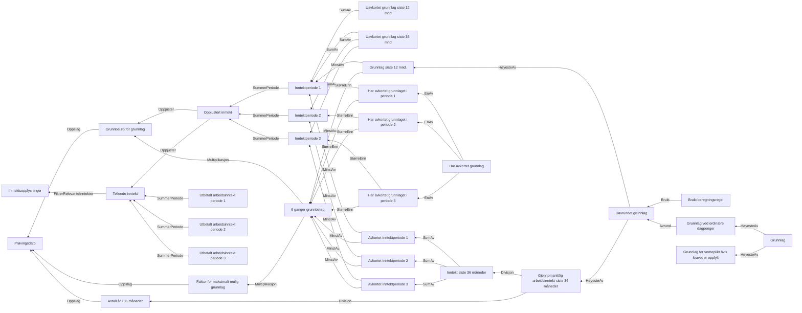

# § 4-11. Dagpengegrunnlag

## Regeltre



## Akseptansetester

```gherkin
#language: no
@dokumentasjon @regel-dagpengegrunnlag
Egenskap: § 4-11. Dagpengegrunnlag

  Scenario: Inntekt i siste 36 måneder er høyest og over 6G
    Gitt at søknadsdato for dagpenger er 01.04.2022
    Gitt at inntekt for grunnlag er
      | Beløp  | Inntektsklasse | Periode |
      | 500000 | ARBEIDSINNTEKT | 2020-04 |
      | 500000 | ARBEIDSINNTEKT | 2020-05 |
      | 50000  | ARBEIDSINNTEKT | 2021-06 |
      | 50000  | ARBEIDSINNTEKT | 2021-07 |
    Så beregnet uavrundet grunnlag være "246131.33333333333333333333"
    Og beregnet grunnlag være "246131"
    Og uavkortet "1157655.060139122727185"
    Og vi har avkortet
    Og beregningsregel er "Gjennomsnittlig arbeidsinntekt siste 36 måneder"

  Scenario: Inntekt i siste 12 måneder er høyest og over 6G
    Gitt at søknadsdato for dagpenger er 01.04.2022
    Gitt at inntekt for grunnlag er
      | Beløp  | Inntektsklasse | Periode |
      | 50000  | ARBEIDSINNTEKT | 2020-04 |
      | 50000  | ARBEIDSINNTEKT | 2020-05 |
      | 500000 | ARBEIDSINNTEKT | 2021-06 |
      | 500000 | ARBEIDSINNTEKT | 2021-07 |
    Så beregnet uavrundet grunnlag være "638394"
    Og beregnet grunnlag være "638394"
    Og uavkortet "1000000"
    Og vi har avkortet
    Og beregningsregel er "Grunnlag siste 12 mnd."

  Scenario: Inntekt i siste 12 måneder er høyest og ikke over 6G
    Gitt at søknadsdato for dagpenger er 01.04.2022
    Gitt at inntekt for grunnlag er
      | Beløp | Inntektsklasse | Periode |
      | 10000 | ARBEIDSINNTEKT | 2020-04 |
      | 10000 | ARBEIDSINNTEKT | 2020-05 |
      | 10000 | ARBEIDSINNTEKT | 2021-06 |
      | 10000 | ARBEIDSINNTEKT | 2021-07 |
    Så beregnet uavrundet grunnlag være "20000"
    Og beregnet grunnlag være "20000"
    Og uavkortet "20000"
    Og vi har ikke avkortet
    Og beregningsregel er "Grunnlag siste 12 mnd."


  ###################################################
  #
  # Tatt scenarioer fra dp-regel-grunnlag under

  Scenario: Skal gi riktig avkortet grunnlag siste 12 kalendermåneder gitt mars 2019 inntekt
    Gitt at søknadsdato for dagpenger er 01.01.2019
    Gitt at inntekt for grunnlag er
      | Beløp | Inntektsklasse | Periode |
      | 300000 | ARBEIDSINNTEKT | 2018-04 |
      | 300000 | ARBEIDSINNTEKT | 2018-05 |
    Så beregnet uavrundet grunnlag være "581298"
    Og beregnet grunnlag være "581298"
    Og uavkortet "610409.68024435568276400000"
    Og vi har avkortet
    Og beregningsregel er "Grunnlag siste 12 mnd."

  Scenario: Skal gi riktig grunnlag med minusinntekt
    Gitt at søknadsdato for dagpenger er 10.05.2019
    Gitt at inntekt for grunnlag er
      | Beløp | Inntektsklasse | Periode |
      | 1000   | ARBEIDSINNTEKT | 2018-04 |
      | 1000 | ARBEIDSINNTEKT | 2018-05 |
      | -1000 | ARBEIDSINNTEKT | 2018-05 |
    Så beregnet uavrundet grunnlag være "1066.47158083602110345000"
    Og beregnet grunnlag være "1066"
    Og uavkortet "1066.47158083602110345000"
    Og vi har ikke avkortet
    Og beregningsregel er "Grunnlag siste 12 mnd."
``` 