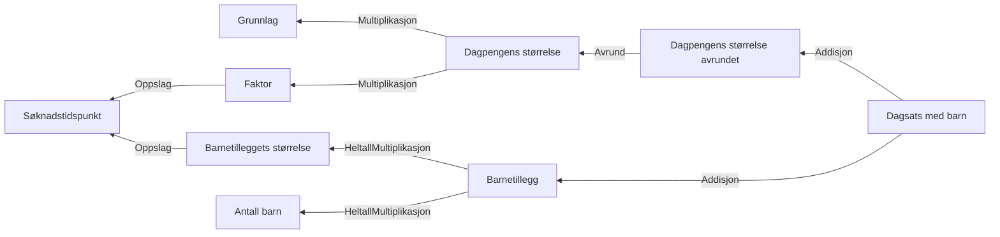

# § 4-12. Dagpengens størrelse (Sats)

## Regeltre



## Akseptansetester

```gherkin
#language: no
@dokumentasjon @regel-dagpengensStørrelse
Egenskap: § 4-12. Dagpengens størrelse (Sats)


  Scenario: Dagpengegrunnlag og søker har ikke barn
    Gitt at dagpengegrunnlag er "246131"
    Og at søker har ikke barn
    Så skal dagpengens uavrundet størrelse være "590.7144"

  Scenario: Dagpengegrunnlag og søker har 2 barn
    Gitt at dagpengegrunnlag er "246131"
    Og at søker har 2 barn
    Så skal dagpengens uavrundet størrelse være "590.7144"
    Så skal dagpengens størrelse være "591"
    Og skal dagpengens størrelse med barn være "663"
``` 