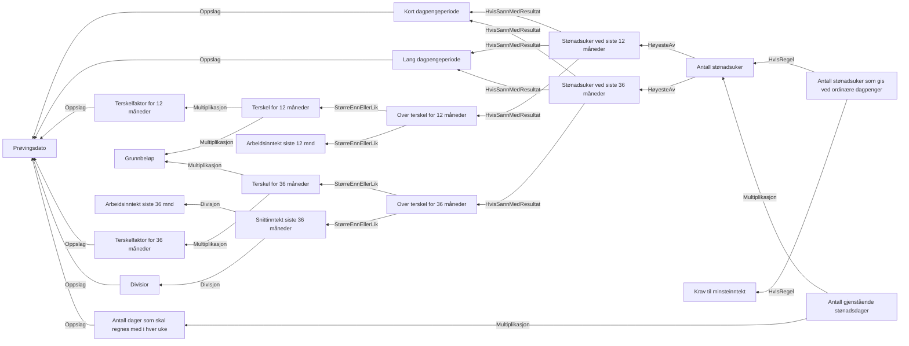

# § 4-15 Antall stønadsuker, stønadsperiode

## Regeltre



## Akseptansetester

```gherkin
#language: no
@dokumentasjon @regel-dapengeperiode
Egenskap: § 4-15 Antall stønadsuker, stønadsperiode

  Scenariomal: Søker har rett til dagpenger
    Gitt at søker har har rett til dagpenger fra "<virkningstidspunkt>"
    Og at søker har "<inntekt siste 12>" siste 12 måneder
    Og at søker har "<inntekt siste 36>" siste 36 måneder
    Så skal søker ha <antall uker> uker med dagpenger
    Eksempler:
      | virkningstidspunkt | inntekt siste 12 | inntekt siste 36 | antall uker |
      | 01.08.2024         | 300000           | 0                | 104         |
      | 01.08.2024         | 200000           | 0                | 52          |
      | 01.08.2024         | 0                | 300000           | 0           |
      | 01.08.2024         | 0                | 200000           | 0           |
      | 01.08.2024         | 0                | 748000           | 104         |
      | 01.08.2024         | 300000           | 200000           | 104         |
      | 01.08.2024         | 248056           | 0                | 104         |
      | 01.08.2024         | 248055           | 0                | 52          |
      | 01.08.2024         | 248055           | 0                | 52          |
      | 01.08.2024         | 248056           | 0                | 104         |
``` 