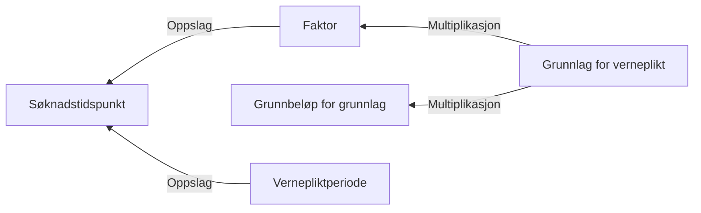

# § 4-19 Verneplikt (fastsetting)

## Regeltre



## Akseptansetester

```gherkin
#language: no
@dokumentasjon @regel-verneplikt-fastsetting
Egenskap: § 4-19 Verneplikt (fastsetting)

  Scenario: Gitt at søker oppfyller kravet verneplikt
    Gitt at søker har søkt om dagpenger under verneplikt 19.08.2024
    Så skal grunnlag være 372084
    Og dagpengerperioden være 26 uker
``` 