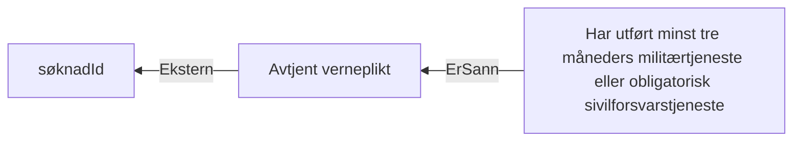

# § 4-19 Verneplikt

## Regeltre



## Akseptansetester

```gherkin
#language: no
@dokumentasjon @regel-verneplikt
Egenskap: § 4-19 Verneplikt

  Scenariomal: Søker oppfyller kravet til verneplikt
    Gitt at søker har "<søkt>" om dagpenger under verneplikt
    Og saksbehandler vurderer at søker har "<oppfylt>" kravet til verneplikt
    Så skal søker få "<utfall>" av verneplikt
  Eksempler:
    | søkt | oppfylt | utfall |
    | Ja   | Ja      | Ja     |
    | Ja   | Nei     | Nei    |
    | Nei  | Ja      | Ja     |
    | Nei  | Nei     | Nei    |
``` 