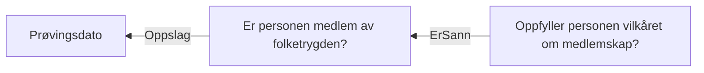

# § 4-2. Medlemskap

## Regeltre



## Akseptansetester

```gherkin
#language: no
@dokumentasjon @regel-medlemskap
Egenskap: § 4-2. Medlemskap


  Scenariomal: Søker oppfyller § 4-2. Medlemskap
    Gitt at søker har søkt om dagpenger og er medlem?
    Og at personen er medlem "<svar>" i folketrygden
    Så skal vilkåret om medlemskap være "<utfall>"

    Eksempler:
      | svar | utfall |
      | ja   | ja     |
      | nei  | nei    |
``` 