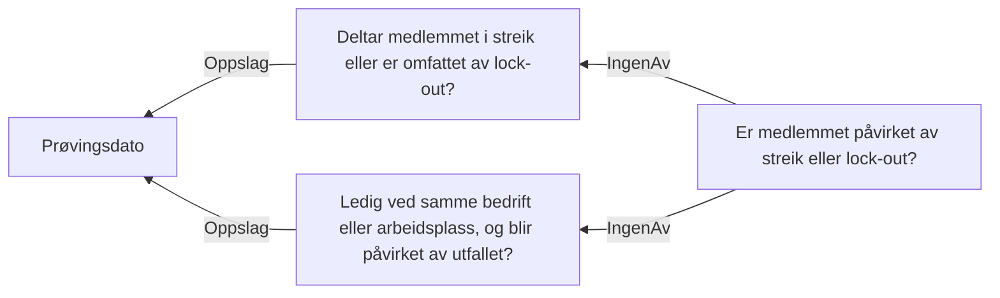

# § 4-22. Bortfall ved streik eller lockout

## Regeltre



## Akseptansetester

```gherkin
#language: no
@dokumentasjon @regel-streik-og-lockout
Egenskap: § 4-22. Bortfall ved streik eller lockout

  Scenariomal: Søker oppfyller kravet om å ikke være i streik eller lockout
    Gitt at søker har søkt om dagpenger under streik eller lockout
    Og saksbehandler vurderer at søker "<deltar>" i streik eller lockout
    Og saksbehandler vurderer at søker ikke blir "<påvirket>" av streik eller lockout i samme bedrift
    Så skal kravet om å ikke være i streik eller lockout være "<oppfylt>"

    Eksempler:
      | deltar | påvirket | oppfylt |
      | Ja     | Ja       | Nei     |
      | Ja     | Nei      | Nei     |
      | Nei    | Ja       | Nei     |
      | Nei    | Nei      | Ja      |
``` 