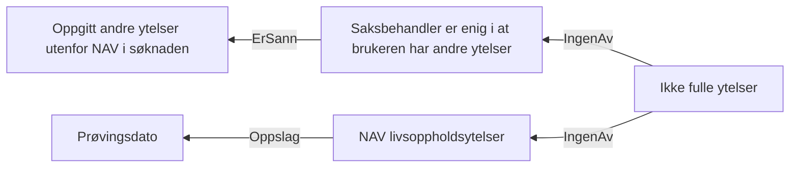

# § 4-24 Medlem som har fulle ytelser etter folketrygdloven eller avtalefestet pensjon

## Regeltre



## Akseptansetester

```gherkin
#language: no
@dokumentasjon @regel-fulle-ytelser-eller-afp
Egenskap: § 4-24 Medlem som har fulle ytelser etter folketrygdloven eller avtalefestet pensjon

  Scenariomal: Søker oppfyller kravet til ikke fulle ytelser
    Gitt at søker har søkt om dagpenger
    Og har oppgitt i søknaden at søker "<andre ytelser>" andre ytelser
    Og saksbehandler er "<enig>" i at brukeren har andre ytelser
    Og ikke "<nav-ytelser>" NAV-ytelser
    Så skal søker få "<utfall>" om ikke fulle ytelser
    Eksempler:
      | andre ytelser | enig | nav-ytelser | utfall |
      | Ja            | Ja   | Ja          | Nei    |
      | Ja            | Ja   | Nei         | Nei    |
      | Ja            | Nei  | Ja          | Nei    |
      | Ja            | Nei  | Nei         | Ja     |
      | Nei           | Ja   | Ja          | Nei    |
      | Nei           | Ja   | Nei         | Nei    |
      | Nei           | Nei  | Ja          | Nei    |
      | Nei           | Nei  | Nei         | Ja     |
``` 