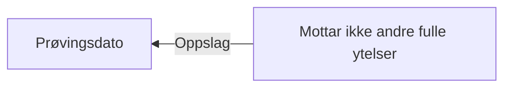

# § 4-24 Medlem som har fulle ytelser etter folketrygdloven eller avtalefestet pensjon

## Regeltre



## Akseptansetester

```gherkin
#language: no
@dokumentasjon @regel-fulle-ytelser-eller-afp
Egenskap: § 4-24 Medlem som har fulle ytelser etter folketrygdloven eller avtalefestet pensjon

  Scenariomal: Søker oppfyller kravet til ikke fulle ytelser
    Gitt at søker har søkt om dagpenger
    Og andre ytelser er "<andre ytelser>"
    Så skal søker få "<utfall>" om ikke fulle ytelser
    Eksempler:
      | andre ytelser | utfall |
      | Ja            | Ja     |
      | Nei           | Nei    |
``` 