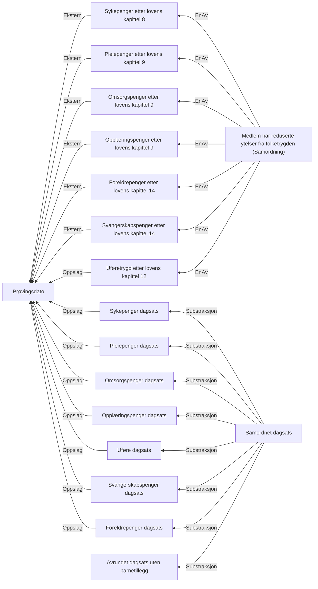

# § 4-25.Samordning med reduserte ytelser fra folketrygden, eller redusert avtalefestet pensjon

## Regeltre



## Akseptansetester

```gherkin
#language: no
@dokumentasjon @regel-samordning
Egenskap: § 4-25.Samordning med reduserte ytelser fra folketrygden, eller redusert avtalefestet pensjon

  Scenariomal: Søker oppfyller kravet til samordning
    Gitt at søker har søkt om dagpenger og har redusert ytelse
    Og søker har redusert sykepenger "<sykepenger>"
    Og dagsats for sykepenger er "<sykepengerDagsats>"
    Og søker har redusert pleiepenger "<pleiepenger>"
    Og søker har redusert omsorgspenger "<omsorgspenger>"
    Og søker har redusert opplæringspenger "<opplæringspenger>"
    Og søker har redusert uføre "<uføre>"
    Og søker har redusert foreldrepenger "<foreldrepenger>"
    Og søker har redusert svangerskapspenger "<svangerskapspenger>"
    Så skal søker få samordnet dagsats "<samordnet>"
    Og gitt at bruker har "<dagsats>" i dagsats
    Så skal at bruker ha "<samordnetsats>" i samordnet dagsats
    Eksempler:
      | sykepenger | pleiepenger | omsorgspenger | opplæringspenger | uføre | foreldrepenger | svangerskapspenger | samordnet | sykepengerDagsats | dagsats |  samordnetsats |
      | Ja         | Nei         | Nei           | Nei              | Nei   | Nei            | Nei                | Ja        | 500               | 1000    |  500           |
``` 