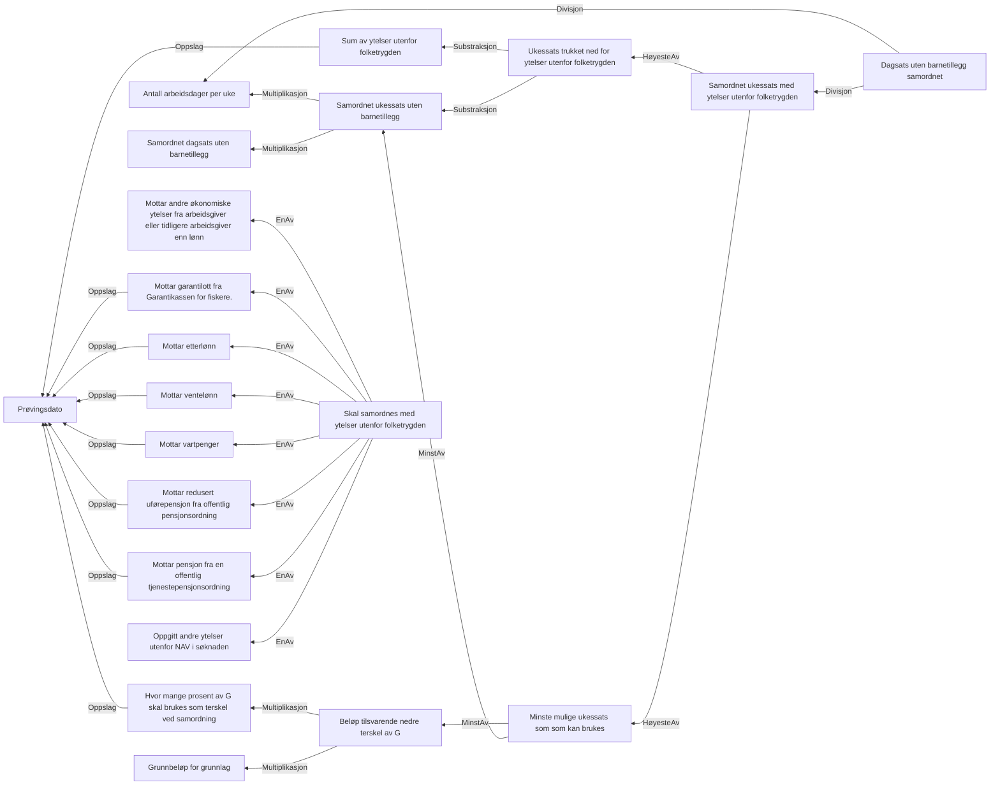

# § 4-26.Samordning med ytelser utenfor folketrygden

## Regeltre



## Akseptansetester

```gherkin
#language: no
@dokumentasjon @regel-samordning-utenfor-folketrygden
Egenskap: § 4-26.Samordning med ytelser utenfor folketrygden

  Scenariomal: Søker har ytelser utenfor folketrygden som kan kreve samordning
    Gitt at søker har søkt om dagpenger med andre ytelser
    Og søker har oppgitt ytelse "<ytelse>"
    Så skal vi kreve samordning
    Eksempler:
      | ytelse       |
      | andreYtelser |

  Scenariomal: Søker har ytelser utenfor folketrygden som gir samordning
    Gitt at søker har søkt om dagpenger med andre ytelser
    Og søker har ukessats "<ukessats>"
    Og søker har oppgitt ytelse med "<beløp>" utbetalt per uke
    Så skal vi endre ukessats til "<samordnet ukessats>"
    Og skal vi endre dagsats til "<samordnet dagsats>"
    Eksempler:
      | ukessats | beløp | samordnet ukessats | samordnet dagsats |
      | 1000     | 500   | 1000               | 200               |
      | 3000     | 500   | 3000               | 600               |
      | 3800     | 500   | 3720.84            | 744.168           |
      | 3800     | 1500  | 3720.84            | 744.168           |
      | 6000     | 500   | 5500               | 1100              |
      | 3200     | 15000 | 3200               | 640               |
``` 