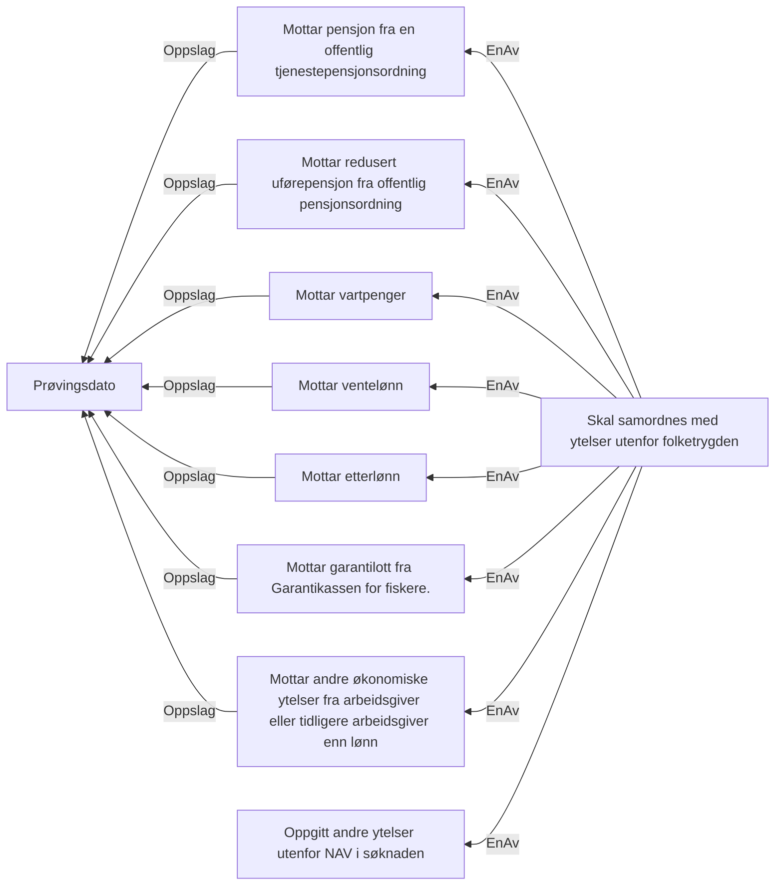

# § 4-26.Samordning med ytelser utenfor folketrygden

## Regeltre



## Akseptansetester

```gherkin
#language: no
@dokumentasjon @regel-samordning-utenfor-folketrygden
Egenskap: § 4-26.Samordning med ytelser utenfor folketrygden

  Scenariomal: Søker har ytelser utenfor folketrygden som kan kreve samordning
    Gitt at søker har søkt om dagpenger med andre ytelser
    Og søker har oppgitt ytelse "<ytelse>"
    Så skal vi kreve samordning
    Eksempler:
      | ytelse       |
      | andreYtelser |
``` 