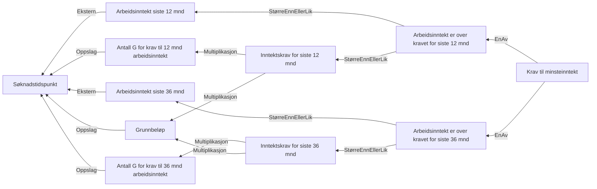

# § 4-4. Krav til minsteinntekt

## Regeltre



## Akseptansetester

```gherkin
                    #language: no
@dokumentasjon @regel-minsteinntekt
Egenskap: § 4-4. Krav til minsteinntekt

  Bakgrunn:
    Gitt at søknadsdato er "01.04.2022"

  Scenariomal: Søker oppfyller § 4-4. Krav til minsteinntekt
    Gitt at inntekt er
      | Siste 12 måneder | <Siste12> |
      | Siste 36 måneder | <Siste36> |
    Så skal utfallet til minste arbeidsinntekt være "<utfall>"

    Eksempler:
      | Siste12 | Siste36 | utfall |
      | 0       | 0       | Nei    |
      | 118620  | 0       | Nei    |
      | 0       | 284688  | Nei    |
      | 177930  | 0       | Ja     |
      | 0       | 355860  | Ja     |
``` 