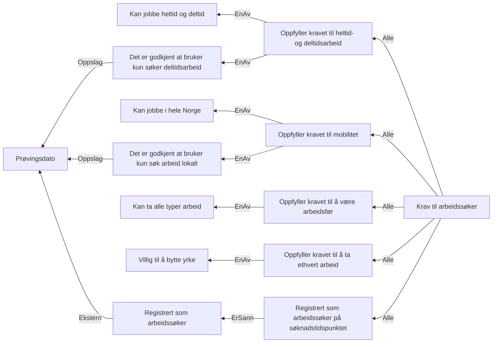

# § 4-5. Reelle arbeidssøkere

## Regeltre



## Akseptansetester

```gherkin
#language: no
@dokumentasjon @regel-reell-arbeidssøker
Egenskap: § 4-5. Reelle arbeidssøkere

  Scenario: Søker fyller kravene til å være reell arbeidssøker
    Gitt at personen søkte "11.05.2022"
    Og personen var registrert "Ja" på "11.05.2022"
    Og kan jobbe både heltid og deltid
    Og kan jobbe i hele Norge
    Og kan ta alle typer arbeid
    Og er villig til å bytte yrke eller gå ned i lønn
    Så skal kravet til reell arbeidssøker være oppfylt

  Scenario: Søker fyller ikke kravene til å være reell arbeidssøker
    Gitt at personen søkte "11.05.2022"
    Og personen var registrert "Ja" på "11.05.2022"
    Og kan ikke jobbe både heltid og deltid
    Og kan ikke jobbe i hele Norge
    Og kan ikke ta alle typer arbeid
    Og er ikke villig til å bytte yrke eller gå ned i lønn
    Så skal kravet til reell arbeidssøker ikke være oppfylt

  Scenario: Søker fyller vilkårene til å kun søke arbeid lokalt
    Gitt at personen søkte "11.05.2022"
    Og personen var registrert "Ja" på "11.05.2022"
    Og kan jobbe både heltid og deltid
    Og kan ikke jobbe i hele Norge
    Men oppfyller kravet å kun søke lokalt arbeid
    Og kan ta alle typer arbeid
    Og er villig til å bytte yrke eller gå ned i lønn
    Så skal kravet til reell arbeidssøker være oppfylt

  Scenario: Søker fyller vilkårene til å kun søke deltidssarbeid
    Gitt at personen søkte "11.05.2022"
    Og personen var registrert "Ja" på "11.05.2022"
    Og kan ikke jobbe både heltid og deltid
    Men oppfyller kravet til å kun søke deltidssarbeid
    Og kan jobbe i hele Norge
    Og kan ta alle typer arbeid
    Og er villig til å bytte yrke eller gå ned i lønn
    Så skal kravet til reell arbeidssøker være oppfylt

  Scenariomal: Søker fyller kravene til å være registrert som arbeidssøker
    Gitt at personen søkte "<søknadstidspunktet>"
    Og personen var registrert "<var registrert>" på "<registreringsdato>"
    Så er kravet til meldeplikt "<utfall>"

    Eksempler:
      | søknadstidspunktet | var registrert | registreringsdato | utfall       |
      | 10.05.2022         | Ja             | 10.05.2022        | Oppfylt      |
      | 10.05.2022         | Nei            | 10.05.2022        | Ikke oppfylt |
      | 15.05.2022         | Ja             | 15.05.2022        | Oppfylt      |
``` 