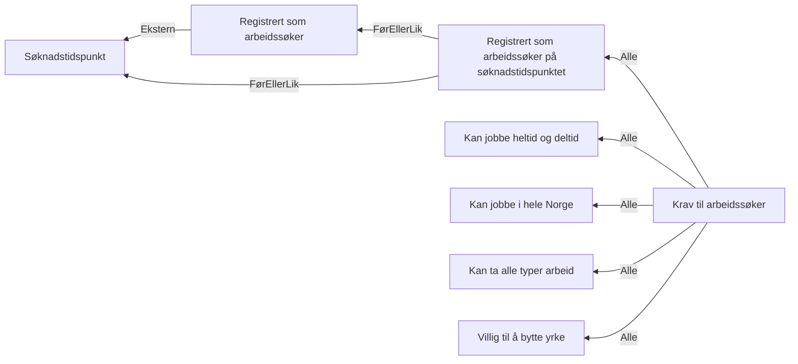

# § 4-5. Reelle arbeidssøkere

## Regeltre



## Akseptansetester

```gherkin
#language: no
@dokumentasjon @regel-reell-arbeidssøker
Egenskap: § 4-5. Reelle arbeidssøkere

  Scenariomal: Søker fyller kravene til å være reell arbeidssøker
    Gitt at personen søkte "<søknadstidspunktet>"
    Og personen registrerte seg "<registreringsdato>"
    Og kan jobbe både heltid og deltid
    Og kan jobbe i hele Norge
    Og kan ta alle typer arbeid
    Og er villig til å bytte yrke eller gå ned i lønn
    Så skal utfallet for kravet til reell arbeidssøker være "<utfall>"

    Eksempler:
      | søknadstidspunktet | registreringsdato | utfall |
      | 05.12.2023         | 05.12.2023        | Ja     |
      | 05.12.2023         | 01.12.2023        | Ja     |
      | 05.12.2023         | 10.12.2023        | Nei    |
``` 