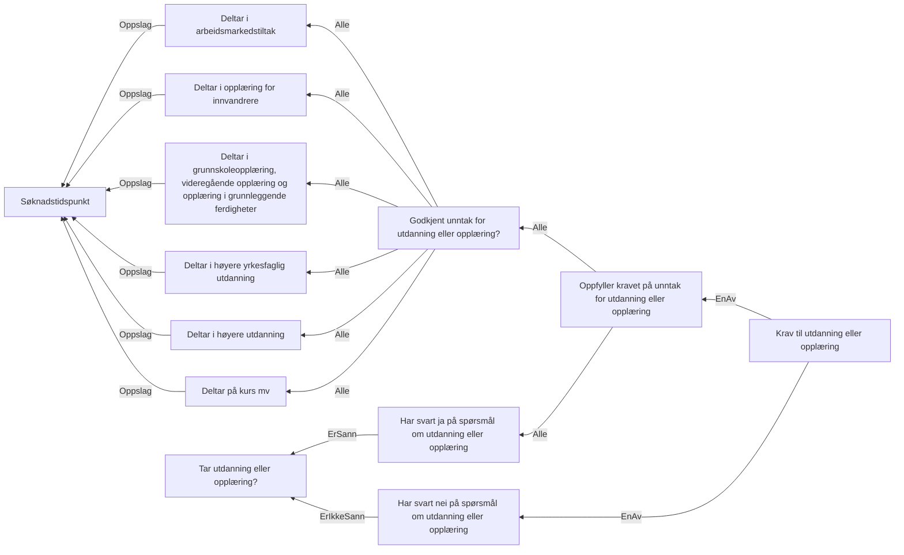

# § 4-6 Utdanning - første og andre avsnitt

## Regeltre



## Akseptansetester

```gherkin
#language: no
@dokumentasjon @regel-utdanning
Egenskap: § 4-6 Utdanning - første og andre avsnitt

  Scenariomal: Søker oppfyller kravet til utdanning
    Gitt at personen søker på kravet om dagpenger
    Og at søkeren svarer "<utdanning>" på spørsmålet om utdanning
    Og søkeren har fått "<godkjent>" unntak til kravet om utdanning
    Så skal utfallet om utdanning være "<utfall>"

    Eksempler:
      | utdanning | godkjent | utfall |
      | Nei       | Nei      | Ja     |
      | Ja        | Nei      | Nei    |
      | Ja        | Ja       | Ja     |
``` 