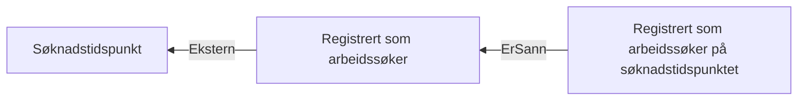

# § 4-8. Meldeplikt og møteplikt

## Regeltre



## Akseptansetester

```gherkin
#language: no
@dokumentasjon @regel-meldeplikt
Egenskap: § 4-8. Meldeplikt og møteplikt

  Scenariomal: Søker fyller kravene til å være reell arbeidssøker
    Gitt at personen søkte "<søknadstidspunktet>"
    Og personen registrerte seg "<registreringsdato>"
    Så er kravet til meldeplikt "<utfall>"

    Eksempler:
      | søknadstidspunktet | registreringsdato | utfall       |
      | 10.05.2022         | 10.05.2022        | Oppfylt      |
      | 11.05.2022         | 01.05.2022        | Ikke oppfylt |
      | 10.05.2022         | 15.05.2022        | Ikke oppfylt |
      | 15.05.2022         | 15.05.2022        | Oppfylt      |
``` 