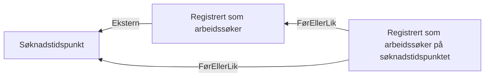

# § 4-8. Meldeplikt og møteplikt

## Regeltre



## Akseptansetester

```gherkin
#language: no
@dokumentasjon @regel-meldeplikt
Egenskap: § 4-8. Meldeplikt og møteplikt

  Scenariomal: Søker fyller kravene til å være reell arbeidssøker
    Gitt at personen søkte "<søknadstidspunktet>"
    Og personen registrerte seg "<registreringsdato>"
    Så er kravet til meldeplikt "<utfall>"

    Eksempler:
      | søknadstidspunktet | registreringsdato | utfall       |
      | 05.12.2023         | 05.12.2023        | Oppfylt      |
      | 05.12.2023         | 01.12.2023        | Oppfylt      |
      | 05.12.2023         | 10.12.2023        | Ikke oppfylt |
``` 