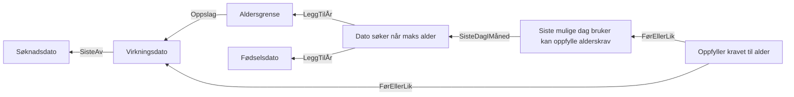

# §4-23 Bortfall på grunn av alder
 
 ## Regletre



 ## Akseptansetester

```gherkin
#language: no
Egenskap: §4-23 Bortfall på grunn av alder

  Bakgrunn:
    Gitt at fødselsdatoen til søkeren er "10.02.1953"

  Scenariomal: Søker oppfyller alderskravet for §4-23 ut februar 2020
    Gitt at virkningstidspunktet er "<virkningstidspunkt>"
    Så skal utfallet være "<utfall>"

    Eksempler:
 virkningstidspunkt | utfall |
 01.02.2020         | Ja     |
 10.02.2020         | Ja     |
 29.02.2020         | Ja     |
 01.03.2020         | Nei    |
 01.04.2022         | Nei    |

```